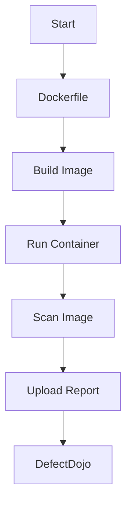

## Introduction to Docker Image Security

Docker images are the building blocks of containerized applications. They encapsulate an application along with its dependencies, environment variables, and configurations, allowing for consistent deployment across different environments. However, these images can also introduce significant security risks if not properly managed. In this section, we will delve into the best practices for securing Docker images, including how to automate the uploading of image scanning results to a platform like DefectDojo.

### Importance of Securing Docker Images

Securing Docker images is crucial because vulnerabilities within these images can be exploited to compromise the entire application stack. This includes unauthorized access, data breaches, and even the execution of malicious code. By following security best practices, you can significantly reduce the attack surface and mitigate these risks.

### Key Concepts

#### Attack Surface
The attack surface refers to the total number of points where an unauthorized user can attempt to enter data to or extract data from an environment. Reducing the attack surface means minimizing the number of entry points that could be exploited by attackers.

#### Vulnerabilities
Vulnerabilities are weaknesses in software that can be exploited to cause harm. Common vulnerabilities in Docker images include outdated libraries, misconfigured permissions, and unpatched software.

### Security Best Practices for Docker Images

To ensure that your Docker images are secure, you should follow several best practices:

1. **Use Minimal Base Images**
2. **Keep Software Updated**
3. **Limit Privileges**
4. **Scan for Vulnerabilities**
5. **Automate Scanning and Reporting**

#### Use Minimal Base Images

Using minimal base images reduces the amount of unnecessary code and dependencies in your Docker image. This minimizes the potential attack surface.

**Example:**
```Dockerfile
FROM alpine:latest
```

In this example, `alpine:latest` is a minimal base image that contains only the essential components needed to run your application.

#### Keep Software Updated

Ensure that all software and libraries used in your Docker image are up-to-date. Outdated software can contain known vulnerabilities that can be exploited.

**Example:**
```Dockerfile
RUN apk update && apk upgrade
```

This command updates the package list and upgrades all installed packages to their latest versions.

#### Limit Privileges

Running your Docker container with limited privileges ensures that even if an attacker gains access, they will have limited capabilities. This can be achieved by using non-root users and limiting the capabilities of the container.

**Example:**
```Dockerfile
FROM alpine:latest
RUN addgroup myapp && adduser -S -G myapp myapp
USER myapp
```

In this example, a new group and user named `myapp` are created, and the container runs as this user.

#### Scan for Vulnerabilities

Regularly scanning your Docker images for vulnerabilities is essential. Tools like Trivy, Clair, and Aqua Security can be used to scan images for known vulnerabilities.

**Example:**
```bash
trivy image my-docker-image:latest
```

This command scans the `my-docker-image:latest` Docker image for vulnerabilities using Trivy.

#### Automate Scanning and Reporting

Automating the process of scanning and reporting vulnerabilities ensures that security checks are consistently performed. Tools like DefectDojo can be used to manage and report on the results of these scans.

### Automating Uploading of Image Scanning Results to DefectDojo

DefectDojo is a popular open-source platform for managing security testing and vulnerability management. Integrating your Docker image scanning process with DefectDojo allows you to automatically upload and track the results of your scans.

#### Setting Up DefectDojo

Before integrating with DefectDojo, you need to set up the platform. You can install DefectDojo using Docker Compose.

**Example:**
```yaml
version: '3'
services:
  dojo:
    image: deftio/defectdojo:latest
    ports:
      - "8000:8000"
    environment:
      - DJANGO_SETTINGS_MODULE=dojo.settings.production
      - DOJO_SECRET_KEY=your_secret_key
      - DOJO_DATABASE_ENGINE=django.db.backends.postgresql
      - DOJO_DATABASE_NAME=defectdojo
      - DOJO_DATABASE_USER=defectdojo
      - DOJO_DATABASE_PASSWORD=your_password
      - DOJO_DATABASE_HOST=db
      - DOJO_DATABASE_PORT=5432
    depends_on:
      - db
  db:
    image: postgres:latest
    environment:
      - POSTGRES_DB=defectdojo
      - POSTGRES_USER=defectdojo
      - POSTGRES_PASSWORD=your_password
```

This Docker Compose file sets up DefectDojo and a PostgreSQL database.

#### Configuring Scanning Tools

Configure your scanning tool to generate reports in a format compatible with DefectDojo. For example, Trivy can generate reports in JSON format.

**Example:**
```bash
trivy image --format json --output trivy-report.json my-docker-image:latest
```

This command generates a JSON report of the scan results.

#### Uploading Reports to DefectDojo

Use the DefectDojo API to upload the scan reports. You can use tools like `curl` or Python scripts to interact with the API.

**Example:**
```python
import requests

url = "http://localhost:8000/api/v2/import-scan/"
headers = {
    "Authorization": "Token your_api_token",
    "Content-Type": "application/json",
}
data = {
    "scan_type": "Docker Scan",
    "engagement": 1,
    "product": 1,
    "file": open("trivy-report.json", "rb"),
}

response = requests.post(url, headers=headers, data=data)
print(response.json())
```

This Python script uploads the scan report to DefectDojo.

### Mermaid Diagrams

#### Docker Image Build Process



This diagram shows the process of building a Docker image, running a container, scanning the image, and uploading the report to DefectDojo.

### Real-World Examples

#### CVE-2021-44228 (Log4Shell)

CVE-2021-44228, also known as Log4Shell, is a critical vulnerability in the Apache Log4j library. This vulnerability can be exploited to execute arbitrary code on the server. If your Docker image uses Log4j, it is essential to update to a patched version.

**Example:**
```Dockerfile
FROM alpine:latest
RUN apk add --no-cache log4j
RUN apk update && apk upgrade
```

This Dockerfile ensures that the Log4j library is updated to the latest version.

### How to Prevent / Defend

#### Detection

Regularly scan your Docker images for vulnerabilities using tools like Trivy or Clair. Integrate these scans into your CI/CD pipeline to ensure that vulnerabilities are detected early.

#### Prevention

1. **Use Minimal Base Images**: Reduce the attack surface by using minimal base images.
2. **Keep Software Updated**: Ensure that all software and libraries are up-to-date.
3. **Limit Privileges**: Run your Docker container with limited privileges.
4. **Automate Scanning and Reporting**: Automate the process of scanning and reporting vulnerabilities.

#### Secure Coding Fixes

**Vulnerable Code:**
```Dockerfile
FROM alpine:latest
RUN apk add --no-cache log4j
```

**Secure Code:**
```Dockerfile
FROM alpine:latest
RUN apk add --no-cache log4j
RUN apk update && apk upgrade
```

This secure code ensures that the Log4j library is updated to the latest version.

### Conclusion

Securing Docker images is essential to protect your applications from security threats. By following best practices such as using minimal base images, keeping software updated, limiting privileges, and automating scanning and reporting, you can significantly reduce the attack surface and mitigate vulnerabilities. Integrating with platforms like DefectDojo helps you manage and track the results of your scans effectively.

### Practice Labs

For hands-on practice, consider the following labs:

- **PortSwigger Web Security Academy**: Offers a comprehensive set of labs covering various aspects of web security, including Docker image security.
- **OWASP Juice Shop**: A deliberately insecure web application for security training purposes, which can be containerized using Docker.
- **Docker Security Workshop**: Provides practical exercises to learn about securing Docker images and containers.

By following these best practices and engaging in hands-on practice, you can build and maintain secure Docker images effectively.

---
<!-- nav -->
[[DevSecOps/DevSecOps Bootcamp/06-Container & Kubernetes Security/03-Image Scanning - Build Secure Docker Images/Automate Uploading Image Scanning Results in DefectDojo/00-Overview|Overview]] | [[DevSecOps/DevSecOps Bootcamp/06-Container & Kubernetes Security/03-Image Scanning - Build Secure Docker Images/Automate Uploading Image Scanning Results in DefectDojo/02-Introduction to Image Scanning and DefectDojo Integration|Introduction to Image Scanning and DefectDojo Integration]]
