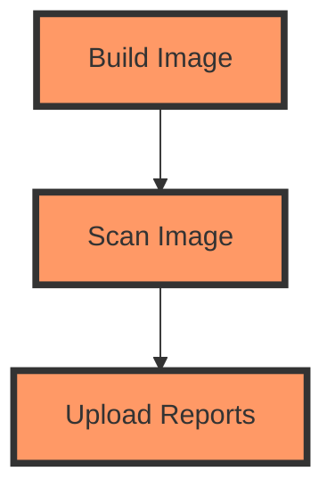

## Introduction to Image Scanning and DefectDojo Integration

### Background Theory

Image scanning is a critical component of DevSecOps practices, ensuring that Docker images are free from vulnerabilities and malicious components before deployment. Tools such as Trivy help automate the process of identifying known vulnerabilities in container images. Once scanned, the results need to be uploaded to a centralized platform for tracking and management. DefectDojo is an open-source application security testing (AST) platform that helps organizations manage their security testing processes, including image scanning results.

### Why Automate Image Scanning?

Automating the process of uploading image scanning results to DefectDojo ensures that security findings are consistently tracked and managed. This automation reduces the likelihood of human error and ensures that all findings are recorded in a centralized location, making it easier to track remediation efforts and compliance requirements.

### How Image Scanning Works

Image scanning tools like Trivy analyze Docker images against a database of known vulnerabilities. The process involves:

1. **Fetching the Image**: The scanner fetches the Docker image to be analyzed.
2. **Analyzing Components**: The scanner identifies all the components within the image, including base OS packages, libraries, and dependencies.
3. **Comparing Against Vulnerability Database**: Each identified component is compared against a database of known vulnerabilities.
4. **Generating Report**: The scanner generates a report detailing any vulnerabilities found.

### Example of Trivy Usage

Here’s a basic example of using Trivy to scan a Docker image:

```bash
trivy image my-docker-image:latest
```

This command scans the `my-docker-image:latest` image and outputs any vulnerabilities found.

### Integrating Trivy with DefectDojo

To integrate Trivy with DefectDojo, we need to configure the CI/CD pipeline to automatically upload the scan results to DefectDojo. This involves several steps:

1. **Running Trivy Scan**: Execute Trivy to scan the Docker image.
2. **Generating JSON Report**: Save the scan results in a JSON format.
3. **Uploading Report to DefectDojo**: Use the DefectDojo API to upload the JSON report.

### Configuring the CI/CD Pipeline

Let’s walk through the configuration of a GitLab CI/CD pipeline to achieve this integration.

#### Step 1: Running Trivy Scan

First, we need to run Trivy to scan the Docker image and save the results in a JSON file.

```yaml
image: docker:latest

stages:
  - build
  - scan
  - upload_reports

build_image:
  stage: build
  script:
    - docker build -t my-docker-image:latest .

scan_image:
  stage: scan
  script:
    - trivy image --format json --output trivy.json my-docker-image:latest
```

In this configuration, we define three stages: `build`, `scan`, and `upload_reports`. The `build_image` job builds the Docker image, and the `scan_image` job runs Trivy to scan the image and save the results in `trivy.json`.

#### Step 2: Uploading Reports to DefectDojo

Next, we need to configure the `upload_reports` job to upload the `trivy.json` file to DefectDojo.

```yaml
upload_reports:
  stage: upload_reports
  script:
    - echo "Uploading Trivy report to DefectDojo"
    - curl -X POST -H "Authorization: Token $DEFECTDOJO_API_TOKEN" -H "Content-Type: application/json" -F "file=@trivy.json" -F "engagement=19" -F "scan_type=Trivy Scan" https://defectdojo.example.com/api/v2/import-scan/
```

In this script, we use `curl` to send a POST request to the DefectDojo API endpoint for importing scan results. The `Authorization` header includes the API token, and the `engagement` parameter specifies the engagement ID in DefectDojo.

### Adjusting the Upload Script

The original script provided in the transcript chunk needs to be adjusted to handle the `trivy.json` file correctly. Here’s the updated script:

```yaml
upload_reports:
  stage: upload_reports
  script:
    - if [ "$FILE_NAME" = "trivy.json" ]; then
        SCAN_TYPE="Trivy Scan";
      fi
    - echo "Uploading Trivy report to DefectDojo"
    - curl -X POST -H "Authorization: Token $DEFECTDOJO_API_TOKEN" -H "Content-Type: application/json" -F "file=@$FILE_NAME" -F "engagement=$ENGAGEMENT_ID" -F "scan_type=$SCAN_TYPE" https://defectdojo.example.com/api/v2/import-scan/
```

This script checks if the file being uploaded is `trivy.json` and sets the `SCAN_TYPE` accordingly. It then uses `curl` to upload the file to DefectDojo.

### Handling Authentication and Engagement Details

Since the DefectDojo demo website may change over time, it’s important to ensure that the authentication token and engagement details are up-to-date. Here’s how to acquire a new token and set up an engagement:

1. **Log in to DefectDojo**: Navigate to the DefectDojo UI and log in with your credentials.
2. **Generate New Token**: Go to the user settings and generate a new API token.
3. **Set Up Engagement**: Create a new engagement for your project. For example, if you’re working on a Juice Shop project, you might create an engagement named “Juice Shop”.

### Full Example of CI/CD Configuration

Here’s the complete CI/CD configuration with all the necessary steps:

```yaml
image: docker:latest

variables:
  FILE_NAME: trivy.json
  ENGAGEMENT_ID: 19
  DEFECTDOJO_API_TOKEN: your_api_token_here

stages:
  - build
  - scan
  - upload_reports

build_image:
  stage: build
  script:
    - docker build -t my-docker-image:latest .

scan_image:
  stage: scan
  script:
    - trivy image --format json --output trivy.json my-docker-image:latest

upload_reports:
  stage: upload_reports
  script:
    - if [ "$FILE_NAME" = "trivy.json" ]; then
        SCAN_TYPE="Trivy Scan";
      fi
    - echo "Uploading Trivy report to DefectDojo"
    - curl -X POST -H "Authorization: Token $DEFECTDOJO_API_TOKEN" -H "Content-Type: application/json" -F "file=@$FILE_NAME" -F "engagement=$ENGAGEMENT_ID" -F "scan_type=$SCAN_TYPE" https://defectdojo.example.com/api/v2/import-scan/
```

### Diagram of the CI/CD Pipeline

A visual representation of the CI/CD pipeline can help understand the flow better:



### Common Pitfalls and How to Avoid Them

#### Pitfall 1: Outdated Tokens and Engagement IDs

**Why It Matters**: Using outdated tokens or engagement IDs can result in failed uploads and lost security findings.

**How to Avoid**: Regularly check and update the tokens and engagement IDs in your CI/CD pipeline configuration.

#### Pitfall 2: Incorrect File Names

**Why It Matters**: If the file name does not match the expected value, the upload script may fail to identify the correct scan type.

**How to Avoid**: Ensure that the file name is correctly specified and matches the expected value in the script.

### How to Prevent / Defend

#### Detection

- **Regular Audits**: Periodically review the CI/CD pipeline configurations to ensure that all necessary steps are correctly implemented.
- **Logging**: Enable detailed logging in the CI/CD pipeline to capture any errors or issues during the upload process.

#### Prevention

- **Secure Token Management**: Store API tokens securely using environment variables or secrets management tools.
- **Automated Testing**: Implement automated tests to verify that the upload process works as expected.

#### Secure Coding Fixes

Here’s an example of a vulnerable configuration and the corrected secure version:

**Vulnerable Configuration**:

```yaml
upload_reports:
  stage: upload_reports
  script:
    - curl -X POST -H "Authorization: Token $DEFECTDOJO_API_TOKEN" -H "Content-Type: application/json" -F "file=@trivy.json" -F "engagement=19" -F "scan_type=Trivy Scan" https://defectdojo.example.com/api/v2/import-scan/
```

**Secure Configuration**:

```yaml
upload_reports:
  stage: upload_reports
  script:
    - if [ "$FILE_NAME" = "trivy.json" ]; then
        SCAN_TYPE="Trivy Scan";
      fi
    - echo "Uploading Trivy report to DefectDojo"
    - curl -X POST -H "Authorization: Token $DEFECTDOJO_API_TOKEN" -H "Content-Type: application/json" -F "file=@$FILE_NAME" -F "engagement=$ENGAGEMENT_ID" -F "scan_type=$SCAN_TYPE" https://defectdojo.example.com/api/v2/import-scan/
```

### Real-World Examples

#### Recent CVEs and Breaches

- **CVE-2021-21315**: A vulnerability in Docker that allowed unauthorized access to the Docker daemon. Ensuring that Docker images are scanned regularly can help mitigate such risks.
- **SolarWinds Supply Chain Attack**: This attack highlighted the importance of supply chain security. Image scanning tools like Trivy can help detect and mitigate vulnerabilities in third-party components.

### Hands-On Labs

For hands-on practice with image scanning and DefectDojo integration, consider the following labs:

- **PortSwigger Web Security Academy**: Offers practical exercises on web security, including image scanning.
- **OWASP Juice Shop**: A deliberately insecure web application for practicing security testing, including image scanning.
- **DefectDojo Demo Website**: Provides a sandbox environment to practice integrating image scanning results.

By following these steps and best practices, you can ensure that your Docker images are scanned and the results are uploaded to DefectDojo, providing a robust security posture for your applications.

---
<!-- nav -->
[[DevSecOps/DevSecOps Bootcamp/06-Container & Kubernetes Security/03-Image Scanning - Build Secure Docker Images/Automate Uploading Image Scanning Results in DefectDojo/01-Introduction to Docker Image Security|Introduction to Docker Image Security]] | [[DevSecOps/DevSecOps Bootcamp/06-Container & Kubernetes Security/03-Image Scanning - Build Secure Docker Images/Automate Uploading Image Scanning Results in DefectDojo/00-Overview|Overview]] | [[DevSecOps/DevSecOps Bootcamp/06-Container & Kubernetes Security/03-Image Scanning - Build Secure Docker Images/Automate Uploading Image Scanning Results in DefectDojo/03-Introduction to Image Scanning and Vulnerability Management|Introduction to Image Scanning and Vulnerability Management]]
