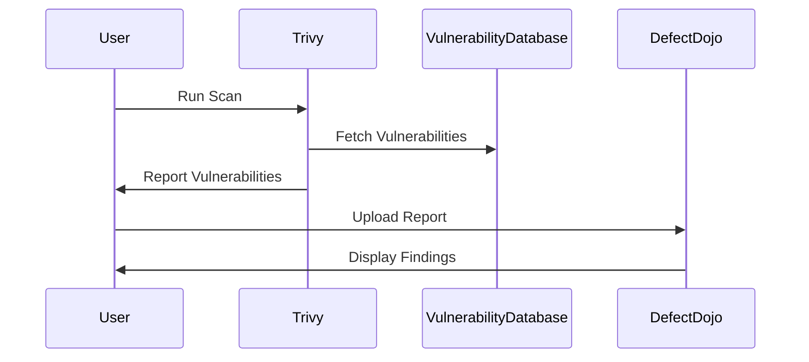
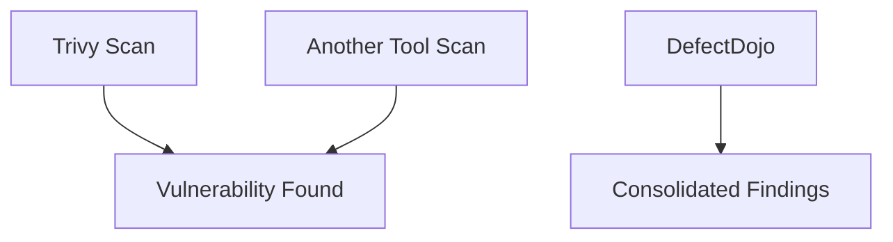

## Introduction to Image Scanning and Vulnerability Management

In the realm of DevSecOps, ensuring the security of Docker images is paramount. One of the key practices is to perform image scanning to identify vulnerabilities within the container images. Tools like Trivy are widely used for this purpose. However, managing the results of these scans can become cumbersome, especially when dealing with large numbers of images and multiple scanning tools. This is where vulnerability management platforms like DefectDojo come into play. They provide a centralized location to manage and track vulnerabilities across different tools and environments.

### Why Use DefectDojo?

DefectDojo is an open-source vulnerability management platform that helps organizations manage their security findings in a structured manner. It supports various types of scans, including static application security testing (SAST), dynamic application security testing (DAST), and container image scanning. By integrating Trivy with DefectDojo, you can centralize the management of your image scanning results, making it easier to track and remediate vulnerabilities.

#### Benefits of Using DefDefDojo

- **Centralized Management**: All findings from different scanning tools are aggregated in one place.
- **Automatic Duplication Finding**: Identifies and removes duplicate vulnerabilities reported by different tools.
- **Improved Visibility**: Provides a comprehensive view of the security posture of your applications and infrastructure.
- **Integration Support**: Supports integration with various CI/CD pipelines and scanning tools.

### Trivy: A Container Image Scanner

Trivy is a lightweight, fast, and easy-to-use scanner for container images, local files, and Git repositories. It checks for vulnerabilities in the operating system packages, language dependencies, and the base image itself. Trivy supports multiple package managers and can generate reports in various formats, including JSON.

#### How Trivy Works

Trivy works by analyzing the contents of a container image and comparing them against a database of known vulnerabilities. It supports multiple databases, including the National Vulnerability Database (NVD), which contains information about known vulnerabilities in software packages.



### Exporting Trivy Reports

To integrate Trivy with DefectDojo, you need to export the scan results in a format that DefectDojo can understand. Trivy supports exporting reports in JSON format, which is ideal for integration purposes.

#### Steps to Export Trivy Reports

1. **Run Trivy Scan**: Execute the Trivy scan on your Docker image.
2. **Export Report**: Specify the output format as JSON.

Here is an example of how to run Trivy and export the report:

```bash
trivy image --format json --output trivy-report.json <image-name>
```

This command will run a Trivy scan on the specified Docker image and save the results in `trivy-report.json`.

### Integrating Trivy with DefectDojo

To automate the uploading of Trivy scan results to DefectDojo, you can use a Python script. This script will handle the process of reading the Trivy report and sending it to DefectDojo.

#### Prerequisites

Before proceeding, ensure you have the following:

- **DefectDojo API Key**: You need an API key to authenticate with DefectDojo.
- **Python Environment**: Ensure you have Python installed on your machine.

#### Python Script to Upload Trivy Reports

Below is a sample Python script that reads the Trivy report and uploads it to DefectDojo.

```python
import requests
import json

# Configuration
DEFECTDOJO_API_URL = "https://your-defectdojo-instance/api/v2/"
API_KEY = "your-api-key"
PRODUCT_ID = 1  # Replace with your product ID
ENVIROMENT_ID = 1  # Replace with your environment ID

def upload_trivy_report(report_path):
    with open(report_path, 'r') as file:
        trivy_report = json.load(file)

    # Prepare data for DefectDojo
    data = {
        "product": PRODUCT_ID,
        "engagement": ENVIROMENT_ID,
        "scanner": "Trivy",
        "file": trivy_report
    }

    headers = {
        "Authorization": f"Token {API_KEY}",
        "Content-Type": "application/json"
    }

    # Send POST request to DefectDojo
    response = requests.post(f"{DEFECTDOJO_API_URL}/findings/", headers=headers, data=json.dumps(data))

    if response.status_code == 201:
        print("Report uploaded successfully.")
    else:
        print(f"Failed to upload report. Status code: {response.status_code}")
        print(response.text)

if __name__ == "__main__":
    report_path = "trivy-report.json"
    upload_trivy_report(report_path)
```

### Handling Duplicates and Centralizing Findings

One of the key benefits of using DefectDojo is its ability to handle duplicates and centralize findings. When multiple scanning tools report the same vulnerability, DefectDojo can automatically identify and remove these duplicates, providing a cleaner and more manageable view of your security posture.

#### Example of Duplicate Handling

Consider a scenario where both Trivy and another scanning tool report the same vulnerability in a Docker image. DefectDojo will recognize this and consolidate the findings, presenting them as a single entry.



### Real-World Examples and Recent CVEs

Integrating Trivy with DefectDojo has been particularly useful in recent security incidents. For instance, the Log4j vulnerability (CVE-2021-44228) affected numerous applications and systems. By using Trivy to scan Docker images and then uploading the results to DefectDojo, organizations were able to quickly identify and remediate instances of the Log4j vulnerability.

#### Example: Log4j Vulnerability

- **CVE-2021-44228**: A critical vulnerability in the Apache Log4j library that allowed remote code execution.
- **Impact**: Affected numerous applications and systems globally.
- **Mitigation**: Organizations used Trivy to scan their Docker images and DefectDojo to manage and track the remediation efforts.

### How to Prevent / Defend

#### Detection

- **Regular Scans**: Schedule regular Trivy scans to detect new vulnerabilities.
- **Automated Reporting**: Use scripts to automatically upload scan results to DefectDojo.

#### Prevention

- **Secure Coding Practices**: Follow secure coding guidelines to minimize vulnerabilities.
- **Patch Management**: Keep all software components up to date with the latest security patches.

#### Secure-Coding Fixes

Compare the vulnerable code with the secure version:

**Vulnerable Code:**
```python
import logging
logging.basicConfig(filename='app.log', level=logging.DEBUG)
logging.debug('This is a debug message')
```

**Secure Code:**
```python
import logging
from logging.config import dictConfig

dictConfig({
    'version': 1,
    'disable_existing_loggers': False,
    'formatters': {
        'standard': {
            'format': '%(asctime)s [%(levelname)s] %(name)s: %(message)s'
        },
    },
    'handlers': {
        'file': {
            'level': 'DEBUG',
            'class': 'logging.FileHandler',
            'filename': 'app.log',
            'formatter': 'standard',
        },
    },
    'loggers': {
        '': {
            'handlers': ['file'],
            'level': 'DEBUG',
            'propagate': True
        },
    }
})
logger = logging.getLogger(__name__)
logger.debug('This is a debug message')
```

### Complete Example

#### Full HTTP Request and Response

Here is an example of the full HTTP request and response when uploading a Trivy report to DefectDojo:

**HTTP Request:**

```http
POST /api/v2/findings/ HTTP/1.1
Host: your-defectdojo-instance
Authorization: Token your-api-key
Content-Type: application/json

{
    "product": 1,
    "engagement": 1,
    "scanner": "Trivy",
    "file": {
        "vulnerabilities": [
            {
                "id": "CVE-2021-44228",
                "description": "A critical vulnerability in the Apache Log4j library.",
                "severity": "Critical",
                "cvss_score": 9.8
            }
        ]
    }
}
```

**HTTP Response:**

```http
HTTP/1.1 201 Created
Date: Mon, 01 Jan 2024 00:00:00 GMT
Server: Apache/2.4.41 (Ubuntu)
Content-Length: 123
Content-Type: application/json

{
    "id": 1,
    "title": "Trivy Scan Report",
    "status": "New",
    "severity": "Critical",
    "cvss_score": 9.8
}
```

### Conclusion

By integrating Trivy with DefectDojo, you can streamline the process of managing and tracking vulnerabilities in your Docker images. This approach provides a centralized and efficient way to handle security findings, making it easier to maintain a secure DevSecOps environment.

### Practice Labs

For hands-on practice with Trivy and DefectDojo, consider the following labs:

- **PortSwigger Web Security Academy**: Offers exercises on container security and vulnerability management.
- **OWASP Juice Shop**: Provides a vulnerable web application for practicing security assessments.
- **Kubernetes Goat**: Focuses on Kubernetes security and can be used to practice securing containerized applications.

These labs will help you gain practical experience in using Trivy and DefectDojo to manage vulnerabilities in your Docker images.

---
<!-- nav -->
[[DevSecOps/DevSecOps Bootcamp/06-Container & Kubernetes Security/03-Image Scanning - Build Secure Docker Images/Automate Uploading Image Scanning Results in DefectDojo/02-Introduction to Image Scanning and DefectDojo Integration|Introduction to Image Scanning and DefectDojo Integration]] | [[DevSecOps/DevSecOps Bootcamp/06-Container & Kubernetes Security/03-Image Scanning - Build Secure Docker Images/Automate Uploading Image Scanning Results in DefectDojo/00-Overview|Overview]] | [[DevSecOps/DevSecOps Bootcamp/06-Container & Kubernetes Security/03-Image Scanning - Build Secure Docker Images/Automate Uploading Image Scanning Results in DefectDojo/04-Introduction to Image Scanning in DevSecOps|Introduction to Image Scanning in DevSecOps]]
