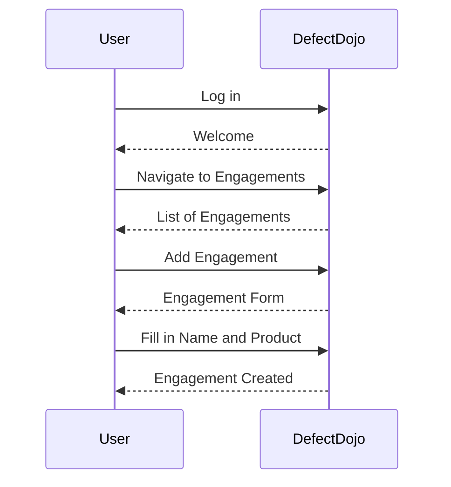
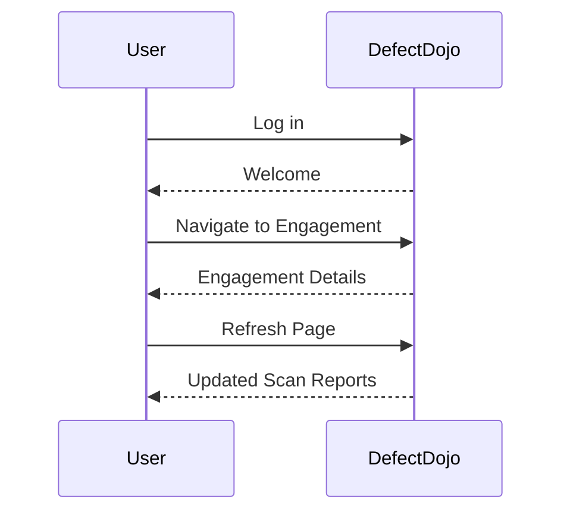

## Introduction to Image Scanning in DevSecOps

Image scanning is a critical component of DevSecOps, ensuring that Docker images used in applications are free from vulnerabilities and malicious content. This process involves automating the scanning of Docker images during the build phase and integrating the results into a centralized security management platform like DefectDojo. In this chapter, we will delve deep into the mechanics of image scanning, focusing specifically on Trivy, a popular open-source scanner, and how to automate the uploading of scan results to DefectDojo.

### What is Image Scanning?

Image scanning is the process of analyzing Docker images to identify potential security vulnerabilities, such as outdated libraries, known exploits, and malicious code. This is essential because Docker images often contain pre-installed software and dependencies that could introduce security risks if not properly vetted.

#### Why Image Scanning Matters

- **Security**: Identifies and mitigates known vulnerabilities, reducing the risk of exploitation.
- **Compliance**: Ensures that images meet organizational security policies and regulatory requirements.
- **Efficiency**: Automates the scanning process, allowing developers to focus on writing code rather than manually checking for vulnerabilities.

### Tools Used in Image Scanning

Several tools are available for image scanning, but we will focus on Trivy due to its popularity and effectiveness.

#### Trivy Overview

Trivy is an open-source vulnerability scanner for container images, private registries, and local filesystems. It supports various package managers and provides detailed reports on vulnerabilities found within the scanned images.

##### Key Features of Trivy

- **Multi-platform support**: Trivy supports a wide range of operating systems and package managers.
- **Detailed reporting**: Provides comprehensive information on vulnerabilities, including severity levels, CVE IDs, and remediation steps.
- **Integration capabilities**: Can be easily integrated into CI/CD pipelines and security management platforms like DefectDojo.

### Setting Up Trivy for Image Scanning

To set up Trivy for image scanning, follow these steps:

1. **Install Trivy**:
   ```sh
   wget https://github.com/aquasecurity/trivy/releases/download/v0.29.1/trivy_0.29.1_Linux-64bit.deb
   sudo dpkg -i trivy_0.29.1_Linux-64bit.deb
   ```

2. **Scan a Docker Image**:
   ```sh
   trivy image --format template --template '{{ .VulnerabilityID }} {{ .Severity }} {{ .Title }}\n' <image-name>
   ```

### Integrating Trivy with DefectDojo

DefectDojo is a web-based application designed to manage, track, and report on software vulnerabilities. To integrate Trivy with DefectDojo, we need to create a custom script that uploads the scan results to DefectDojo.

#### Creating a New Engagement in DefectDojo

An engagement in DefectDojo represents a specific project or application being tested. Here’s how to create a new engagement:

1. **Log in to DefectDojo**.
2. **Navigate to Engagements**.
3. **Click on "Add Engagement"**.
4. **Fill in the required fields**:
   - **Name**: Release (or any other meaningful name)
   - **Product**: To Shop and Create (or your product name)



### Automating the Upload of Scan Results

To automate the upload of Trivy scan results to DefectDojo, we need to create a Python script that interacts with DefectDojo’s API.

#### Example Python Script

```python
import requests
import json

def upload_scan_results(api_url, api_key, engagement_id, scan_file):
    headers = {
        'Authorization': f'Token {api_key}',
        'Content-Type': 'application/json'
    }
    
    with open(scan_file, 'r') as file:
        scan_data = file.read()
    
    data = {
        'engagement': engagement_id,
        'file': scan_data,
        'scan_type': 'trivy_scan',
        'verified': True
    }
    
    response = requests.post(f'{api_url}/api/v2/import-scan/', headers=headers, data=json.dumps(data))
    
    if response.status_code == 201:
        print("Scan results uploaded successfully.")
    else:
        print(f"Failed to upload scan results: {response.text}")

# Example usage
upload_scan_results('https://your-defectdojo-instance.com', 'your-api-key', '12345', 'trivy-report.json')
```

### Committing Changes and Triggering the Pipeline

Once the script is ready, commit the changes to your repository and trigger the CI/CD pipeline to ensure the script runs automatically.

#### Example Git Commands

```sh
git add .
git commit -m "Add Trivy scan integration with DefectDojo"
git push origin main
```

### Verifying the Integration

After triggering the pipeline, verify that the scan results are uploaded correctly to DefectDojo.

#### Checking the Engagement in DefectDojo

1. **Log in to DefectDojo**.
2. **Navigate to the Engagement**.
3. **Refresh the page** to see the newly imported scan reports.



### Analyzing Scan Results

Once the scan results are imported, analyze them to identify and address critical issues.

#### Example Scan Report Analysis

1. **Critical Issues**: Review issues marked as critical by Trivy.
2. **CVE Links**: Click on CVE links to get more details about the vulnerabilities.
3. **CWE Numbers**: Understand the Common Weakness Enumeration (CWE) associated with each vulnerability.

### How to Prevent / Defend Against Vulnerabilities

#### Detection

- **Regular Scans**: Schedule regular scans to catch new vulnerabilities.
- **Automated Alerts**: Set up automated alerts for high-severity vulnerabilities.

#### Prevention

- **Secure Coding Practices**: Follow secure coding guidelines to minimize vulnerabilities.
- **Dependency Management**: Keep dependencies up-to-date and remove unused packages.

#### Secure Code Fix

Compare the vulnerable code with the secure version:

**Vulnerable Code**
```python
import os
os.system("rm -rf /")
```

**Secure Code**
```python
import shutil
shutil.rmtree("/path/to/directory", ignore_errors=True)
```

#### Configuration Hardening

- **Use Minimal Base Images**: Start with minimal base images to reduce the attack surface.
- **Disable Unnecessary Services**: Disable services that are not needed in the production environment.

### Real-World Examples

#### Recent CVEs and Breaches

- **CVE-2021-44228 (Log4Shell)**: A critical vulnerability in Apache Log4j that allowed remote code execution.
- **Breaches**: Several high-profile breaches have occurred due to unpatched vulnerabilities in Docker images.

### Conclusion

By integrating Trivy with DefectDojo, you can automate the process of scanning Docker images and managing the results. This ensures that your applications remain secure and compliant with organizational policies. Regularly reviewing and addressing vulnerabilities is crucial to maintaining a robust security posture.

### Practice Labs

For hands-on practice, consider using the following labs:

- **PortSwigger Web Security Academy**: Offers a variety of labs focused on web application security.
- **OWASP Juice Shop**: A deliberately insecure web application for practicing security testing.
- **DVWA (Damn Vulnerable Web Application)**: Another popular web application for security testing.

These labs provide practical experience in identifying and mitigating vulnerabilities in Docker images and web applications.

---
<!-- nav -->
[[DevSecOps/DevSecOps Bootcamp/06-Container & Kubernetes Security/03-Image Scanning - Build Secure Docker Images/Automate Uploading Image Scanning Results in DefectDojo/03-Introduction to Image Scanning and Vulnerability Management|Introduction to Image Scanning and Vulnerability Management]] | [[DevSecOps/DevSecOps Bootcamp/06-Container & Kubernetes Security/03-Image Scanning - Build Secure Docker Images/Automate Uploading Image Scanning Results in DefectDojo/00-Overview|Overview]] | [[DevSecOps/DevSecOps Bootcamp/06-Container & Kubernetes Security/03-Image Scanning - Build Secure Docker Images/Automate Uploading Image Scanning Results in DefectDojo/05-Image Scanning and Reporting in DevSecOps|Image Scanning and Reporting in DevSecOps]]
