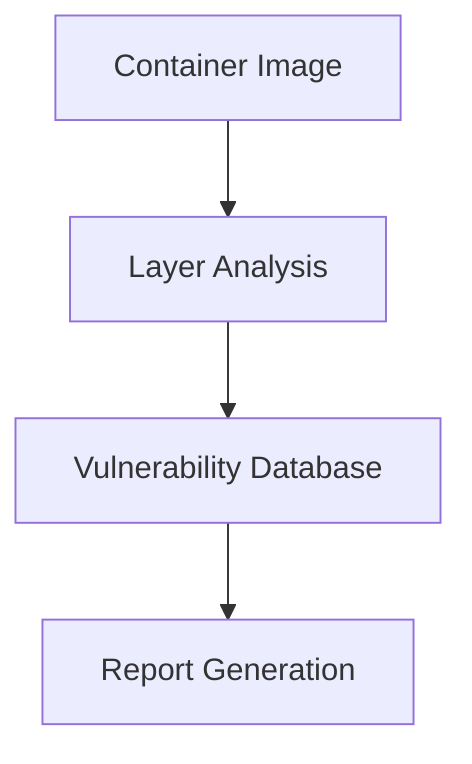

## Image Scanning and Reporting in DevSecOps

### Introduction to Image Scanning

Image scanning is a critical component of DevSecOps, ensuring that Docker images are free from vulnerabilities and comply with security policies. This process involves analyzing the contents of Docker images to identify known vulnerabilities, misconfigurations, and other security issues. By automating this process, organizations can ensure that their containerized applications are secure throughout the development lifecycle.

### Trivy: A Vulnerability Scanner for Containers

One popular tool for image scanning is **Trivy**, which is designed to scan container images, local filesystems, and Git repositories for vulnerabilities. Trivy supports various package managers and provides detailed reports about the identified vulnerabilities.

#### How Trivy Works

Trivy works by analyzing the layers of a Docker image and comparing the packages within these layers against a database of known vulnerabilities. This database is regularly updated to reflect the latest security advisories.



### Automating the Upload of Scan Results to DefectDojo

DefectDojo is a web application that serves as a centralized platform for managing and tracking security findings across different tools and projects. Integrating Trivy with DefectDojo allows for automated reporting and management of scan results.

#### Steps to Automate the Process

1. **Run Trivy Scan**: Execute Trivy to scan the Docker image and generate a report.
2. **Save Report as Artifact**: Save the generated report as an artifact for manual download if needed.
3. **Upload Report to DefectDojo**: Automatically upload the report to DefectDojo for centralized management.

#### Example Pipeline Configuration

Let's walk through a complete example of how to configure a pipeline using a tool like Jenkins to automate the scanning and reporting process.

```yaml
stages:
  - stage: Build
    jobs:
      - job: BuildDockerImage
        steps:
          - script: docker build -t myapp .
  - stage: Test
    jobs:
      - job: RunTests
        steps:
          - script: docker run myapp sh -c "pytest"
  - stage: Scan
    jobs:
      - job: RunTrivyScan
        steps:
          - script: trivy image --format json --output Trivy.json myapp
  - stage: UploadReports
    jobs:
      - job: UploadToDefectDojo
        steps:
          - script: |
              curl -X POST -H "Authorization: Token <your-token>" \
                -H "Content-Type: application/json" \
                -d @Trivy.json https://defectdojo.example.com/api/v2/import-scan/
```

### Saving Reports as Artifacts

Saving the scan report as an artifact ensures that you can manually download and review the report if needed. This is particularly useful for auditing purposes or when you need to investigate specific findings in more detail.

#### Example Artifact Configuration

In Jenkins, you can configure the pipeline to save the `Trivy.json` file as an artifact.

```yaml
stages:
  - stage: Scan
    jobs:
      - job: RunTrivyScan
        steps:
          - script: trivy image --format json --output Trivy.json myapp
          - archiveArtifacts: Trivy.json
```

### Handling Multiple Jobs and Stages

When integrating multiple jobs and stages into your pipeline, it's important to manage dependencies and ensure that jobs are executed in the correct order.

#### Example with Multiple Jobs and Stages

Consider a scenario where you have multiple jobs and stages, including a new `UploadReports` stage.

```yaml
stages:
  - stage: Build
    jobs:
      - job: BuildDockerImage
        steps:
          - script: docker build -t myapp .
  - stage: Test
    jobs:
      - job: RunTests
        steps:
          - script: docker run myapp sh -c "pytest"
  - stage: Scan
    jobs:
      - job: RunTrivyScan
        steps:
          - script: trivy image --format json --output Trivy.json myapp
  - stage: UploadReports
    jobs:
      - job: UploadToDefectDoDojo
        steps:
          - script: |
              curl -X POST -H "Authorization: Token <your-token>" \
                -H "Content-Type: application/json" \
                -d @Trivy.json https://defectdojo.example.com/api/v2/import-scan/
```

### Real-World Examples and Recent CVEs

Recent breaches and CVEs highlight the importance of image scanning and automated reporting. For instance, the Log4j vulnerability (CVE-2021-44228) affected numerous Docker images, emphasizing the need for continuous scanning and reporting.

#### Example: Log4j Vulnerability

The Log4j vulnerability was a critical issue that affected many Java-based applications, including those packaged in Docker images. By integrating Trivy and DefectDojo, organizations were able to quickly identify and mitigate the vulnerability.

### Common Pitfalls and Best Practices

#### Common Pitfalls

1. **Incomplete Scans**: Ensure that all layers of the Docker image are scanned.
2. **Outdated Vulnerability Database**: Regularly update the vulnerability database used by Trivy.
3. **Manual Review Overload**: Avoid relying solely on manual review of scan results; automate as much as possible.

#### Best Practices

1. **Automate Scanning**: Integrate Trivy into your CI/CD pipeline to ensure that scans are performed automatically.
2. **Centralize Reporting**: Use DefectDojo to centralize and manage scan results.
3. **Regular Audits**: Perform regular audits of your Docker images to ensure ongoing compliance.

### How to Prevent / Defend

#### Detection

Use Trivy to regularly scan Docker images and generate detailed reports. Integrate these reports into DefectDojo for centralized management and tracking.

#### Prevention

1. **Secure Coding Practices**: Implement secure coding practices to minimize vulnerabilities.
2. **Regular Updates**: Keep your Docker images and the underlying operating systems up to date.
3. **Configuration Hardening**: Harden the configurations of your Docker images to reduce attack surfaces.

#### Secure-Coding Fixes

Compare the vulnerable and secure versions of a Dockerfile:

**Vulnerable Dockerfile**
```dockerfile
FROM python:3.8
RUN pip install flask
CMD ["python", "app.py"]
```

**Secure Dockerfile**
```dockerfile
FROM python:3.8-slim
RUN pip install --no-cache-dir flask
COPY app.py /app/app.py
WORKDIR /app
CMD ["python", "app.py"]
```

### Conclusion

By automating the scanning and reporting process using tools like Trivy and DefectDojo, organizations can ensure that their Docker images are secure and compliant with security policies. This approach helps in identifying and mitigating vulnerabilities early in the development lifecycle, reducing the risk of security breaches.

### Hands-On Labs

For practical experience, consider the following labs:

- **PortSwigger Web Security Academy**: Offers a variety of labs related to web application security, including Docker and container security.
- **OWASP Juice Shop**: A deliberately insecure web application for practicing web security skills.
- **DVWA (Damn Vulnerable Web Application)**: Another web application for learning web security concepts.

These labs provide a comprehensive environment to practice and reinforce the concepts learned in this chapter.

---
<!-- nav -->
[[DevSecOps/DevSecOps Bootcamp/06-Container & Kubernetes Security/03-Image Scanning - Build Secure Docker Images/Automate Uploading Image Scanning Results in DefectDojo/04-Introduction to Image Scanning in DevSecOps|Introduction to Image Scanning in DevSecOps]] | [[DevSecOps/DevSecOps Bootcamp/06-Container & Kubernetes Security/03-Image Scanning - Build Secure Docker Images/Automate Uploading Image Scanning Results in DefectDojo/00-Overview|Overview]] | [[DevSecOps/DevSecOps Bootcamp/06-Container & Kubernetes Security/03-Image Scanning - Build Secure Docker Images/Automate Uploading Image Scanning Results in DefectDojo/06-Practice Questions & Answers|Practice Questions & Answers]]
