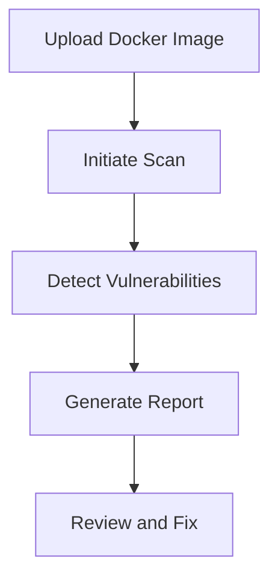
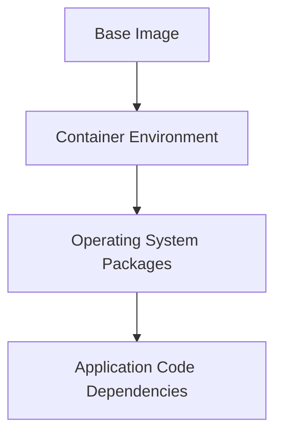

## Introduction to Image Scanning in Docker Images

### What is Image Scanning?

Image scanning is a process used to identify vulnerabilities and security issues within Docker images. These images are essentially snapshots of an application’s runtime environment, including the operating system, libraries, and application code. By scanning these images, organizations can ensure that their applications are free from known vulnerabilities before deploying them into production environments.

### Why is Image Scanning Important?

Image scanning is crucial for several reasons:

1. **Security**: Identifying and fixing vulnerabilities helps prevent potential attacks and data breaches.
2. **Compliance**: Many regulatory requirements mandate regular security assessments of software components.
3. **Quality Assurance**: Ensures that the deployed applications meet the required security standards.

### How Does Image Scanning Work?

Image scanning typically involves the following steps:

1. **Image Upload**: The Docker image is uploaded to a registry like Amazon Elastic Container Registry (ECR).
2. **Scan Initiation**: The registry initiates a scan using an integrated or third-party scanner.
3. **Vulnerability Detection**: The scanner checks the image against a database of known vulnerabilities.
4. **Report Generation**: The scanner generates a report detailing any vulnerabilities found.

### Example: Scanning a Docker Image in ECR

Let's walk through the process of configuring automated image security scanning in an ECR repository.

#### Step-by-Step Process

1. **Create an ECR Repository**:
    - Log in to the AWS Management Console.
    - Navigate to the ECR service.
    - Create a new repository.

2. **Upload a Docker Image**:
    - Tag your local Docker image with the ECR repository URI.
    - Push the image to the ECR repository.

```bash
# Tag the local image
docker tag myapp:latest <aws_account_id>.dkr.ecr.<region>.amazonaws.com/myrepo:latest

# Push the image to ECR
aws ecr get-login-password --region <region> | docker login --username AWS --password-stdin <aws_account_id>.dkr.ecr.<region>.amazonaws.com
docker push <aws_account_id>.dkr.ecr.<region>.amazonaws.com/myrepo:latest
```

3. **Enable Scanning**:
    - In the ECR console, navigate to the repository.
    - Enable the image scanning feature.

4. **View Scan Results**:
    - After a short wait, the scan results will be available.
    - Click on the image tag to view the vulnerabilities.

### Understanding the Scan Results

When you click on an image tag in the ECR repository, you will see a column labeled "Vulnerabilities." This column contains links to detailed vulnerability reports.

#### Vulnerability Report Breakdown

- **Critical and High-Level Issues**: The report highlights critical and high-level vulnerabilities.
- **Package Name and CVE Link**: Each vulnerability includes the package name and a link to the Common Vulnerabilities and Exposures (CVE) entry.
- **Detailed Descriptions**: Each issue comes with a detailed description to help you understand the nature of the vulnerability.

### Real-World Examples

#### Recent CVEs and Breaches

- **CVE-2021-44228 (Log4j)**: This vulnerability affected many Java applications and demonstrated the importance of continuous scanning.
- **SolarWinds Supply Chain Attack**: This attack highlighted the need for thorough scanning of third-party dependencies.

### Enhanced Scanning Capabilities

The enhanced scanner in ECR not only scans the container environment and image layers but also scans the entire application, including code dependencies.

#### Example: Scanning Application Code Dependencies

Consider an application that uses a library with a known vulnerability. The enhanced scanner would identify this vulnerability even if it was not present in the base image.

### How to Prevent / Defend

#### Detection

- **Regular Scans**: Schedule regular scans to catch newly discovered vulnerabilities.
- **Automated Alerts**: Set up alerts to notify you of new vulnerabilities.

#### Prevention

- **Secure Coding Practices**: Follow secure coding guidelines to minimize vulnerabilities.
- **Dependency Management**: Use tools like `npm audit` or `pip-audit` to manage dependencies securely.

#### Secure-Coding Fixes

##### Vulnerable Code Example

```python
import requests

def fetch_data(url):
    response = requests.get(url)
    return response.text
```

##### Secure Code Example

```python
import requests

def fetch_data(url):
    response = requests.get(url, verify=True)
    return response.text
```

### Configuration Hardening

#### ECR Configuration

Ensure that your ECR repository is configured securely:

- **IAM Policies**: Restrict access to the ECR repository using IAM policies.
- **Encryption**: Enable encryption for the repository.

```json
{
  "Version": "2012-10-17",
  "Statement": [
    {
      "Effect": "Allow",
      "Action": [
        "ecr:GetDownloadUrlForLayer",
        "ecr:BatchCheckLayerAvailability",
        "ecr:BatchGetImage"
      ],
      "Resource": "*"
    }
  ]
}
```

### Hands-On Labs

To practice image scanning, consider the following labs:

- **PortSwigger Web Security Academy**: Offers hands-on labs for web application security.
- **OWASP Juice Shop**: A deliberately insecure web application for practicing security skills.
- **CloudGoat**: Provides scenarios for practicing cloud security in AWS.

### Conclusion

Image scanning is a vital component of DevSecOps practices. By integrating automated scanning into your CI/CD pipeline, you can ensure that your Docker images are free from known vulnerabilities. Regular scanning and adherence to secure coding practices can significantly reduce the risk of security breaches.

### Mermaid Diagrams

#### Image Scanning Workflow



#### Enhanced Scanner Capabilities



By following these steps and best practices, you can build more secure Docker images and protect your applications from potential threats.

---
<!-- nav -->
[[DevSecOps/DevSecOps Bootcamp/06-Container & Kubernetes Security/03-Image Scanning - Build Secure Docker Images/Configure Automated Image Security Scanning in ECR Image Repository/00-Overview|Overview]] | [[DevSecOps/DevSecOps Bootcamp/06-Container & Kubernetes Security/03-Image Scanning - Build Secure Docker Images/Configure Automated Image Security Scanning in ECR Image Repository/02-Introduction to Image Scanning in Docker Registries|Introduction to Image Scanning in Docker Registries]]
