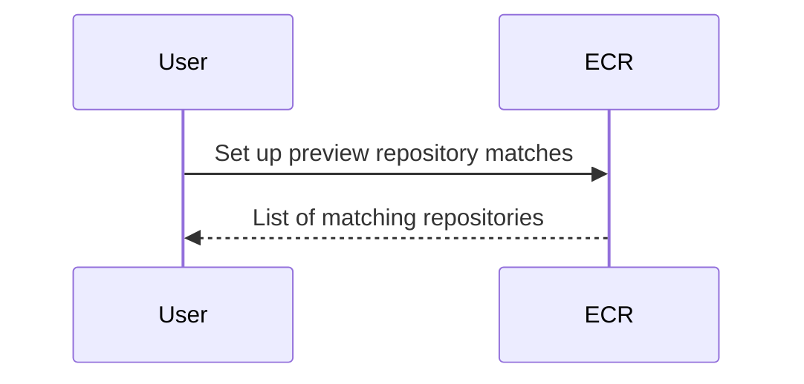
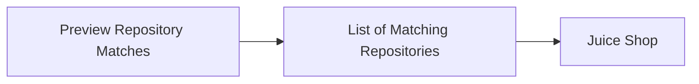
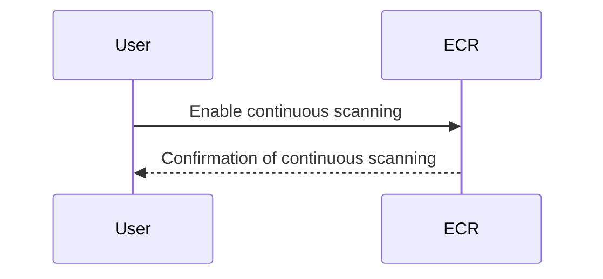
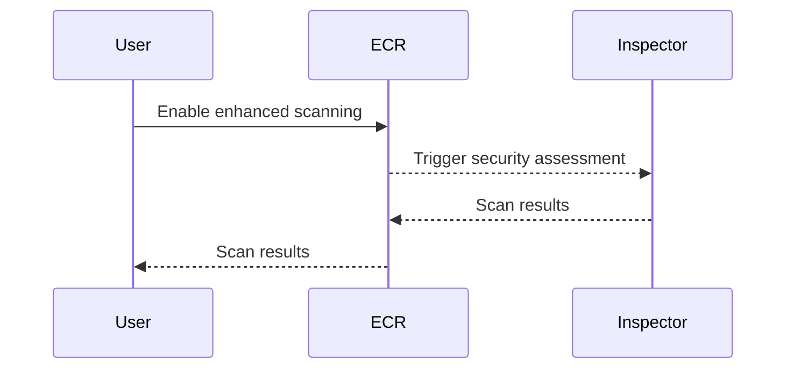
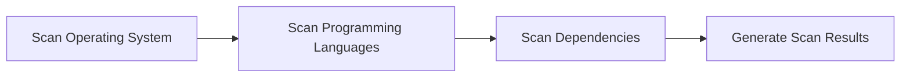
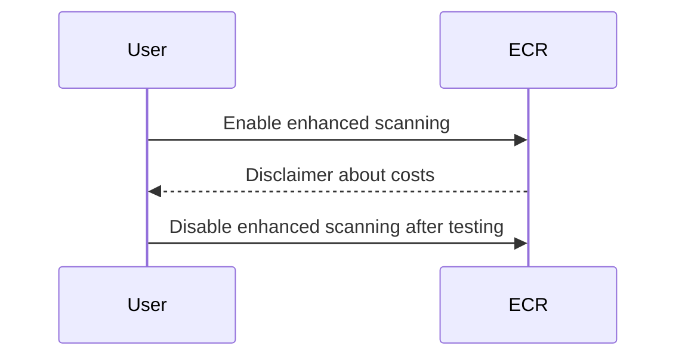
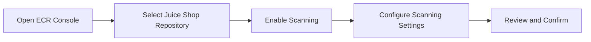

## Introduction to Image Scanning in Docker Repositories

Image scanning is a critical component of DevSecOps practices, ensuring that Docker images are free from vulnerabilities and malicious content before they are deployed into production environments. This process helps organizations maintain the integrity and security of their applications throughout the development lifecycle. In this section, we will delve into configuring automated image security scanning in Amazon Elastic Container Registry (ECR) using enhanced scanning features.

### Background Theory

Docker images are built from layers of files and configurations, which can potentially contain vulnerabilities or malware. These vulnerabilities can range from outdated libraries to known exploits that can be leveraged by attackers. Therefore, it is essential to scan these images for known vulnerabilities and ensure they meet the organization's security policies.

#### What is Image Scanning?

Image scanning involves analyzing Docker images to identify known vulnerabilities, such as those listed in the National Vulnerability Database (NVD), and other potential security issues. This process typically includes:

- **Vulnerability Scanning**: Identifying known vulnerabilities in the base OS, libraries, and dependencies.
- **Malware Detection**: Detecting the presence of malware or unauthorized code within the image.
- **Configuration Compliance**: Ensuring that the image adheres to organizational security policies and best practices.

#### Why is Image Scanning Important?

Image scanning is crucial for several reasons:

- **Security**: It helps in identifying and mitigating known vulnerabilities, reducing the risk of exploitation.
- **Compliance**: Many regulatory requirements mandate regular security assessments of software components.
- **Reliability**: By ensuring that images are free from vulnerabilities, organizations can improve the reliability and stability of their applications.

### Configuring Automated Image Security Scanning in ECR

Amazon Elastic Container Registry (ECR) provides a managed Docker registry service that makes it easy to store, manage, and deploy Docker container images. One of the key features of ECR is its ability to perform automated image security scanning.

#### Setting Up Preview Repository Matches

Before enabling automated scanning, it is important to verify that the correct repositories are being selected. This can be done by setting up preview repository matches.



When you set up preview repository matches, you will see a list of all the repositories that the scanning will match. This is a good feature because it allows you to validate that the right repositories will be selected.

For example, if you have a repository named `Juice Shop`, you can preview the matches to ensure that only this repository is selected.



### Continuous Scanning of Repositories

Once you have validated the repository matches, you can enable continuous scanning of the repositories. This ensures that the images are scanned automatically whenever new images are pushed to the repository.



In the given example, the `Juice Shop` repository is selected for continuous scanning. This means that every time a new image is pushed to this repository, it will be automatically scanned for vulnerabilities.

### Enhanced Scanning with Amazon Inspector

Enhanced scanning in ECR integrates with Amazon Inspector, an AWS service used for security and compliance. Amazon Inspector performs detailed security assessments of your EC2 instances, containers, and other resources.



By enabling enhanced scanning, you can leverage the capabilities of Amazon Inspector to perform more thorough security assessments of your Docker images.

### What is Scanned and How?

The enhanced scanning feature in ECR scans various aspects of the Docker images, including:

- **Operating System Distributions**: Scans for vulnerabilities in the base OS and its packages.
- **Programming Languages**: Scans for vulnerabilities in popular programming languages and their libraries.
- **Dependencies**: Scans for vulnerabilities in the dependencies used in the application.

Here is an example of what the scanning process might look like:



### Cost Considerations

It is important to note that enhanced scanning is not a free service. When you enable it, you will incur additional costs. Therefore, it is recommended to disable the scanning once you are done testing to avoid unnecessary charges.



### Enabling Scanning in ECR

To enable scanning in ECR, follow these steps:

1. **Navigate to the ECR Console**:
   - Open the AWS Management Console and navigate to the ECR service.
   
2. **Select the Repository**:
   - Choose the repository you want to configure for scanning. In this case, it is the `Juice Shop` repository.

3. **Enable Scanning**:
   - Click on the "Scanning" tab and enable the scanning feature.
   - You can choose between basic and enhanced scanning options.

4. **Configure Scanning Settings**:
   - Set up the scanning settings, such as the scan frequency and the repositories to be scanned.

5. **Review and Confirm**:
   - Review the settings and confirm the configuration.

### Example Configuration

Here is an example of how you might configure the scanning settings in ECR:



### Full HTTP Request and Response

When you enable scanning in ECR, the following HTTP request and response might occur:

```http
POST /v2/repository/juice-shop/scanning HTTP/1.1
Host: ecr.amazonaws.com
Authorization: Bearer <token>
Content-Type: application/json

{
  "scanType": "enhanced",
  "repositories": ["juice-shop"],
  "frequency": "continuous"
}
```

Response:

```http
HTTP/1.1 200 OK
Content-Type: application/json

{
  "message": "Scanning enabled for repository juice-shop",
  "scanType": "enhanced",
  "repositories": ["juice-shop"],
  "frequency": "continuous"
}
```

### Detection and Prevention

#### How to Prevent / Defend

To effectively prevent and defend against vulnerabilities in Docker images, you should:

1. **Regularly Update Base Images**: Ensure that the base images used in your Dockerfiles are regularly updated to patch known vulnerabilities.
   
2. **Use Secure Coding Practices**: Implement secure coding practices to minimize the risk of introducing vulnerabilities during development.

3. **Implement Image Scanning**: Regularly scan Docker images for vulnerabilities and malware using tools like ECR enhanced scanning.

4. **Monitor and Audit**: Continuously monitor and audit the images to ensure they remain compliant with organizational security policies.

#### Secure Code Fix Example

Here is an example of a vulnerable Dockerfile and its secure version:

**Vulnerable Dockerfile**:

```dockerfile
FROM ubuntu:18.04
RUN apt-get update && apt-get install -y python3
COPY . /app
WORKDIR /app
CMD ["python3", "app.py"]
```

**Secure Dockerfile**:

```dockerfile
FROM ubuntu:20.04
RUN apt-get update && apt-get install -y python3
COPY . /app
WORKDIR /app
CMD ["python3", "app.py"]
```

In the secure version, the base image has been updated to a more recent version (`ubuntu:20.04`) to reduce the risk of known vulnerabilities.

### Real-World Examples

Recent breaches and CVEs have highlighted the importance of image scanning. For example, the Log4j vulnerability (CVE-2021-44228) affected numerous applications and demonstrated the need for continuous monitoring and scanning of Docker images.

### Hands-On Labs

To practice configuring automated image security scanning in ECR, you can use the following labs:

- **PortSwigger Web Security Academy**: Offers hands-on labs for web application security, including Docker image scanning.
- **OWASP Juice Shop**: Provides a vulnerable web application that can be used to practice securing Docker images.
- **CloudGoat**: Offers a series of labs focused on AWS security, including ECR image scanning.

### Conclusion

Configuring automated image security scanning in ECR is a critical step in maintaining the security and integrity of your Docker images. By leveraging the enhanced scanning features and integrating with Amazon Inspector, you can ensure that your images are free from known vulnerabilities and comply with organizational security policies. Regularly updating base images, implementing secure coding practices, and continuously monitoring and auditing your images are essential steps in defending against potential threats.

---
<!-- nav -->
[[DevSecOps/DevSecOps Bootcamp/06-Container & Kubernetes Security/03-Image Scanning - Build Secure Docker Images/Configure Automated Image Security Scanning in ECR Image Repository/02-Introduction to Image Scanning in Docker Registries|Introduction to Image Scanning in Docker Registries]] | [[DevSecOps/DevSecOps Bootcamp/06-Container & Kubernetes Security/03-Image Scanning - Build Secure Docker Images/Configure Automated Image Security Scanning in ECR Image Repository/00-Overview|Overview]] | [[04-Introduction to Image Scanning in Docker Repositories|Introduction to Image Scanning in Docker Repositories]]
