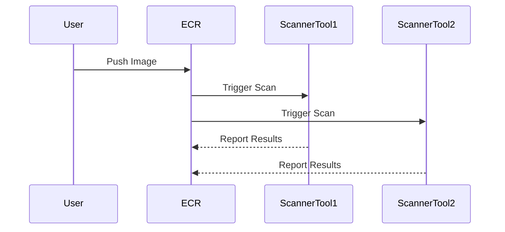
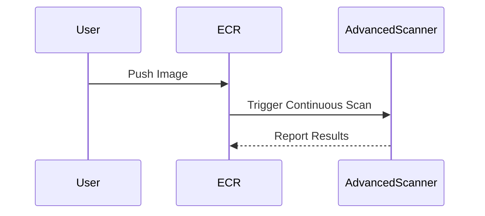

## Introduction to Image Scanning in Docker Repositories

Image scanning is a critical component of DevSecOps practices, ensuring that Docker images are free from vulnerabilities and malicious components before they are deployed into production environments. This process involves using automated tools to analyze Docker images for known vulnerabilities, malware, and other security issues. In the context of Amazon Elastic Container Registry (ECR), two types of scanning are available: Basic Scanning and Enhanced Scanning. Each type offers different levels of coverage and automation, which can significantly impact the security posture of your containerized applications.

### Basic Scanning

Basic Scanning is a free service provided by Amazon ECR. It uses two different scanning tools to provide a comprehensive view of potential vulnerabilities within your Docker images. However, it has some limitations compared to Enhanced Scanning:

- **Coverage**: Basic Scanning provides a more shallow analysis compared to Enhanced Scanning. It may miss deeper vulnerabilities that require more thorough inspection.
- **Automation**: Basic Scanning is triggered either when an image is pushed to the repository or manually initiated. This means that it does not offer continuous monitoring and may not catch new vulnerabilities that arise after the initial scan.

#### How Basic Scanning Works

When an image is pushed to an ECR repository, Basic Scanning automatically triggers a scan using two different tools. These tools analyze the image for known vulnerabilities and report back any findings. The results are stored in the ECR repository and can be accessed via the AWS Management Console or programmatically through the AWS SDK.



#### Real-World Example: CVE-2021-44228 (Log4j)

In December 2021, the Log4j vulnerability (CVE-2021-44228) was discovered, affecting millions of Java applications worldwide. Basic Scanning would have detected this vulnerability if the affected libraries were present in the Docker image at the time of the push. However, if the vulnerability was introduced later, Basic Scanning would not have caught it unless the image was re-scanned manually.

### Enhanced Scanning

Enhanced Scanning is a paid service that provides more comprehensive and continuous monitoring of Docker images. It uses advanced scanning tools to perform deeper analysis, covering a wider range of vulnerabilities and security issues. Enhanced Scanning is particularly useful for large-scale deployments where continuous monitoring is essential.

#### Key Features of Enhanced Scanning

- **Continuous Monitoring**: Enhanced Scanning can be configured to continuously monitor all images in a repository or specific repositories. This ensures that any new vulnerabilities are detected promptly.
- **Deeper Analysis**: Enhanced Scanning uses more sophisticated tools to analyze the operating system, different layers, programming language packages, and other components of the Docker image.
- **Customizable Scanning**: Users can configure Enhanced Scanning to run on all repositories or specific repositories based on their needs.

#### How Enhanced Scanning Works

Enhanced Scanning can be configured to run continuously on all repositories or specific repositories. When enabled, it automatically triggers scans whenever an image is pushed to the repository. The results are stored in the ECR repository and can be accessed via the AWS Management Console or programmatically through the AWS SDK.



#### Real-World Example: CVE-2021-34527 (Apache Tomcat)

In October 2021, a vulnerability (CVE-2021-34527) was discovered in Apache Tomcat, affecting versions 8.5.x, 9.0.x, and 10.0.x. Enhanced Scanning would have detected this vulnerability if the affected versions were present in the Docker image at the time of the push. Additionally, if the vulnerability was introduced later, Enhanced Scanning would have detected it due to its continuous monitoring capabilities.

### Configuring Enhanced Scanning in ECR

To configure Enhanced Scanning in ECR, follow these steps:

1. **Enable Enhanced Scanning**:
   - Navigate to the ECR console.
   - Select the repository where you want to enable Enhanced Scanning.
   - Click on the "Scan" tab.
   - Enable Enhanced Scanning and configure the settings as needed.

2. **Configure Specific Repositories**:
   - If you want to enable Enhanced Scanning for specific repositories, uncheck the "All repositories" option.
   - Add the specific repositories you want to scan.

3. **Define Filters**:
   - You can define filters to match specific repositories using expressions. For example, you can use a filter like `juice-shop` to match repositories containing the string "juice-shop".

#### Example Configuration

Here is an example of how to configure Enhanced Scanning using the AWS CLI:

```bash
aws ecr put-image-scanning-configuration --repository-name my-repo --image-scanning-configuration scanOnPush=true
```

This command enables Enhanced Scanning for the specified repository (`my-repo`) and sets the `scanOnPush` parameter to `true`, meaning that Enhanced Scanning will be triggered whenever an image is pushed to the repository.

### Detection and Prevention

#### Detection

Detection of vulnerabilities in Docker images is crucial for maintaining a secure environment. Enhanced Scanning provides detailed reports of vulnerabilities found in the images. These reports can be accessed via the AWS Management Console or programmatically through the AWS SDK.

#### Prevention

Preventing vulnerabilities in Docker images requires a combination of proactive measures and continuous monitoring. Here are some best practices for preventing vulnerabilities:

1. **Use Secure Base Images**: Always start with a secure base image. Avoid using outdated or vulnerable base images.
2. **Keep Dependencies Updated**: Regularly update dependencies to ensure that you are using the latest and most secure versions.
3. **Implement Security Policies**: Define and enforce security policies for your Docker images. Use tools like Trivy to scan images for vulnerabilities.
4. **Automate Scanning**: Automate the scanning process to ensure that images are continuously monitored for vulnerabilities.

#### Secure Coding Practices

Secure coding practices are essential for preventing vulnerabilities in Docker images. Here are some examples of secure coding practices:

1. **Avoid Hardcoding Secrets**: Never hardcode secrets such as API keys, passwords, or other sensitive information in your Docker images. Use environment variables or secrets management tools instead.
2. **Minimize Privileges**: Run your Docker containers with the least privileges necessary. Avoid running containers as root unless absolutely necessary.
3. **Use Secure Communication Protocols**: Ensure that all communication between containers and external services is encrypted using secure protocols such as HTTPS.

#### Example Vulnerable Code vs. Secure Code

Here is an example of a vulnerable Dockerfile and its secure counterpart:

**Vulnerable Dockerfile**

```Dockerfile
FROM python:3.8-slim
COPY . /app
WORKDIR /app
RUN pip install -r requirements.txt
EXPOSE 8000
CMD ["python", "app.py"]
```

**Secure Dockerfile**

```Dockerfile
FROM python:3.8-slim
COPY . /app
WORKDIR /app
RUN pip install --no-cache-dir -r requirements.txt
EXPOSE 8000
USER appuser
CMD ["python", "app.py"]
```

In the secure Dockerfile, the `--no-cache-dir` flag is used to avoid storing unnecessary files in the image. Additionally, the `USER` directive is used to run the container as a non-root user.

### Conclusion

Image scanning is a critical component of DevSecOps practices, ensuring that Docker images are free from vulnerabilities and malicious components. Enhanced Scanning in Amazon ECR provides more comprehensive and continuous monitoring of Docker images, making it an essential tool for maintaining a secure environment. By following best practices and implementing secure coding practices, you can minimize the risk of vulnerabilities in your Docker images and ensure a secure deployment.

### Practice Labs

For hands-on experience with image scanning in Docker repositories, consider the following practice labs:

- **PortSwigger Web Security Academy**: Offers a series of labs focused on web application security, including Docker image scanning.
- **OWASP Juice Shop**: A deliberately insecure web application for security training. It includes Docker images that can be scanned for vulnerabilities.
- **DVWA (Damn Vulnerable Web Application)**: Another popular web application for security training that includes Docker images for testing and scanning.

These labs provide practical experience with image scanning and help reinforce the concepts covered in this chapter.

---
<!-- nav -->
[[03-Introduction to Image Scanning in Docker Repositories Part 1|Introduction to Image Scanning in Docker Repositories Part 1]] | [[DevSecOps/DevSecOps Bootcamp/06-Container & Kubernetes Security/03-Image Scanning - Build Secure Docker Images/Configure Automated Image Security Scanning in ECR Image Repository/00-Overview|Overview]] | [[05-Introduction to Image Scanning in Docker Part 1|Introduction to Image Scanning in Docker Part 1]]
