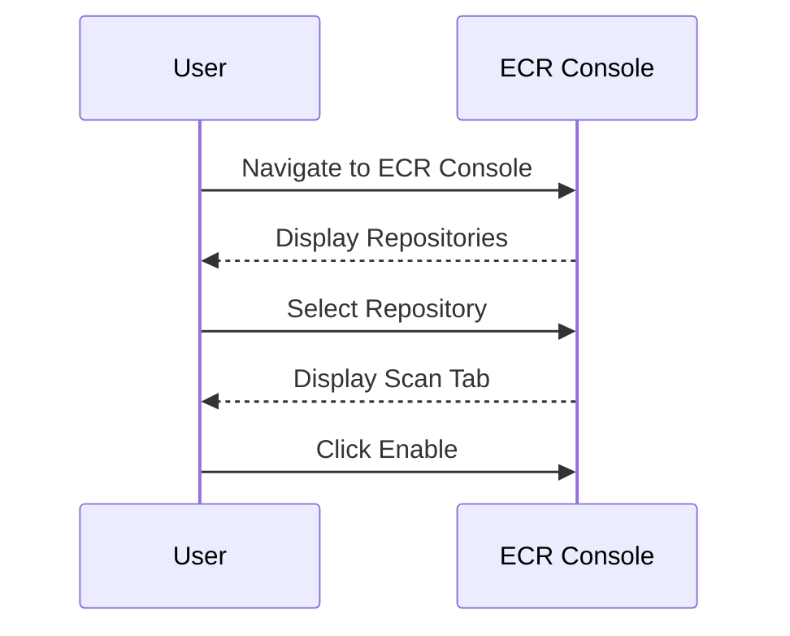
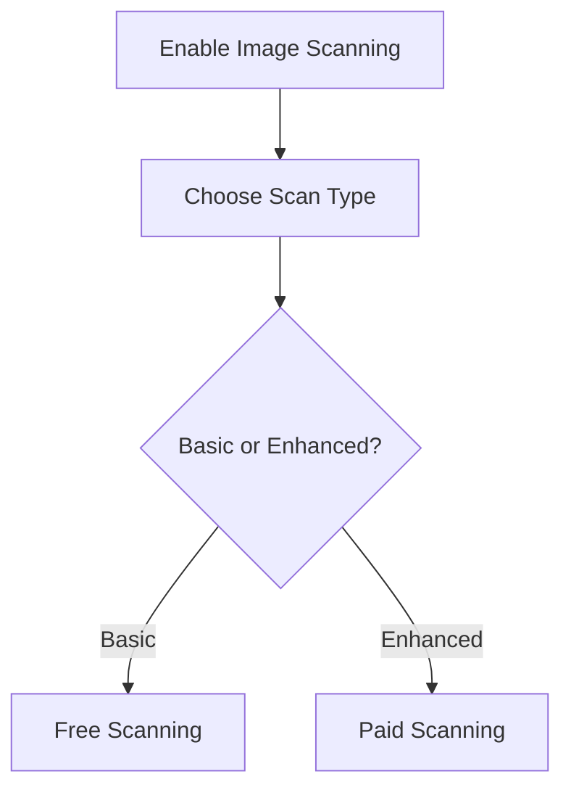
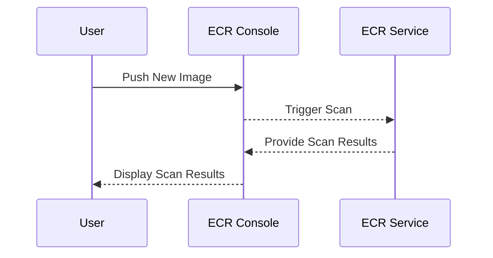

## Introduction to Image Scanning in Docker

### What is Image Scanning?

Image scanning is the process of analyzing Docker images for security vulnerabilities, compliance issues, and other potential risks before they are deployed. This is crucial in a DevSecOps environment, where security is integrated into the development lifecycle. By scanning images at the registry level, organizations can ensure that only secure images are used in their applications.

### Why is Image Scanning Important?

Image scanning helps identify and mitigate security risks early in the development process. Without it, vulnerabilities could be unknowingly deployed into production environments, leading to potential breaches. Recent high-profile breaches such as the Log4j vulnerability (CVE-2021-44228) highlight the importance of proactive security measures.

### How Does Image Scanning Work?

Image scanning tools analyze Docker images for known vulnerabilities, misconfigurations, and other security issues. They typically use a combination of static analysis and dynamic analysis techniques. Static analysis involves examining the contents of the image without executing it, while dynamic analysis involves running the image in a controlled environment to observe its behavior.

### Enabling Registry-Level Image Scanning in ECR

Amazon Elastic Container Registry (ECR) provides built-in support for image scanning. By enabling this feature, you can scan images for vulnerabilities without interfering with the release pipeline. This is particularly useful in a DevSecOps context, where security checks should not slow down the development process.

### Configuring Automated Image Security Scanning in ECR

To configure automated image security scanning in ECR, follow these steps:

1. **Enable Image Scanning**: Navigate to the ECR console and enable image scanning for your repository.
2. **Configure Scan Settings**: Choose whether to perform basic or enhanced scanning. Enhanced scanning provides more detailed results but incurs additional costs.
3. **Monitor Scan Results**: Once enabled, ECR will automatically scan new images pushed to the repository and provide detailed reports.

### Detailed Steps to Enable Image Scanning in ECR

#### Step 1: Enable Image Scanning

Navigate to the ECR console and select the repository where you want to enable image scanning. Click on the "Scan" tab and then click "Enable".



#### Step 2: Configure Scan Settings

After enabling image scanning, you can configure the scan settings. Choose between basic and enhanced scanning. Basic scanning is free and provides a good overview of vulnerabilities, while enhanced scanning provides more detailed results but incurs additional costs.



#### Step 3: Monitor Scan Results

Once image scanning is enabled, ECR will automatically scan new images pushed to the repository. You can monitor the scan results in the ECR console. The results include a list of vulnerabilities, their severity, and recommendations for remediation.



### Real-World Example: Log4j Vulnerability (CVE-2021-44228)

The Log4j vulnerability (CVE-2021-44228) is a prime example of why image scanning is critical. This vulnerability allowed attackers to execute arbitrary code on affected systems. By scanning Docker images for this vulnerability, organizations could identify and patch affected images before deploying them.

### Full Raw HTTP Message Example

When configuring image scanning, you might interact with the ECR API to enable and manage scan settings. Here is an example of a full HTTP request and response for enabling image scanning:

```http
POST /v2/repository-name/tags/tag-name/scan HTTP/1.1
Host: ecr.amazonaws.com
Authorization: Bearer <token>
Content-Type: application/json

{
  "type": "enhanced"
}
```

```http
HTTP/1.1 200 OK
Date: Mon, 20 Mar 2023 12:00:00 GMT
Content-Type: application/json

{
  "status": "enabled",
  "type": "enhanced"
}
```

### Common Pitfalls and How to Avoid Them

#### Pitfall 1: Not Monitoring Scan Results

**What Goes Wrong**: If you enable image scanning but do not monitor the results, vulnerabilities may go unnoticed.

**How to Prevent**: Regularly review scan results and set up alerts for critical vulnerabilities. Integrate scan results into your CI/CD pipeline to fail builds if vulnerabilities are detected.

#### Pitfall 2: Incurring Unnecessary Costs

**What Goes Wrong**: Using enhanced scanning without monitoring costs can lead to unexpected expenses.

**How to Prevent**: Switch to basic scanning once you have identified and addressed initial vulnerabilities. Use cost management tools provided by AWS to monitor and control expenses.

### How to Prevent / Defend

#### Detection

Use ECR's built-in scanning capabilities to detect vulnerabilities. Set up alerts to notify you of critical vulnerabilities.

#### Prevention

1. **Regular Scans**: Perform regular scans to catch new vulnerabilities.
2. **Patch Management**: Keep your base images and dependencies up to date.
3. **Secure Coding Practices**: Follow secure coding practices to minimize vulnerabilities.

#### Secure-Coding Fixes

Here is an example of a vulnerable Dockerfile and its secure version:

**Vulnerable Dockerfile**

```Dockerfile
FROM python:3.8-slim
COPY . /app
WORKDIR /app
RUN pip install --no-cache-dir -r requirements.txt
EXPOSE 8000
CMD ["python", "app.py"]
```

**Secure Dockerfile**

```Dockerfile
FROM python:3.8-slim
COPY requirements.txt /app/
WORKDIR /app
RUN pip install --no-cache-dir -r requirements.txt
COPY . /app
EXPOSE 8000
CMD ["python", "app.py"]
```

### Configuration Hardening

Ensure that your ECR repository is configured securely. Use IAM policies to restrict access to the repository and enable encryption for stored images.

#### IAM Policy Example

```json
{
    "Version": "2012-10-17",
    "Statement": [
        {
            "Effect": "Allow",
            "Action": [
                "ecr:GetDownloadUrlForLayer",
                "ecr:BatchGetImage"
            ],
            "Resource": "*"
        }
    ]
}
```

### Hands-On Labs

To practice image scanning in ECR, consider using the following labs:

- **PortSwigger Web Security Academy**: Offers hands-on labs for web application security, including Docker image scanning.
- **OWASP Juice Shop**: A deliberately insecure web application for practicing security testing, including Docker image scanning.
- **CloudGoat**: Provides scenarios for practicing cloud security, including ECR image scanning.

By following these steps and best practices, you can ensure that your Docker images are scanned for vulnerabilities, helping to maintain a secure and reliable deployment environment.

---
<!-- nav -->
[[04-Introduction to Image Scanning in Docker Repositories|Introduction to Image Scanning in Docker Repositories]] | [[DevSecOps/DevSecOps Bootcamp/06-Container & Kubernetes Security/03-Image Scanning - Build Secure Docker Images/Configure Automated Image Security Scanning in ECR Image Repository/00-Overview|Overview]] | [[06-Introduction to Image Scanning in Docker|Introduction to Image Scanning in Docker]]
