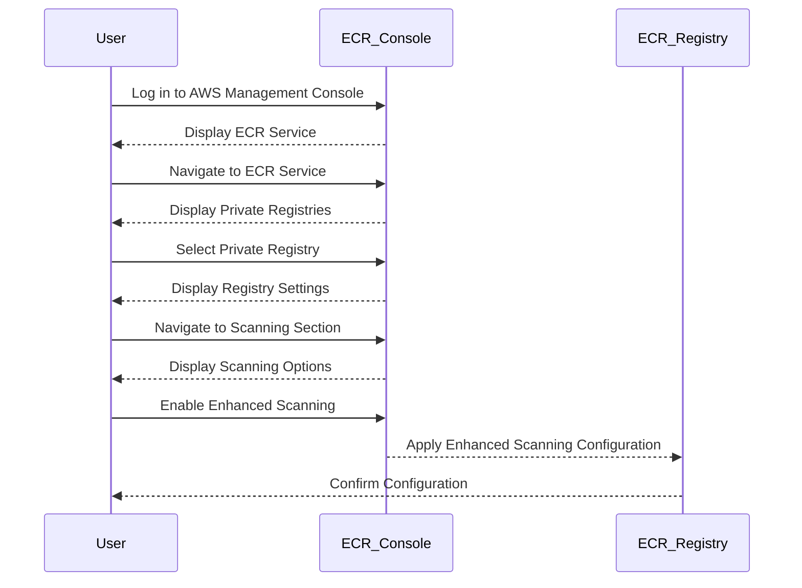
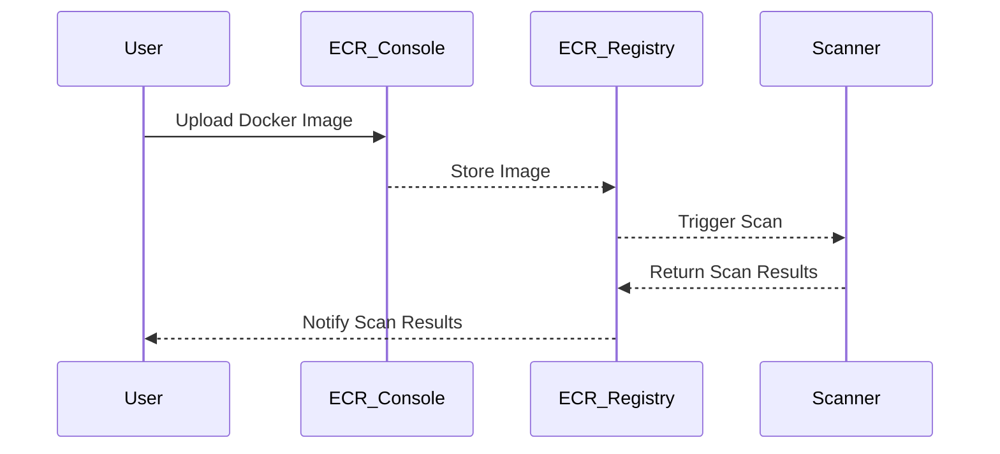
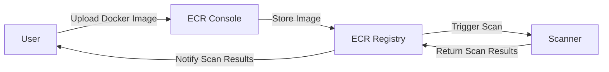

## Introduction to Image Scanning in ECR

In the realm of DevSecOps, ensuring the security of Docker images is paramount. One of the key tools in this process is Amazon Elastic Container Registry (ECR), which provides a managed service for storing and distributing Docker images. ECR offers automated image scanning capabilities to help identify vulnerabilities in your Docker images. This chapter delves into the details of configuring automated image security scanning in an ECR image repository, explaining the concepts, configurations, and best practices involved.

### Background Theory

Before diving into the specifics of ECR image scanning, it's essential to understand the basics of container registries and repositories:

- **Container Registry**: A container registry is a storage service that hosts container images. It acts as a central repository for Docker images. In the context of AWS, the Elastic Container Registry (ECR) is the managed service provided by Amazon for storing Docker images.
  
- **Repository**: A repository within a container registry is a collection of related Docker images. Each repository can contain multiple versions of an image, identified by tags. For instance, in ECR, you might have a repository named `juice-shop` that contains different versions of the Docker image for the Juice Shop application.

### Evolution of ECR Image Scanning

Initially, ECR offered a feature called "Scan on Push," which allowed users to enable automatic scanning of images upon their upload to a specific repository. However, this feature has been deprecated in favor of registry-level scans. The rationale behind this change is to provide a more centralized and consistent approach to image scanning across all repositories within an ECR registry.

#### Deprecation of Repository-Level Scan on Push

The deprecation of the repository-level "Scan on Push" feature means that users can no longer configure scanning settings individually for each repository. Instead, scanning configurations are now managed at the registry level, providing a more unified and scalable solution.

### Configuring Registry-Level Scanning in ECR

To configure automated image security scanning in ECR, you need to navigate to the registry settings and enable the appropriate scanning options. Here’s a step-by-step guide to setting up registry-level scanning:

1. **Navigate to the ECR Console**:
   - Log in to the AWS Management Console.
   - Navigate to the Elastic Container Registry (ECR) service.

2. **Select the Private Registry**:
   - Identify the private registry you wish to configure. Typically, this would be the default ECR registry associated with your AWS account.

3. **Configure Scanning Settings**:
   - Within the registry settings, locate the "Scanning" section.
   - Here, you can enable and configure the scanning options for the entire registry.

### Types of Scans in ECR

ECR offers two types of scans:

- **Basic Scanning**: This type of scan is similar to the deprecated repository-level "Scan on Push" feature. It provides a basic level of vulnerability detection and is suitable for environments where minimal scanning is required.

- **Enhanced Scanning**: This is a more comprehensive form of scanning that provides detailed vulnerability reports and additional insights into the security posture of your Docker images. Enhanced scanning is recommended for most production environments due to its thoroughness and the depth of information it provides.

### Enabling Enhanced Scanning

To enable enhanced scanning in ECR, follow these steps:

1. **Navigate to the Scanning Section**:
   - In the ECR console, go to the "Scanning" section of your private registry.

2. **Enable Enhanced Scing**:
   - Select the "Enhanced Scanning" option.
   - Configure any additional settings as needed, such as specifying the frequency of scans or enabling notifications for scan results.

### Example Configuration

Here is an example of how to configure enhanced scanning via the AWS Management Console:



### Real-World Examples and Recent Breaches

Recent breaches and vulnerabilities have highlighted the importance of robust image scanning practices. For example, the Log4j vulnerability (CVE-2021-44228) affected numerous Docker images, emphasizing the need for continuous scanning and patch management.

#### Example: Log4j Vulnerability

The Log4j vulnerability is a critical security flaw that affects the Apache Log4j logging utility. Many Docker images that included Log4j were vulnerable to remote code execution attacks. By enabling enhanced scanning in ECR, organizations can quickly identify and remediate such vulnerabilities.

### Common Pitfalls and Best Practices

While configuring image scanning in ECR, several common pitfalls should be avoided:

- **Incomplete Scanning Coverage**: Ensure that all repositories and images are included in the scanning process. Overlooking certain repositories can leave your environment exposed to vulnerabilities.

- **Outdated Scanning Definitions**: Regularly update the scanning definitions to ensure that the latest vulnerabilities are detected. Outdated definitions can miss newly discovered threats.

- **Ignoring Scan Results**: Simply enabling scanning is not enough. It is crucial to review and act on the scan results promptly. Ignoring scan results can lead to unpatched vulnerabilities remaining in your environment.

### How to Prevent / Defend

#### Detection

To effectively detect vulnerabilities in your Docker images, follow these steps:

1. **Enable Enhanced Scanning**: Ensure that enhanced scanning is enabled for your ECR registry.
2. **Regularly Review Scan Results**: Set up alerts and notifications to be informed of new scan results. Regularly review these results to identify any vulnerabilities.

#### Prevention

To prevent vulnerabilities from affecting your environment, implement the following measures:

1. **Patch Management**: Maintain a regular patch management process to keep all dependencies and libraries up-to-date.
2. **Secure Coding Practices**: Follow secure coding practices to minimize the introduction of vulnerabilities during development.
3. **Automated Testing**: Integrate automated testing into your CI/CD pipeline to catch vulnerabilities early in the development cycle.

#### Secure-Coding Fixes

Here is an example of a vulnerable Dockerfile and its secure version:

**Vulnerable Dockerfile**:
```Dockerfile
FROM python:3.8-slim
RUN pip install flask==1.1.2
COPY . /app
WORKDIR /app
CMD ["python", "app.py"]
```

**Secure Dockerfile**:
```Dockerfile
FROM python:3.8-slim
RUN pip install --upgrade pip && pip install flask==2.0.1
COPY . /app
WORKDIR /app
CMD ["python", "app.py"]
```

In the secure version, the Flask library is updated to the latest version, which includes security patches.

### Complete Example: Full HTTP Request and Response

When configuring ECR scanning settings via the AWS Management Console, the underlying API calls involve HTTP requests and responses. Here is an example of a complete HTTP request and response for enabling enhanced scanning:

**HTTP Request**:
```http
POST /v2/repository/scan HTTP/1.1
Host: ecr.amazonaws.com
Authorization: Bearer <token>
Content-Type: application/json

{
  "repositoryName": "juice-shop",
  "scanType": "enhanced"
}
```

**HTTP Response**:
```http
HTTP/1.1 200 OK
Content-Type: application/json

{
  "repositoryName": "juice-shop",
  "scanType": "enhanced",
  "status": "enabled"
}
```

### Mermaid Diagrams

#### Sequence Diagram for Scanning Process



#### Architecture Diagram for ECR Scanning



### Hands-On Labs

For practical experience with configuring ECR image scanning, consider the following labs:

- **PortSwigger Web Security Academy**: Offers modules on container security, including hands-on exercises for configuring ECR image scanning.
- **OWASP Juice Shop**: Provides a vulnerable web application that can be used to practice securing Docker images and configuring ECR scanning.
- **CloudGoat**: A cloud security training platform that includes scenarios for configuring and managing ECR image scanning.

By following these guidelines and best practices, you can ensure that your Docker images are scanned regularly and securely, minimizing the risk of vulnerabilities in your environment.

---
<!-- nav -->
[[06-Introduction to Image Scanning in Docker|Introduction to Image Scanning in Docker]] | [[DevSecOps/DevSecOps Bootcamp/06-Container & Kubernetes Security/03-Image Scanning - Build Secure Docker Images/Configure Automated Image Security Scanning in ECR Image Repository/00-Overview|Overview]] | [[DevSecOps/DevSecOps Bootcamp/06-Container & Kubernetes Security/03-Image Scanning - Build Secure Docker Images/Configure Automated Image Security Scanning in ECR Image Repository/08-Practice Questions & Answers|Practice Questions & Answers]]
