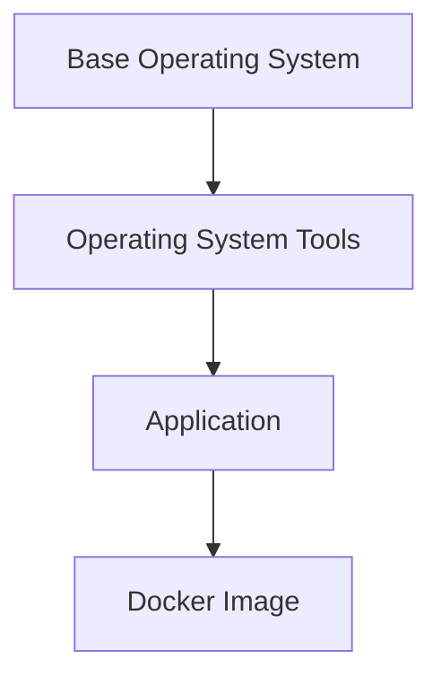
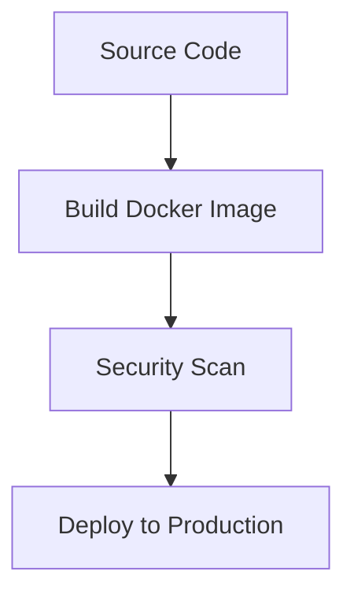

## Introduction to Docker Images and Security

When developing applications, one of the most critical aspects is ensuring that the runtime environment is secure. In the context of modern DevOps practices, Docker images play a pivotal role in packaging applications along with their dependencies into a portable and consistent environment. A Docker image is essentially a lightweight, standalone, executable package that includes everything needed to run a piece of software, including the code, a runtime, libraries, environment variables, and configuration files.

### What is a Docker Image?

A Docker image consists of multiple layers, each representing a specific component of the application environment. These layers are built upon a base operating system layer, followed by additional layers that install necessary tools, libraries, and the application itself. This layered architecture allows for efficient storage and distribution, as changes to the image only affect the relevant layers.

#### Example of a Dockerfile

```Dockerfile
# Use an official Python runtime as a parent image
FROM python:3.8-slim

# Set the working directory in the container
WORKDIR /app

# Copy the current directory contents into the container at /app
COPY . /app

# Install any needed packages specified in requirements.txt
RUN pip install --no-cache-dir -r requirements.txt

# Make port 80 available to the world outside this container
EXPOSE 80

# Define environment variable
ENV NAME World

# Run app.py when the container launches
CMD ["python", "app.py"]
```

### Importance of Secure Docker Images

While the application code itself might be secure, the runtime environment provided by the Docker image can introduce significant security risks. An insecure Docker image can allow attackers to exploit vulnerabilities within the container, leading to unauthorized access, data breaches, and other malicious activities.

#### Real-World Example: CVE-2021-21315

In 2021, a critical vulnerability was discovered in the Docker daemon, identified as CVE-2021-21315. This vulnerability allowed attackers to execute arbitrary code on the host machine by manipulating the `docker` API. This example underscores the importance of securing not just the application code, but also the underlying container environment.

### Why Automated Security Scanning is Essential

Automated security scanning tools can help identify and mitigate potential vulnerabilities in Docker images before they are deployed. These tools analyze the image layers, check for known vulnerabilities in the software components, and provide recommendations for securing the image.

#### How to Prevent / Defend

To ensure the security of Docker images, it is crucial to implement automated security scanning as part of the CI/CD pipeline. This involves integrating tools like Trivy, Clair, or Aqua Security into the build process to scan the images for vulnerabilities.

##### Vulnerable vs. Secure Code Example

**Vulnerable Dockerfile**

```Dockerfile
FROM ubuntu:latest

RUN apt-get update && apt-get install -y \
    curl \
    wget

COPY . /app
WORKDIR /app

CMD ["python", "app.py"]
```

**Secure Dockerfile**

```Dockerfile
FROM ubuntu:20.04

RUN apt-get update && apt-get install -y \
    curl \
    wget \
    && apt-get clean \
    && rm -rf /var/lib/apt/lists/*

COPY . /app
WORKDIR /app

CMD ["python", "app.py"]
```

### Configuring Automated Security Scanning

To configure automated security scanning in your CI/CD pipeline, you can integrate tools like Trivy or Clair. These tools can be run as part of the build process to scan the Docker images for vulnerabilities.

#### Example Using Trivy

Trivy is an open-source tool that scans container images, file systems, and Git repositories for vulnerabilities. To integrate Trivy into your CI/CD pipeline, you can use the following steps:

1. **Install Trivy**: Ensure Trivy is installed in your build environment.
2. **Scan the Docker Image**: Use Trivy to scan the Docker image during the build process.

```bash
# Build the Docker image
docker build -t my-app .

# Scan the Docker image using Trivy
trivy image my-app
```

#### Example Using Clair

Clair is another popular tool for scanning Docker images for vulnerabilities. To integrate Clair into your CI/CD pipeline, you can use the following steps:

1. **Set Up Clair**: Deploy Clair in your environment.
2. **Scan the Docker Image**: Use Clair to scan the Docker image during the build process.

```bash
# Build the Docker image
docker build -t my-app .

# Scan the Docker image using Clair
clair-scanner --app=my-app --image=my-app
```

### Full HTTP Request and Response Example

When integrating security scanning tools into your CI/CD pipeline, you might need to interact with these tools via HTTP requests. Here is an example of how you might send a request to a security scanning service and receive a response.

#### HTTP Request

```http
POST /api/v1/scans HTTP/1.1
Host: scanner.example.com
Content-Type: application/json

{
  "image": "my-app",
  "tool": "trivy"
}
```

#### HTTP Response

```http
HTTP/1.1 200 OK
Content-Type: application/json

{
  "status": "success",
  "results": [
    {
      "vulnerability": "CVE-2021-21315",
      "severity": "critical",
      "description": "Arbitrary code execution in Docker daemon",
      "fix": "Upgrade to Docker version 20.10.7 or later"
    }
  ]
}
```

### Mermaid Diagrams

#### Docker Image Layers



#### CI/CD Pipeline with Security Scanning



### Common Pitfalls and Best Practices

#### Common Pitfalls

1. **Using Outdated Base Images**: Always use the latest stable versions of base images to avoid known vulnerabilities.
2. **Ignoring Security Scanning Results**: Regularly review and address security scanning results to ensure the image remains secure.
3. **Overlooking Configuration Hardening**: Ensure that the Docker image is configured securely, including setting appropriate permissions and disabling unnecessary services.

#### Best Practices

1. **Use Minimal Base Images**: Choose minimal base images to reduce the attack surface.
2. **Regular Updates**: Keep the base images and installed packages up to date with the latest security patches.
3. **Automate Security Scanning**: Integrate security scanning tools into the CI/CD pipeline to catch vulnerabilities early.

### Conclusion

Ensuring the security of Docker images is a critical aspect of modern DevSecOps practices. By understanding the importance of secure Docker images and implementing automated security scanning, you can significantly reduce the risk of vulnerabilities in your application runtime environment. Integrating tools like Trivy or Clair into your CI/CD pipeline can help you maintain a secure and reliable deployment process.

### Hands-On Labs

For practical experience with configuring automated security scanning in Docker images, consider the following labs:

- **PortSwigger Web Security Academy**: Offers hands-on labs for web application security, including Docker image scanning.
- **OWASP Juice Shop**: Provides a vulnerable web application that can be used to practice securing Docker images.
- **CloudGoat**: Focuses on cloud security and includes scenarios for securing Docker images in cloud environments.

By completing these labs, you can gain a deeper understanding of how to build and deploy secure Docker images in a real-world setting.

---
<!-- nav -->
[[DevSecOps/DevSecOps Bootcamp/06-Container & Kubernetes Security/03-Image Scanning - Build Secure Docker Images/Configure Automated Security Scanning in Application Image/00-Overview|Overview]] | [[02-Introduction to Image Scanning in DevSecOps Part 1|Introduction to Image Scanning in DevSecOps Part 1]]
