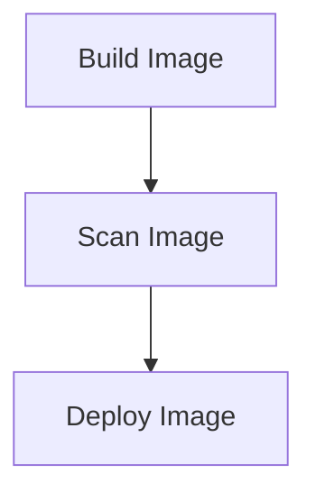

## Introduction to Image Scanning in DevSecOps

In the realm of DevSecOps, ensuring the security of your application images is paramount. One of the key practices in this area is **image scanning**. This process involves analyzing Docker images for vulnerabilities, misconfigurations, and other security issues before deploying them to production environments. By integrating automated security scanning into your CI/CD pipeline, you can catch and address potential security risks early in the development lifecycle, thereby reducing the likelihood of deploying insecure applications.

### Why Image Scanning Matters

Image scanning is crucial for several reasons:

1. **Early Detection of Vulnerabilities**: By scanning images during the build stage, you can identify and fix security issues before they reach production. This helps in preventing potential breaches and data leaks.
   
2. **Compliance Requirements**: Many organizations are subject to regulatory requirements that mandate regular security assessments. Image scanning ensures compliance with these regulations.
   
3. **Reduced Attack Surface**: Insecure images can introduce vulnerabilities that attackers can exploit. By scanning and fixing these issues, you reduce the overall attack surface of your application.

### How Image Scanning Works

Image scanning typically involves the following steps:

1. **Building the Image**: First, the Docker image is built using the `Dockerfile`.
2. **Scanning the Image**: Once the image is built, it is scanned for vulnerabilities using tools such as Trivy, Clair, or Aqua Security.
3. **Analyzing Results**: The scanning tool provides a report detailing any vulnerabilities found in the image.
4. **Deciding Deployment**: Based on the scan results, you can decide whether to proceed with deployment or to fix the identified issues.

### Example Pipeline Configuration

Let's consider an example pipeline configuration using GitLab CI/CD. We'll integrate Trivy for image scanning.

```yaml
stages:
  - build
  - scan
  - deploy

build_image:
  stage: build
  script:
    - docker build -t myapp .
    - docker tag myapp $CI_REGISTRY_IMAGE:$CI_COMMIT_REF_NAME
  artifacts:
    paths:
      - myapp.tar

scan_image:
  stage: scan
  dependencies:
    - build_image
  script:
    - docker pull $CI_REGISTRY_IMAGE:$CI_COMMIT_REF_NAME
    - trivy image --severity CRITICAL,HIGH $CI_REGISTRY_IMAGE:$CI_COMMIT_REF_NAME
  when: manual

deploy_image:
  stage: deploy
  dependencies:
    - scan_image
  script:
    - docker push $CI_REGISTRY_IMAGE:$CI_COMMIT_REF_NAME
```

### Explanation of the Pipeline

- **build_image Job**: This job builds the Docker image and tags it with the current branch name.
- **scan_image Job**: This job pulls the built image and runs Trivy to scan for vulnerabilities. The `--severity` flag specifies that only critical and high severity issues should be reported.
- **deploy_image Job**: This job deploys the image to the Docker registry. It depends on the `scan_image` job to ensure that the image has been scanned.

### Mermaid Diagram of the Pipeline



### Splitting Commands for Better Control

In the given transcript, the lecturer suggests splitting the build and push commands to allow for better control over the scanning process. This means that the image is built first, then scanned, and only if the scan passes, the image is pushed to the repository.

#### Example of Split Commands

```yaml
build_image:
  stage: build
  script:
    - docker build -t myapp .

scan_image:
  stage: scan
  dependencies:
    - build_image
  script:
    - trivy image --severity CRITICAL,HIGH myapp

push_image:
  stage: deploy
  dependencies:
    - scan_image
  script:
    - docker tag myapp $CI_REGISTRY_IMAGE:$CI_COMMIT_REF_NAME
    - docker push $CI_REGISTRY_IMAGE:$CI_COMMIT_REF_NAME
```

### Explanation of Split Commands

- **build_image Job**: Builds the Docker image.
- **scan_image Job**: Scans the built image for vulnerabilities.
- **push_image Job**: Tags and pushes the image to the Docker registry if the scan passes.

### Additional Scanning on Repository Level

The lecturer mentions that scanning is also activated on the ECR (Amazon Elastic Container Registry) repository level. This means that even if the image passes the initial scan in the pipeline, it will undergo another round of scanning once it is pushed to the ECR.

#### Example of ECR Scanning

```yaml
post_push_scan:
  stage: post_push
  dependencies:
    - push_image
  script:
    - aws ecr describe-image-scan-findings --repository-name myrepo --image-id imageTag=$CI_COMMIT_REF_NAME
```

### Explanation of Post-Push Scan

- **post_push_scan Job**: After the image is pushed to the ECR, this job checks the scan findings using the AWS CLI.

### Real-World Examples and Recent CVEs

Recent breaches and vulnerabilities highlight the importance of image scanning. For instance, the Log4j vulnerability (CVE-2021-44228) affected numerous Docker images. By integrating image scanning tools like Trivy, organizations could have detected and mitigated this vulnerability earlier.

#### Example of Trivy Output

```plaintext
2023-07-01T12:00:00Z     INFO    Detecting OS packages in Docker image
2023-07-01T12:00:01Z     INFO    Checking for vulnerabilities...
2023-07-01T12:00:02Z     INFO    Total: 1 (UNKNOWN: 0, LOW: 0, MEDIUM: 0, HIGH: 1, CRITICAL: 0)
2023-07-01T12:00:02Z     INFO    Vulnerable packages found in Docker image
2023-07-01T12:00:02Z     INFO    Package: log4j-1.2.17.jar
2023-07-01T12:00:02Z     INFO    Vulnerability ID: CVE-2021-44228
2023-07-01T12:00:02Z     INFO    Severity: HIGH
```

### How to Prevent / Defend

To effectively prevent and defend against vulnerabilities in Docker images, follow these best practices:

1. **Use Trusted Base Images**: Always start with trusted base images from reputable sources.
2. **Keep Dependencies Updated**: Regularly update dependencies to the latest versions.
3. **Minimize Image Size**: Reduce the size of your images by removing unnecessary files and layers.
4. **Use Security Tools**: Integrate tools like Trivy, Clair, or Aqua Security into your CI/CD pipeline.
5. **Automate Scanning**: Ensure that image scanning is automated and integrated into every build stage.
6. **Review Scan Results**: Regularly review scan results and address any identified vulnerabilities.
7. **Secure Configuration**: Harden the configuration of your Docker images and containers.

#### Example of Secure Dockerfile

```dockerfile
# Vulnerable Dockerfile
FROM python:3.8
COPY . /app
WORKDIR /app
RUN pip install -r requirements.txt
CMD ["python", "app.py"]

# Secure Dockerfile
FROM python:3.8-slim
COPY . /app
WORKDIR /app
RUN pip install --no-cache-dir -r requirements.txt
CMD ["python", "app.py"]
```

### Explanation of Secure Dockerfile

- **Base Image**: Use a slim version of the base image to reduce the size and potential vulnerabilities.
- **No Cache**: Use `--no-cache-dir` to avoid storing unnecessary cache files.
- **Minimal Layers**: Minimize the number of layers to reduce the attack surface.

### Hands-On Labs

For hands-on practice, consider the following labs:

- **PortSwigger Web Security Academy**: Offers comprehensive training on web security, including Docker image scanning.
- **OWASP Juice Shop**: Provides a vulnerable web application for practicing security testing.
- **CloudGoat**: Focuses on cloud security and includes scenarios for securing Docker images.

By following these best practices and integrating image scanning into your CI/CD pipeline, you can significantly enhance the security of your Docker images and reduce the risk of deploying vulnerable applications.

---
<!-- nav -->
[[DevSecOps/DevSecOps Bootcamp/06-Container & Kubernetes Security/03-Image Scanning - Build Secure Docker Images/Configure Automated Security Scanning in Application Image/01-Introduction to Docker Images and Security|Introduction to Docker Images and Security]] | [[DevSecOps/DevSecOps Bootcamp/06-Container & Kubernetes Security/03-Image Scanning - Build Secure Docker Images/Configure Automated Security Scanning in Application Image/00-Overview|Overview]] | [[03-Introduction to Image Scanning in DevSecOps Part 2|Introduction to Image Scanning in DevSecOps Part 2]]
