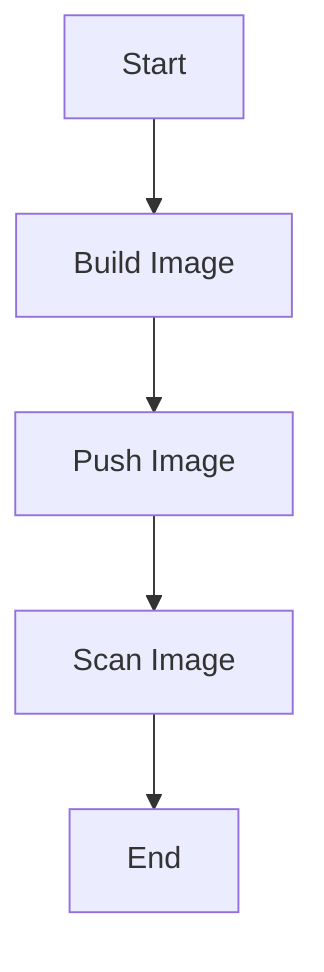

## Introduction to Image Scanning in DevSecOps

In the realm of DevSecOps, ensuring the security of Docker images is paramount. This involves automating the process of scanning Docker images for vulnerabilities and ensuring that the images are built securely. In this section, we will delve into the details of configuring automated security scanning in application images, focusing on the use of Docker, AWS CLI, and Trivy.

### Why Automate Security Scanning?

Automating security scanning is crucial for several reasons:

1. **Consistency**: Manual processes are prone to errors and inconsistencies. Automation ensures that the same checks are performed consistently across all builds.
2. **Speed**: Automated scans can be integrated into the CI/CD pipeline, allowing for quick feedback on the security status of the images.
3. **Compliance**: Many organizations are required to comply with specific security standards. Automated scanning helps ensure that these standards are met.
4. **Early Detection**: By scanning images early in the development cycle, potential issues can be identified and addressed before they become critical.

### Tools Used

The tools mentioned in the transcript are:

- **Docker**: A platform for building, shipping, and running applications in containers.
- **AWS CLI**: The Amazon Web Services Command Line Interface, which allows users to interact with AWS services.
- **Trivy**: An open-source vulnerability scanner for containers, which supports various package managers and operating systems.

### Setting Up the Environment

To set up the environment for automated security scanning, we need to configure the Docker executor and install the necessary tools. Let's break down the steps involved.

#### Installing Docker and AWS CLI

First, we need to install Docker and AWS CLI. These are general-purpose tools that might be needed in multiple jobs, and they are installed via the package manager.

```bash
# Install Docker
sudo apt-get update
sudo apt-get install -y docker.io

# Install AWS CLI
pip install awscli
```

#### Using Docker-in-Docker (DinD)

Docker-in-Docker (DinD) is a setup where a Docker daemon runs inside a container. This is useful for scenarios where you need to build Docker images within a CI/CD pipeline.

```yaml
services:
  - docker:dind

before_script:
  - docker info
```

### Configuring Shared Runner with Docker Image

Instead of registering a Docker executor on a managed runner, we opt for a shared runner using a Docker image. This approach simplifies the setup and reduces dependency on the underlying runner.

#### Copying Previous Configuration

We reuse a previous configuration where Docker-in-Docker was used along with AWS CLI installation.

```yaml
image: docker:latest

services:
  - docker:dind

before_script:
  - docker info
  - pip install awscli
  - pip install trivy
```

### Installing AWS CLI and Trivy

Next, we install AWS CLI and Trivy inside the Docker image.

```bash
# Install AWS CLI
pip install awscli

# Install Trivy
pip install trivy
```

### Executing the Scanning Process

Once the environment is set up, we proceed to execute the scanning process. The first step is to pull the Docker image.

#### Logging into the Registry

Before pulling the image, we need to log in to the Docker registry.

```bash
docker login -u <username> -p <password> <registry-url>
```

#### Pulling the Docker Image

We pull the latest image or the image with the commit hash from the previous job.

```bash
docker pull <registry-url>/<image-name>:<commit-hash>
```

### Example of Full Pipeline Configuration

Here is a complete example of a GitLab CI/CD pipeline configuration that includes the steps described above.

```yaml
stages:
  - build
  - scan

build_image:
  stage: build
  image: docker:latest
  services:
    - docker:dind
  script:
    - docker info
    - docker build -t my-image .
    - docker tag my-image $CI_REGISTRY_IMAGE:$CI_COMMIT_SHORT_SHA
    - docker push $CI_REGISTRY_IMAGE:$CI_COMMIT_SHORT_SHA

scan_image:
  stage: scan
  image: docker:latest
  services:
    - docker:dind
  before_script:
    - docker info
    - pip install awscli
    - pip install trivy
  script:
    - docker login -u $CI_REGISTRY_USER -p $CI_REGISTRY_PASSWORD $CI_REGISTRY
    - docker pull $CI_REGISTRY_IMAGE:$CI_COMMIT_SHORT_SHA
    - trivy image $CI_REGISTRY_IMAGE:$CI_COMMIT_SHORT_SHA
```

### Mermaid Diagram of the Pipeline

A visual representation of the pipeline can help understand the flow better.



### Common Pitfalls and How to Avoid Them

#### Dependency on Underlying Runner

One common pitfall is becoming too dependent on the underlying runner. To avoid this, use shared runners and Docker-in-Docker setups.

#### Incorrect Installation of Tools

Ensure that tools like AWS CLI and Trivy are correctly installed. Use package managers and verify installations.

#### Vulnerabilities in Base Images

Base images can contain vulnerabilities. Always scan base images and use trusted sources.

### How to Prevent / Defend

#### Detection

Use tools like Trivy to scan images for vulnerabilities. Integrate these scans into your CI/CD pipeline.

#### Prevention

1. **Secure Base Images**: Use trusted base images and regularly update them.
2. **Least Privilege Principle**: Ensure that the Docker daemon and other services run with the least privileges necessary.
3. **Regular Updates**: Keep all tools and dependencies up to date.

#### Secure Coding Fixes

Compare the vulnerable and secure versions of the Dockerfile.

**Vulnerable Version:**

```Dockerfile
FROM ubuntu:latest
RUN apt-get update && apt-get install -y curl
```

**Secure Version:**

```Dockerfile
FROM ubuntu:20.04
RUN apt-get update && apt-get install -y curl
```

### Real-World Examples

#### Recent CVEs and Breaches

- **CVE-2021-2136**: A vulnerability in Docker that allowed unauthorized access to the Docker daemon.
- **Breaches involving Docker**: Several high-profile breaches have been linked to misconfigured Docker daemons.

### Hands-On Labs

For practical experience, consider the following labs:

- **PortSwigger Web Security Academy**: Offers hands-on labs for web application security.
- **OWASP Juice Shop**: A deliberately insecure web application for security training.
- **DVWA**: Damn Vulnerable Web Application for learning web security.
- **WebGoat**: An interactive web security training application.

These labs provide real-world scenarios and challenges to enhance your skills in securing Docker images.

### Conclusion

Automating security scanning in Docker images is essential for maintaining the integrity and security of your applications. By following the steps outlined in this chapter, you can ensure that your Docker images are built securely and scanned regularly for vulnerabilities.

---
<!-- nav -->
[[03-Introduction to Image Scanning in DevSecOps Part 2|Introduction to Image Scanning in DevSecOps Part 2]] | [[DevSecOps/DevSecOps Bootcamp/06-Container & Kubernetes Security/03-Image Scanning - Build Secure Docker Images/Configure Automated Security Scanning in Application Image/00-Overview|Overview]] | [[05-Introduction to Image Scanning in DevSecOps Part 4|Introduction to Image Scanning in DevSecOps Part 4]]
