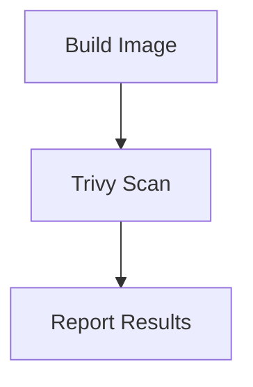

## Configuring Automated Security Scanning in Application Image

To configure automated security scanning using Trivy, we need to integrate it into our CI/CD pipeline. This involves setting up a job that waits for the build image job to complete and then runs the Trivy scan.

### Adding Dependency in the CI/CD Pipeline

When configuring jobs in a CI/CD pipeline, it is crucial to define dependencies between jobs. In this context, we want the Trivy job to wait for the build image job to complete before executing.

#### Example Configuration in GitHub Actions

```yaml
jobs:
  build-image:
    runs-on: ubuntu-latest
    steps:
      - name: Checkout code
        uses: actions/checkout@v2
      - name: Build Docker image
        run: docker build -t myapp .

  trivy-scan:
    needs: build-image
    runs-on: ubuntu-latest
    steps:
      - name: Checkout code
        uses: actions/checkout@v2
      - name: Run Trivy scan
        run: |
          trivy image --severity CRITICAL,HIGH myapp
```

In this example, the `trivy-scan` job depends on the `build-image` job. The `needs` keyword ensures that the `trivy-scan` job waits for the `build-image` job to complete.

### Setting Up the Job Execution Environment

The job execution environment must have the necessary tools installed to perform the Trivy scan. Specifically, we need Trivy, Docker, and AWS CLI installed.

#### Installing Trivy

Trivy can be installed via package managers or downloaded directly from the GitHub releases page. Here’s an example of installing Trivy using `curl`:

```sh
curl -sfL https://raw.githubusercontent.com/aquasecurity/trivy/main/install.sh | sh -s -- -b /usr/local/bin v0.26.1
```

#### Installing Docker

Docker can be installed using the official installation scripts provided by Docker. Here’s an example for Ubuntu:

```sh
sudo apt-get update
sudo apt-get install -y docker.io
```

#### Installing AWS CLI

AWS CLI can be installed using pip:

```sh
pip install awscli
```

### Pulling the Image from ECR

Before running the Trivy scan, we need to pull the Docker image from Amazon Elastic Container Registry (ECR). This requires logging into the ECR repository using the AWS CLI.

#### Logging into ECR

```sh
aws ecr get-login-password --region us-west-2 | docker login --username AWS --password-stdin <account-id>.dkr.ecr.us-west-2.amazonaws.com
```

#### Pulling the Image

```sh
docker pull <account-id>.dkr.ecr.us-west-2.amazonaws.com/myapp
```

### Running the Trivy Scan

Once the image is pulled, we can run the Trivy scan. Here’s an example command:

```sh
trivy image --severity CRITICAL,HIGH myapp
```

This command scans the `myapp` image for critical and high severity vulnerabilities.

### Using Docker Executor

To avoid dependency on the runner configuration, it is recommended to use a Docker executor. This ensures that the job execution environment is consistent and isolated.

#### Example Dockerfile for Job Executor

```Dockerfile
FROM ubuntu:latest

RUN apt-get update && apt-get install -y \
    curl \
    python3-pip \
    docker.io

RUN pip install awscli
RUN curl -sfL https://raw.githubusercontent.com/aquasecurity/trivy/main/install.sh | sh -s -- -b /usr/local/bin v0.26.1

CMD ["bash"]
```

This Dockerfile sets up an environment with Trivy, Docker, and AWS CLI installed.

### Complete CI/CD Pipeline Configuration

Here’s a complete example of a CI/CD pipeline configuration using GitHub Actions:

```yaml
name: CI/CD Pipeline

on:
  push:
    branches:
      - main

jobs:
  build-image:
    runs-on: ubuntu-latest
    steps:
      - name: Checkout code
        uses: actions/checkout@v2
      - name: Build Docker image
        run: docker build -t myapp .

  trivy-scan:
    needs: build-image
    runs-on: ubuntu-latest
    container:
      image: my-custom-executor-image
    steps:
      - name: Checkout code
        uses: actions/checkout@v2
      - name: Login to ECR
        run: |
          aws ecr get-login-password --region us-west-2 | docker login --username AWS --password-stdin <account-id>.dkr.ecr.us-west-2.amazonaws.com
      - name: Pull Docker image
        run: docker pull <account-id>.dkr.ecr.us-west-2.amazonaws.com/myapp
      - name: Run Trivy scan
        run: trivy image --severity CRITICAL,HIGH myapp
```

### Mermaid Diagram for CI/CD Pipeline



### Real-World Examples and Recent CVEs

Recent vulnerabilities in Docker images have highlighted the importance of image scanning. For example, CVE-2021-44228 (Log4Shell) affected many Docker images, emphasizing the need for regular scanning.

### Pitfalls and Common Mistakes

- **Ignoring Low Severity Issues**: While critical and high severity issues should be prioritized, low severity issues should not be ignored as they can be chained together to create more severe vulnerabilities.
- **Manual Installation**: Manually installing tools on the runner can lead to inconsistencies and maintenance overhead. Using a Docker executor is recommended.
- **Incomplete Scanning**: Ensure that all layers of the Docker image are scanned, not just the final layer.

### How to Prevent / Defend

#### Detection

Regularly scan Docker images using tools like Trivy. Integrate these scans into the CI/CD pipeline to ensure that vulnerabilities are detected early.

#### Prevention

- **Use Secure Base Images**: Choose base images that are regularly updated and maintained.
- **Minimize Image Size**: Smaller images reduce the attack surface.
- **Patch Management**: Keep all packages and dependencies up-to-date.

#### Secure Coding Fixes

**Vulnerable Code**

```Dockerfile
FROM python:3.8-slim
COPY . /app
WORKDIR /app
RUN pip install -r requirements.txt
CMD ["python", "app.py"]
```

**Secure Code**

```Dockerfile
FROM python:3.8-slim
COPY requirements.txt /app/
WORKDIR /app
RUN pip install --no-cache-dir -r requirements.txt
COPY . /app
CMD ["python", "app.py"]
```

#### Configuration Hardening

Ensure that the Docker daemon and containers are configured securely. Use tools like `docker-bench-security` to audit your Docker setup.

### Conclusion

Integrating automated security scanning into the CI/CD pipeline is essential for maintaining the security of Docker images. By following best practices and using tools like Trivy, organizations can detect and mitigate vulnerabilities early in the development lifecycle.

### Practice Labs

- **PortSwigger Web Security Academy**: Offers hands-on labs for web application security.
- **OWASP Juice Shop**: A deliberately insecure web application for practicing security skills.
- **DVWA (Damn Vulnerable Web Application)**: Another popular web application for security training.

These labs provide practical experience in securing Docker images and integrating security into the CI/CD pipeline.

---
<!-- nav -->
[[DevSecOps/DevSecOps Bootcamp/06-Container & Kubernetes Security/03-Image Scanning - Build Secure Docker Images/Configure Automated Security Scanning in Application Image/07-Introduction to Image Scanning in DevSecOps|Introduction to Image Scanning in DevSecOps]] | [[DevSecOps/DevSecOps Bootcamp/06-Container & Kubernetes Security/03-Image Scanning - Build Secure Docker Images/Configure Automated Security Scanning in Application Image/00-Overview|Overview]] | [[09-Image Scanning - Build Secure Docker Images|Image Scanning - Build Secure Docker Images]]
