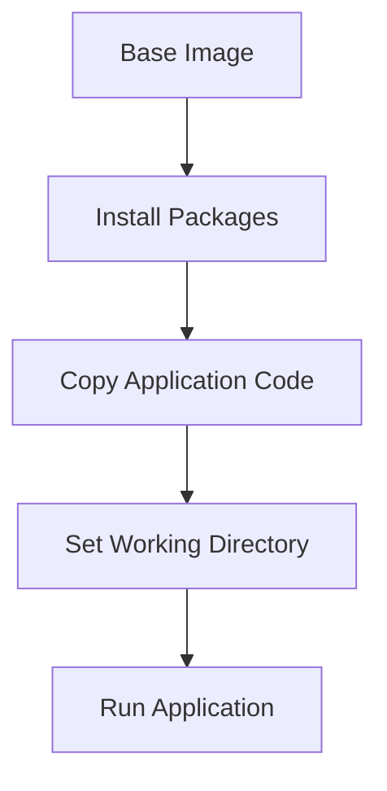

## Excluding Unnecessary Content

### Background Theory

When building a Docker image, it is important to exclude unnecessary content to keep the image size small and secure. This includes auto-generated folders, build artifacts, and other files that are not needed to run the application.

### Why Exclude Unnecessary Content?

1. **Reduce Image Size**: By excluding unnecessary content, you can significantly reduce the size of the Docker image. This leads to faster downloads and less storage usage.

2. **Improve Security**: Smaller images have fewer potential vulnerabilities. By removing unnecessary files, you reduce the attack surface of your application.

### Real-World Examples

Many applications generate build artifacts and temporary files that are not needed in the final image. For example:

- **Build Artifacts**: Auto-generated folders like `target` or `build` are typically not needed in the final image.
- **Configuration Files**: Files like `.gitignore` or `.DS_Store` are not needed in the final image.

### How to Exclude Unnecessary Content

To exclude unnecessary content, you can use a `.dockerignore` file. This file specifies which files and directories should be ignored when building the Docker image.

### Creating a `.dockerignore` File

Here is an example of a `.dockerignore` file:

```
# Ignore the following files and directories
/target
/build
/.git
/.DS_Store
```

### How to Prevent / Defend

**Detection**:
- Use tools like `hadolint` to check your Dockerfile and `.dockerignore` file for best practices.
- Regularly review your `.dockerignore` file to ensure it is up-to-date and covers all unnecessary content.

**Prevention**:
- Always include a `.dockerignore` file in your project.
- Regularly update the `.dockerignore` file to reflect changes in your project structure.

### Code Example

Here is a complete example of a Dockerfile and `.dockerignore` file:

**Dockerfile**

```Dockerfile
# Use the latest version of Alpine Linux as the base image
FROM alpine:latest

# Install necessary packages
RUN apk add --no-cache python3

# Copy the application code into the container
COPY . /app

# Set the working directory
WORKDIR /app

# Run the application
CMD ["python3", "app.py"]
```

**.dockerignore**

```
# Ignore the following files and directories
/target
/build
/.git
/.DS_Store
```

### Mermaid Diagram

A simple diagram showing the layers of a Docker image built with a `.dockerignore` file:



---
<!-- nav -->
[[DevSecOps/DevSecOps Bootcamp/06-Container & Kubernetes Security/03-Image Scanning - Build Secure Docker Images/Docker Security Best Practices/02-Choosing the Right Docker Image|Choosing the Right Docker Image]] | [[DevSecOps/DevSecOps Bootcamp/06-Container & Kubernetes Security/03-Image Scanning - Build Secure Docker Images/Docker Security Best Practices/00-Overview|Overview]] | [[DevSecOps/DevSecOps Bootcamp/06-Container & Kubernetes Security/03-Image Scanning - Build Secure Docker Images/Docker Security Best Practices/04-Handling Build-Time Dependencies|Handling Build-Time Dependencies]]
