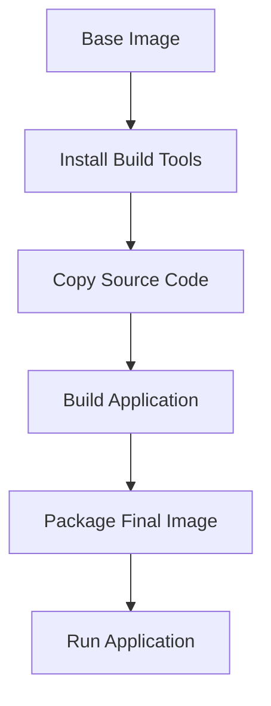

## Handling Build-Time Dependencies

### Background Theory

Sometimes, you may need certain files or directories during the build process, but they are not required in the final image. For example, you might need a build script or a set of dependencies to compile your application, but these are not needed once the application is compiled.

### Why Handle Build-Time Dependencies?

1. **Optimize Image Size**: By separating build-time dependencies from runtime dependencies, you can further reduce the size of the final image.
   
2. **Improve Security**: Removing unnecessary files from the final image reduces the attack surface.

### Real-World Examples

Consider a scenario where you need to compile a C++ application. You might need a compiler and development libraries during the build process, but these are not needed in the final image.

### How to Handle Build-Time Dependencies

One approach is to use multi-stage builds. In a multi-stage build, you can use one stage to build your application and another stage to package the final image.

### Multi-Stage Builds

Here is an example of a multi-stage build:

**Dockerfile**

```Dockerfile
# Stage 1: Build the application
FROM alpine:latest AS builder

# Install necessary build tools
RUN apk add --no-cache gcc g++

# Copy the source code and build the application
COPY src /src
WORKDIR /src
RUN make

# Stage 2: Package the final image
FROM alpine:latest

# Copy the compiled binary from the builder stage
COPY --from=builder /src/app /app

# Set the working directory
WORKDIR /app

# Run the application
CMD ["./app"]
```

### How to Prevent / Defend

**Detection**:
- Use tools like `hadolint` to check your Dockerfile for best practices.
- Regularly review your Dockerfile to ensure it is optimized and secure.

**Prevention**:
- Always use multi-stage builds when possible to separate build-time dependencies from runtime dependencies.
- Regularly update your Dockerfile to reflect changes in your project structure.

### Code Example

Here is a complete example of a multi-stage build Dockerfile:

**Dockerfile**

```Dockerfile
# Stage 1: Build the application
FROM alpine:latest AS builder

# Install necessary build tools
RUN apk add --no-cache gcc g++

# Copy the source code and build the application
COPY src /src
WORKDIR /src
RUN make

# Stage 2: Package the final image
FROM alpine:latest

# Copy the compiled binary from the builder stage
COPY --from=builder /src/app /app

# Set the working directory
WORKDIR /app

# Run the application
CMD ["./app"]
```

### Mermaid Diagram

A simple diagram showing the stages of a multi-stage build:



---
<!-- nav -->
[[DevSecOps/DevSecOps Bootcamp/06-Container & Kubernetes Security/03-Image Scanning - Build Secure Docker Images/Docker Security Best Practices/03-Excluding Unnecessary Content|Excluding Unnecessary Content]] | [[DevSecOps/DevSecOps Bootcamp/06-Container & Kubernetes Security/03-Image Scanning - Build Secure Docker Images/Docker Security Best Practices/00-Overview|Overview]] | [[DevSecOps/DevSecOps Bootcamp/06-Container & Kubernetes Security/03-Image Scanning - Build Secure Docker Images/Docker Security Best Practices/05-Multi-Stage Builds in Docker|Multi-Stage Builds in Docker]]
