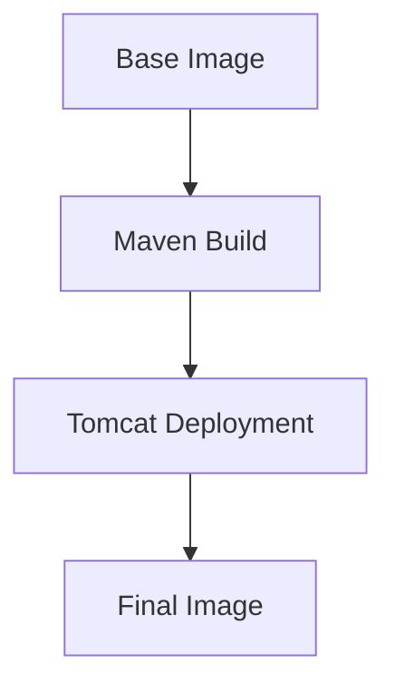

## Multi-Stage Builds in Docker

### Introduction to Multi-Stage Builds

Multi-stage builds in Docker allow you to use multiple temporary images during the build process, but retain only the final image as the output. This approach is particularly useful for reducing the size of your final Docker image and improving security by separating build-time dependencies from runtime dependencies.

#### Example Dockerfile with Two Build Stages

Let's consider an example Dockerfile that demonstrates a multi-stage build:

```Dockerfile
# Stage 1: Build the Java application using Maven
FROM maven:3.8.1-jdk-11 AS build
WORKDIR /workspace
COPY pom.xml .
RUN mvn dependency:resolve
COPY src ./src
RUN mvn package -DskipTests

# Stage 2: Create the final application image using Tomcat
FROM tomcat:9.0-jdk11-openjdk
COPY --from=build /workspace/target/myapp.jar /usr/local/tomcat/webapps/
```

In this example, we have two stages:

1. **Build Stage**: Uses the `maven:3.8.1-jdk-11` image to compile a Java application using Maven.
2. **Final Application Stage**: Uses the `tomcat:9.0-jdk11-openjdk` image to deploy the compiled application.

### How Multi-Stage Builds Work

During the build process, Docker creates intermediate images for each stage. However, only the final image is retained as the output. This means that all the tools and dependencies used in the build stage are discarded, resulting in a smaller and more secure final image.

#### Layers in Docker Images

In Docker, each command in the Dockerfile creates a new layer in the image. These layers are stacked on top of each other to form the final image. In our example, the final two commands (`COPY --from=build ...`) create the layers of the final image.



### Benefits of Multi-Stage Builds

1. **Reduced Image Size**: By discarding unnecessary build-time dependencies, the final image is smaller and more efficient.
2. **Improved Security**: Separating build-time and runtime dependencies reduces the attack surface of the final image.
3. **Easier Maintenance**: Multi-stage builds make it easier to manage and update dependencies.

### Real-World Examples

Consider a scenario where a Docker image was built without separating build-time and runtime dependencies. This could lead to a large image with unnecessary tools and libraries, increasing the risk of vulnerabilities. For instance, a recent CVE (CVE-2021-44228) exploited a log4j vulnerability in a Java application. If the Docker image included the entire development environment, the risk would be higher.

### How to Prevent / Defend

To ensure secure Docker images, follow these best practices:

1. **Use Multi-Stage Builds**: Always use multi-stage builds to separate build-time and runtime dependencies.
2. **Minimize Privileges**: Avoid running containers with root privileges. Instead, use a non-root user.
3. **Regular Updates**: Keep your base images and dependencies up-to-date to mitigate known vulnerabilities.

#### Secure Coding Fix

Here is an example of a Dockerfile with a non-root user:

```Dockerfile
# Stage 1: Build the Java application using Maven
FROM maven:3.8.1-jdk-11 AS build
WORKDIR /workspace
COPY pom.xml .
RUN mvn dependency:resolve
COPY src ./src
RUN mvn package -DskipTests

# Stage 2: Create the final application image using Tomcat
FROM tomcat:9.0-jdk11-openjdk
USER 1000
COPY --from=build /workspace/target/myapp.jar /usr/local/tomcat/webapps/
```

In this example, the `USER 1000` command ensures that the container runs as a non-root user.

### Detection and Prevention

To detect and prevent insecure Docker images, use tools like Trivy, Clair, or Aqua Security. These tools can scan Docker images for known vulnerabilities and provide recommendations for securing the images.

#### Example Scan Output

```plaintext
$ trivy image myapp:latest
2023-09-25T12:00:00Z    INFO    Completed in 1.234567890s
myapp:latest (b7d9c22)
Total: 1 (UNKNOWN: 0, LOW: 0, MEDIUM: 0, HIGH: 1, CRITICAL: 0)

+--------------------------+-------------------+----------+-----------------------------+--------------------------------------+
|      LIBRARY             |    VULNERABILITY   | SEVERITY |         DESCRIPTION         |                FIXED IN              |
+--------------------------+-------------------+----------+-----------------------------+--------------------------------------+
| log4j                    | CVE-2021-44228     | HIGH     | Apache Log4j2 JNDI features | 2.15.0                               |
+--------------------------+-------------------+----------+-----------------------------+--------------------------------------+
```

This output shows that the image contains a high-severity vulnerability in the `log4j` library. To fix this, update the `log4j` dependency to the latest version.

### Hands-On Labs

For hands-on practice with Docker security, consider the following labs:

- **PortSwigger Web Security Academy**: Offers a comprehensive set of labs covering various aspects of web security, including Docker security.
- **OWASP Juice Shop**: A deliberately insecure web application for security training. It includes Docker-based challenges.
- **Kubernetes Goat**: A series of Kubernetes security challenges that involve building and securing Docker images.

By following these best practices and using the appropriate tools, you can build secure Docker images that minimize the risk of vulnerabilities and attacks.

### Conclusion

Multi-stage builds in Docker are a powerful technique for creating smaller and more secure images. By separating build-time and runtime dependencies, you reduce the attack surface and improve the overall security posture of your applications. Always use non-root users and regularly update your dependencies to stay ahead of potential vulnerabilities.

---
<!-- nav -->
[[DevSecOps/DevSecOps Bootcamp/06-Container & Kubernetes Security/03-Image Scanning - Build Secure Docker Images/Docker Security Best Practices/04-Handling Build-Time Dependencies|Handling Build-Time Dependencies]] | [[DevSecOps/DevSecOps Bootcamp/06-Container & Kubernetes Security/03-Image Scanning - Build Secure Docker Images/Docker Security Best Practices/00-Overview|Overview]] | [[DevSecOps/DevSecOps Bootcamp/06-Container & Kubernetes Security/03-Image Scanning - Build Secure Docker Images/Docker Security Best Practices/06-Selecting Lightweight Base Images|Selecting Lightweight Base Images]]
