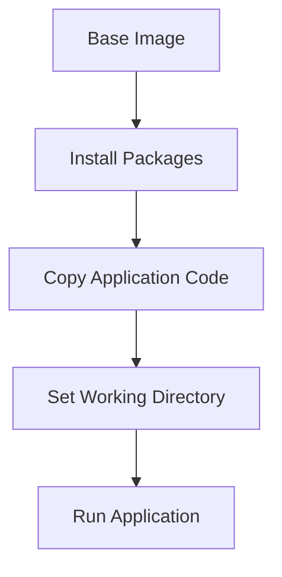

## Selecting Lightweight Base Images

### Background Theory

When building Docker images, selecting the appropriate base image is crucial for ensuring both security and efficiency. A base image is the starting point for your Dockerfile, and it contains the foundational components necessary to run your application. One of the most common and lightweight base images is Alpine Linux.

Alpine Linux is a minimalistic Linux distribution designed for embedded systems and containers. It uses musl libc and BusyBox, which results in a very small footprint compared to other distributions like Ubuntu or Debian. This makes Alpine an excellent choice for Docker images, as it reduces the overall size of the image and minimizes the potential attack surface.

### Why Choose Alpine Linux?

1. **Smaller Footprint**: Alpine images are significantly smaller than their counterparts. For example, the `alpine:latest` image is around 5 MB, whereas `ubuntu:latest` is around 70 MB. This reduction in size means faster downloads and less storage usage.
   
2. **Security**: Smaller images mean fewer packages and dependencies, reducing the number of potential vulnerabilities. Additionally, Alpine uses a package manager called `apk`, which is designed to be secure and efficient.

3. **Compatibility**: Alpine is compatible with most applications and can be used as a drop-in replacement for larger distributions in many cases.

### Real-World Examples

Recent breaches and vulnerabilities often stem from using large, bloated base images that contain unnecessary packages and services. For instance:

- **CVE-2021-21315**: This vulnerability affected several Linux distributions, including Ubuntu and Debian. Using a smaller base image like Alpine could have reduced the risk of exposure to this vulnerability.

- **CVE-2021-39123**: This vulnerability was found in the `glibc` library, which is included in many large Linux distributions. Alpine, which uses `musl libc`, was not affected by this vulnerability.

### How to Select an Alpine-Based Image

To select an Alpine-based image, you can specify it in your Dockerfile:

```Dockerfile
FROM alpine:latest
```

This line tells Docker to use the latest version of the Alpine Linux base image.

### How to Prevent / Defend

**Detection**:
- Regularly scan your Docker images for vulnerabilities using tools like Trivy or Clair.
- Use a CI/CD pipeline to automatically check for vulnerabilities during the build process.

**Prevention**:
- Always use the latest version of the Alpine image to ensure you have the latest security patches.
- Avoid using large base images unless absolutely necessary.

### Code Example

Here is a simple Dockerfile using Alpine as the base image:

```Dockerfile
# Use the latest version of Alpine Linux as the base image
FROM alpine:latest

# Install necessary packages
RUN apk add --no-cache python3

# Copy the application code into the container
COPY . /app

# Set the working directory
WORKDIR /app

# Run the application
CMD ["python3", "app.py"]
```

### Mermaid Diagram

A simple diagram showing the layers of a Docker image built with Alpine:



---
<!-- nav -->
[[DevSecOps/DevSecOps Bootcamp/06-Container & Kubernetes Security/03-Image Scanning - Build Secure Docker Images/Docker Security Best Practices/05-Multi-Stage Builds in Docker|Multi-Stage Builds in Docker]] | [[DevSecOps/DevSecOps Bootcamp/06-Container & Kubernetes Security/03-Image Scanning - Build Secure Docker Images/Docker Security Best Practices/00-Overview|Overview]] | [[DevSecOps/DevSecOps Bootcamp/06-Container & Kubernetes Security/03-Image Scanning - Build Secure Docker Images/Docker Security Best Practices/07-Understanding Container Privileges and Risks|Understanding Container Privileges and Risks]]
