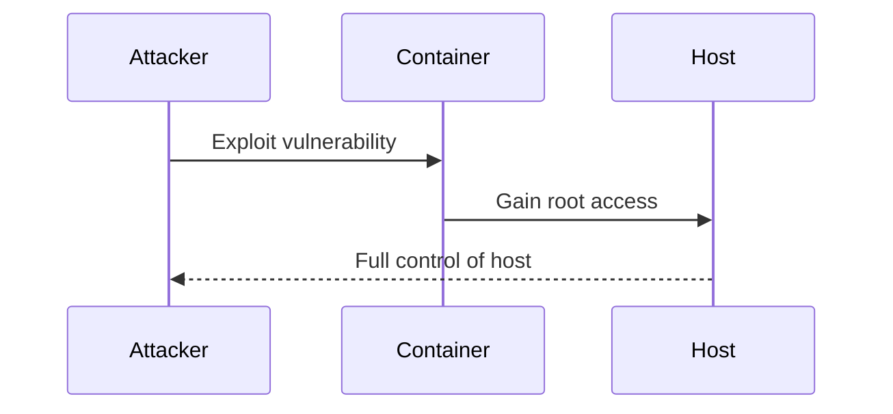
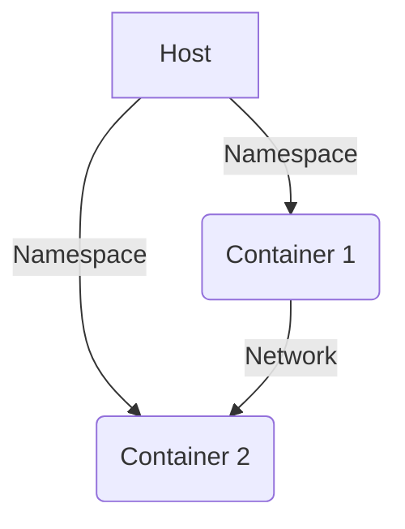

## Understanding Container Privileges and Risks

When a container runs on a host, it can potentially gain root access to the Docker host. This means that if an application inside the container is run as the root user, an attacker could exploit vulnerabilities within the application to escalate their privileges on the host. This escalation would allow the attacker to control not only the container but also the underlying host and its processes. This scenario is particularly dangerous because it can lead to a complete compromise of the host system.

### Real-World Example: CVE-2019-5736

One notable example of such a vulnerability is **CVE-2019-5736**, which affected Docker versions prior to 19.03. This vulnerability allowed a malicious container to escape its isolation and gain root access to the host system. The exploit involved a race condition in the `runc` binary, which is responsible for launching and managing containers. An attacker could leverage this vulnerability to execute arbitrary code on the host with elevated privileges.



### Why Running as Root is Dangerous

Running an application inside a container as the root user poses significant risks:

1. **Privilege Escalation**: If an attacker gains control of the application, they can easily escalate their privileges to root on the host.
2. **Lateral Movement**: Once an attacker has root access on the host, they can move laterally across the network, compromising other systems.
3. **Data Exfiltration**: With root access, an attacker can read sensitive data stored on the host, including credentials, encryption keys, and other confidential information.

### How to Prevent / Defend

To mitigate these risks, it is crucial to follow best practices for securing Docker images. One of the most effective strategies is to run applications inside containers using non-root users.

#### Creating a Dedicated User and Group

The best practice is to create a dedicated user and group within the Docker image to run the application. This can be achieved using standard Linux commands within the Dockerfile.

```Dockerfile
# Create a dedicated user and group
RUN groupadd -r myappgroup && useradd -r -g myappgroup myappuser

# Set the user for the application
USER myappuser

# Run the application
CMD ["myapp"]
```

In this example, we first create a group named `myappgroup` and a user named `myappuser`. We then set the user for the application using the `USER` directive in the Dockerfile. Finally, we specify the command to run the application.

### Using Existing Users

Some Docker images already come with a generic user that can be used to run the application. For example, the Node.js image includes a user called `node`.

```Dockerfile
# Use the existing node user
USER node

# Run the application
CMD ["npm", "start"]
```

By using an existing user, you can avoid the overhead of creating a new user and group.

### Detection and Prevention

To ensure that your Docker images are secure, you should regularly scan them for vulnerabilities and ensure that they are configured correctly. Tools like Trivy, Clair, and Aqua Security can help you identify and remediate vulnerabilities in your Docker images.

#### Vulnerability Scanning Example

Here is an example of using Trivy to scan a Docker image:

```bash
trivy image myapp:latest
```

This command will scan the `myapp:latest` Docker image and report any vulnerabilities found.

### Secure Coding Fixes

Let's compare a vulnerable Dockerfile with a secure one:

**Vulnerable Dockerfile:**

```Dockerfile
FROM node:14

WORKDIR /usr/src/app

COPY package*.json ./

RUN npm install

COPY . .

CMD ["npm", "start"]
```

**Secure Dockerfile:**

```Dockerfile
FROM node:14

WORKDIR /usr/src/app

COPY package*.json ./

RUN npm install

COPY . .

# Create a dedicated user and group
RUN groupadd -r myappgroup && useradd -r -g myappgroup myappuser

# Set the user for the application
USER myappuser

CMD ["npm", "start"]
```

In the secure Dockerfile, we added steps to create a dedicated user and group and set the user for the application. This ensures that the application runs with minimal privileges, reducing the risk of privilege escalation.

### Network Topology and Container Isolation

Understanding how containers are isolated from each other and from the host is crucial for securing Docker environments. Containers are typically isolated using namespaces and cgroups, which provide process isolation and resource management.



In this diagram, the host system provides namespaces for each container, isolating their processes and resources. However, containers can still communicate with each other over the network, which can be controlled using network policies.

### Conclusion

By following best practices for securing Docker images, you can significantly reduce the risk of privilege escalation and other security threats. Creating dedicated users and groups, using existing users when available, and regularly scanning images for vulnerabilities are key steps in building secure Docker images. Additionally, understanding the underlying mechanisms of container isolation and network communication can help you design more secure Docker environments.

### Practice Labs

For hands-on experience with Docker security best practices, consider the following labs:

- **PortSwigger Web Security Academy**: Offers interactive labs on container security and Docker best practices.
- **OWASP Juice Shop**: Provides a vulnerable web application that can be containerized and secured using Docker best practices.
- **Docker Security Workshops**: Official Docker workshops that cover various aspects of Docker security, including image scanning and secure configuration.

These labs will help you apply the concepts learned in this chapter and gain practical experience in securing Docker images.

---
<!-- nav -->
[[DevSecOps/DevSecOps Bootcamp/06-Container & Kubernetes Security/03-Image Scanning - Build Secure Docker Images/Docker Security Best Practices/06-Selecting Lightweight Base Images|Selecting Lightweight Base Images]] | [[DevSecOps/DevSecOps Bootcamp/06-Container & Kubernetes Security/03-Image Scanning - Build Secure Docker Images/Docker Security Best Practices/00-Overview|Overview]] | [[DevSecOps/DevSecOps Bootcamp/06-Container & Kubernetes Security/03-Image Scanning - Build Secure Docker Images/Docker Security Best Practices/08-Using Official and Verified Docker Images|Using Official and Verified Docker Images]]
