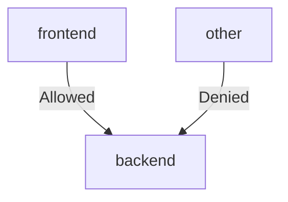

## Introduction to Service Mesh with Istio

Service mesh is a dedicated infrastructure layer for handling service-to-service communication. It provides a way to manage and monitor the interactions between services in a microservices architecture. One of the most popular service mesh implementations is Istio, which adds a layer of control and observability to your applications.

### What is Istio?

Istio is an open-source service mesh that provides a uniform way to secure, connect, and monitor microservices. It is designed to work with any platform and supports a variety of deployment environments, including Kubernetes, VMs, and bare metal.

#### Key Components of Istio

- **Envoy Proxy**: A high-performance proxy that sits between services and handles all network communication.
- **Pilot**: Manages Envoy proxies and provides routing rules.
- **Mixer**: Enforces policies and collects telemetry data.
- **Citadel**: Manages identity and credentials for services.

### Why Use Istio?

Istio offers several advantages over traditional approaches to managing microservices:

- **Traffic Management**: Allows you to route traffic based on various criteria, such as versioning, canary deployments, and A/B testing.
- **Security**: Provides mutual TLS encryption, authentication, and authorization.
- **Observability**: Collects detailed metrics and logs for monitoring and debugging.

### Comparison with Kubernetes Network Policies

Kubernetes Network Policies are used to control the traffic flow between pods within a cluster. While they are powerful, they have limitations compared to Istio policies.

#### Kubernetes Network Policies

Network Policies allow you to define rules for ingress and egress traffic at the pod level. They are implemented by the network plugin (such as Calico, Cilium, etc.).

```yaml
apiVersion: networking.k8s.io/v1
kind: NetworkPolicy
metadata:
  name: deny-all-ingress
spec:
  podSelector: {}
  policyTypes:
  - Ingress
```

This policy denies all ingress traffic to all pods in the namespace.

#### Advantages of Istio Policies

- **Fine-grained Control**: Istio policies can be applied at the service level, allowing more granular control over traffic.
- **Authentication and Authorization**: Istio provides built-in mechanisms for mutual TLS and OAuth2 authentication.
- **Observability**: Istio integrates with Prometheus and Grafana for detailed monitoring and logging.

### Detailed Example: Istio Policies vs Kubernetes Network Policies

Let's consider a scenario where we have two services: `frontend` and `backend`. We want to ensure that only the `frontend` service can communicate with the `backend` service.

#### Using Kubernetes Network Policies

First, we define a Network Policy to restrict access to the `backend` service.

```yaml
apiVersion: networking.k8s.io/v1
kind: NetworkPolicy
metadata:
  name: backend-policy
spec:
  podSelector:
    matchLabels:
      app: backend
  ingress:
  - from:
    - podSelector:
        matchLabels:
          app: frontend
```

This policy allows only pods labeled with `app: frontend` to communicate with pods labeled with `app: backend`.

#### Using Istio Policies

Next, we define an Istio policy to achieve the same result.

```yaml
apiVersion: security.istio.io/v1beta1
kind: AuthorizationPolicy
metadata:
  name: backend-policy
spec:
  selector:
    matchLabels:
      app: backend
  action: ALLOW
  rules:
  - from:
    - source:
        labels:
          app: frontend
```

This policy allows only traffic from pods labeled with `app: frontend` to reach pods labeled with `app: backend`.

### Mermaid Diagrams

To visualize the difference between the two approaches, let's use mermaid diagrams.

#### Kubernetes Network Policy Diagram



#### Istio Policy Diagram


### Real-World Examples and Recent Breaches

Consider the recent breach of a financial institution where unauthorized access to internal services was exploited. By using Istio policies, the institution could have enforced stricter access controls and detected anomalous traffic patterns.

#### CVE Example

CVE-2021-25742: This vulnerability in Kubernetes allowed attackers to bypass network policies. Using Istio policies would have provided an additional layer of security against such attacks.

### How to Prevent / Defend

#### Detection

Monitor network traffic using tools like Prometheus and Grafana integrated with Istio. Set up alerts for unusual traffic patterns.

#### Prevention

- **Secure Configuration**: Ensure that Istio policies are correctly configured to enforce strict access controls.
- **Mutual TLS**: Enable mutual TLS to encrypt all service-to-service communication.
- **Regular Audits**: Perform regular audits of Istio policies to ensure they align with security requirements.

#### Secure Code Fix

Here’s an example of a vulnerable Istio policy and its secure version:

**Vulnerable Policy**

```yaml
apiVersion: security.istio.io/v1beta1
kind: AuthorizationPolicy
metadata:
  name: insecure-policy
spec:
  selector:
    matchLabels:
      app: backend
  action: ALLOW
  rules:
  - from:
    - source:
        principals: ["*"]
```

**Secure Policy**

```yaml
apiVersion: security.istio.io/v1beta1
kind: AuthorizationPolicy
metadata:
  name: secure-policy
spec:
  selector:
    matchLabels:
      app: backend
  action: ALLOW
  rules:
  - from:
    - source:
        principals: ["cluster.local/ns/default/sa/frontend"]
```

### Hands-On Labs

For practical experience with Istio policies, consider the following labs:

- **PortSwigger Web Security Academy**: Offers exercises on securing microservices with Istio.
- **OWASP Juice Shop**: Includes scenarios where Istio policies can be applied to secure services.
- **Istio Workshops**: Official Istio documentation includes detailed labs and tutorials.

By mastering Istio policies, you can significantly enhance the security and observability of your microservices architecture.

---
<!-- nav -->
[[01-Introduction to Service Mesh and Network Policies|Introduction to Service Mesh and Network Policies]] | [[DevSecOps/DevSecOps Bootcamp/06-Container & Kubernetes Security/04-Service Mesh with Istio/07-Istio Policies vs K8s Network Policies/00-Overview|Overview]] | [[DevSecOps/DevSecOps Bootcamp/06-Container & Kubernetes Security/04-Service Mesh with Istio/07-Istio Policies vs K8s Network Policies/03-Practice Questions & Answers|Practice Questions & Answers]]
