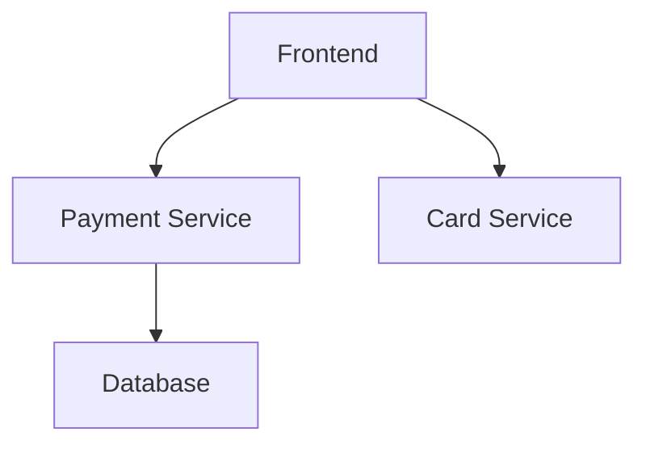

## Introduction to Service Mesh with Istio

In modern distributed systems, service mesh technology plays a crucial role in managing communication between microservices. Istio is one of the most popular service mesh implementations, providing a robust framework for managing service-to-service interactions. This chapter delves deep into authorization mechanisms within Istio, focusing on how to control and secure communication between different microservices within a namespace.

### Namespace Overview

A namespace in Kubernetes is a logical grouping of resources. Within a namespace, you can deploy various microservices such as a frontend, payment service, card service, and database. Each of these services communicates with others through well-defined APIs and endpoints. Understanding the communication patterns within a namespace is essential for implementing effective authorization policies.

### Communication Patterns in a Namespace

Let's consider an example namespace called `online-boutique`. This namespace contains several microservices:

- **Frontend**: Handles user interactions and displays information.
- **Payment Service**: Processes payments.
- **Card Service**: Manages credit card information.
- **Database**: Stores persistent data.

These services communicate with each other through well-defined APIs. For instance, the frontend might interact with the payment service to process payments, and the payment service might interact with the database to store transaction details.

### Visualizing Communication Patterns

To better understand the communication patterns, we can visualize them using a mermaid diagram:



This diagram shows that the frontend interacts with both the payment service and the card service, while the payment service interacts with the database.

### Limiting Unauthorized Communication

One of the key aspects of securing a service mesh is ensuring that unauthorized communication does not occur. For example, the frontend should not be able to directly access the Redis database. If such a request were to occur, it would indicate an unauthorized attempt, possibly due to a misconfiguration or malicious activity.

#### Example Scenario: Frontend Accessing Redis

Consider the scenario where the frontend attempts to access the Redis database. This is not a legitimate interaction and should be prevented. We can achieve this by configuring Istio to enforce strict authorization policies.

### Configuring Authorization Policies in Istio

Istio provides powerful tools for defining and enforcing authorization policies. These policies can be configured at various levels, including namespace-wide policies and more granular policies based on specific services and endpoints.

#### Namespace-Wide Policy

First, let's configure a namespace-wide policy to restrict the frontend from accessing the Redis database. This can be done using an Istio `AuthorizationPolicy` resource.

```yaml
apiVersion: security.istio.io/v1beta1
kind: AuthorizationPolicy
metadata:
  name: frontend-restrictions
  namespace: online-boutique
spec:
  action: DENY
  rules:
  - from:
    - source:
        principals: ["frontend"]
    to:
    - operation:
        methods: ["*"]
        paths: ["/redis/*"]
```

This policy denies any request from the frontend to the Redis database.

#### Granular Endpoint-Level Policy

Next, let's configure more granular policies based on specific API endpoints. For example, we might want to ensure that only the checkout page can send POST requests to certain endpoints of the payment service.

```yaml
apiVersion: security.istio.io/v1beta1
kind: AuthorizationPolicy
metadata:
  name: payment-endpoints
  namespace: online-boutique
spec:
  action: ALLOW
  rules:
  - from:
    - source:
        principals: ["checkout"]
    to:
    - operation:
        methods: ["POST"]
        paths: ["/payment/process"]
  - from:
    - source:
        principals: ["*"]
    to:
    - operation:
        methods: ["GET"]
        paths: ["/payment/status"]
```

This policy allows only the checkout service to send POST requests to the `/payment/process` endpoint, while allowing any service to send GET requests to the `/payment/status` endpoint.

### HTTP Traffic Control

Istio also allows fine-grained control over HTTP traffic based on HTTP methods and API endpoints. This can be achieved using Istio's `VirtualService` and `DestinationRule` resources.

#### VirtualService Configuration

The `VirtualService` resource defines routing rules and HTTP method restrictions.

```yaml
apiVersion: networking.istio.io/v1alpha3
kind: VirtualService
metadata:
  name: payment-virtual-service
  namespace: online-boutique
spec:
  hosts:
  - payment-service.online-boutique.svc.cluster.local
  http:
  - match:
    - uri:
        exact: /payment/process
      method: POST
    route:
    - destination:
        host: payment-service.online-boutique.svc.cluster.local
        port:
          number: 8080
  - match:
    - uri:
        exact: /payment/status
      method: GET
    route:
    - destination:
        host: payment-service.online-boutique.svc.cluster.local
        port:
          number: 8080
```

This `VirtualService` routes POST requests to `/payment/process` and GET requests to `/payment/status`.

#### DestinationRule Configuration

The `DestinationRule` resource defines the behavior of the destination service.

```yaml
apiVersion: networking.istio.io/v1alpha3
kind: DestinationRule
metadata:
  name: payment-destination-rule
  namespace: online-boutique
spec:
  host: payment-service.online-boutique.svc.cluster.local
  trafficPolicy:
    tls:
      mode: ISTIO_MUTUAL
```

This `DestinationRule` ensures mutual TLS encryption between services.

### Real-World Examples and Breaches

Understanding real-world examples and breaches can provide valuable insights into the importance of proper authorization policies.

#### Example: CVE-2021-25285

CVE-2021-25285 is a critical vulnerability in Kubernetes that allows unauthorized access to sensitive resources. This vulnerability highlights the importance of strict authorization policies to prevent unauthorized access.

#### Example: Capital One Data Breach

In 2019, Capital One suffered a significant data breach due to misconfigured web application firewall rules. This breach underscores the need for comprehensive and granular authorization policies to protect sensitive data.

### Common Pitfalls and Best Practices

When implementing authorization policies in Istio, several common pitfalls should be avoided:

1. **Overly Permissive Policies**: Avoid creating overly permissive policies that allow unnecessary access.
2. **Incomplete Coverage**: Ensure that all services and endpoints are covered by appropriate authorization policies.
3. **Complexity**: Keep policies simple and avoid unnecessary complexity that can lead to errors.

### How to Prevent / Defend

#### Detection

Regularly audit and monitor authorization policies to detect any unauthorized access attempts. Tools like Istio's telemetry and Prometheus can be used for monitoring.

#### Prevention

Implement strict authorization policies and regularly review and update them to ensure they remain effective.

#### Secure Coding Fixes

Show the vulnerable pattern and the corrected secure version side by side:

**Vulnerable Pattern:**

```yaml
apiVersion: security.istio.io/v1beta1
kind: AuthorizationPolicy
metadata:
  name: insecure-policy
  namespace: online-boutique
spec:
  action: ALLOW
  rules:
  - from:
    - source:
        principals: ["*"]
    to:
    - operation:
        methods: ["*"]
        paths: ["*"]
```

**Secure Pattern:**

```yaml
apiVersion: security.istio.io/v1beta1
kind: AuthorizationPolicy
metadata:
  name: secure-policy
  namespace: online-boutique
spec:
  action: ALLOW
  rules:
  - from:
    - source:
        principals: ["checkout"]
    to:
    - operation:
        methods: ["POST"]
        paths: ["/payment/process"]
  - from:
    - source:
        principals: ["*"]
    to:
    - operation:
        methods: ["GET"]
        paths: ["/payment/status"]
```

### Conclusion

Implementing effective authorization policies in Istio is crucial for securing communication between microservices. By understanding the communication patterns, configuring granular policies, and regularly auditing and updating these policies, you can significantly enhance the security of your service mesh.

### Hands-On Labs

For practical experience, consider the following labs:

- **PortSwigger Web Security Academy**: Offers hands-on exercises for web application security.
- **OWASP Juice Shop**: Provides a vulnerable web application for practicing security techniques.
- **Kubernetes Goat**: Focuses on Kubernetes security and offers practical scenarios for learning.

By combining theoretical knowledge with practical experience, you can master the art of securing service meshes with Istio.

---
<!-- nav -->
[[DevSecOps/DevSecOps Bootcamp/06-Container & Kubernetes Security/04-Service Mesh with Istio/Authorization in Istio Deep Dive/01-Introduction to Service Mesh with Istio Part 1|Introduction to Service Mesh with Istio Part 1]] | [[DevSecOps/DevSecOps Bootcamp/06-Container & Kubernetes Security/04-Service Mesh with Istio/Authorization in Istio Deep Dive/00-Overview|Overview]] | [[DevSecOps/DevSecOps Bootcamp/06-Container & Kubernetes Security/04-Service Mesh with Istio/Authorization in Istio Deep Dive/03-Introduction to Service Mesh with Istio Part 3|Introduction to Service Mesh with Istio Part 3]]
