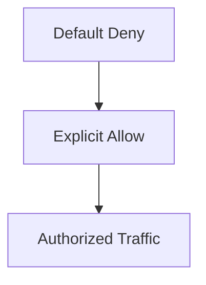

## Introduction to Service Mesh with Istio

Service mesh is an infrastructure layer that handles service-to-service communication. It provides a way to manage and secure interactions between microservices in a distributed system. One of the most popular service meshes is Istio, which offers advanced features such as traffic management, observability, and security.

### What is Istio?

Istio is an open-source service mesh that provides a uniform way to secure, control, and observe interactions between microservices. It is designed to work with any platform and supports a variety of deployment environments, including Kubernetes, VMs, and bare metal servers.

### Why Use Istio?

- **Security**: Istio provides robust security features, including mutual TLS, authentication, and authorization policies.
- **Observability**: Istio enables detailed monitoring and tracing of service interactions.
- **Traffic Management**: Istio allows for fine-grained control over traffic routing, enabling features like A/B testing, canary deployments, and circuit breaking.

### High-Level Configuration Overview

In Istio, authorization policies are used to define who can access what resources within the service mesh. These policies are enforced at the network level, ensuring that only authorized services can communicate with each other.

#### Default Deny Policy

The default behavior in Istio is to deny all traffic unless explicitly allowed. This approach is known as "default deny" and is a fundamental principle of zero-trust security. By starting with a closed environment and then selectively opening up specific traffic, you can ensure that only necessary communications are permitted.



### Authorization Policy Configuration

Authorization policies in Istio are defined using YAML files. These policies specify the conditions under which traffic is allowed or denied. Let's dive into the details of configuring these policies.

#### Example Authorization Policy

Here is an example of an authorization policy that denies all traffic by default:

```yaml
apiVersion: security.istio.io/v1beta1
kind: AuthorizationPolicy
metadata:
  name: default-deny
spec:
  action: DENY
  rules:
  - from:
    - source:
        principals: ["*"]
```

This policy uses the `DENY` action, which means that all traffic is denied unless explicitly allowed. The `principals` field specifies that the policy applies to all sources (`"*"`).

#### Explicit Allow Policy

To allow specific traffic, you can create additional policies that override the default deny rule. Here is an example of an explicit allow policy:

```yaml
apiVersion: security.istio.io/v1beta1
kind: AuthorizationPolicy
metadata:
  name: allow-internal-services
spec:
  action: ALLOW
  rules:
  - from:
    - source:
        principals: ["service-account@namespace.svc.cluster.local"]
      to:
      - operation:
          methods: ["GET", "POST"]
          paths: ["/api/*"]
```

This policy allows traffic from a specific service account (`service-account@namespace.svc.cluster.local`) to access the `/api/*` path using `GET` and `POST` methods.

### Full Example of Authorization Policies

Let's walk through a complete example of setting up authorization policies in Istio.

#### Step 1: Create the Default Deny Policy

First, create the default deny policy:

```bash
kubectl apply -f - <<EOF
apiVersion: security.istio.io/v1beta1
kind: AuthorizationPolicy
metadata:
  name: default-deny
spec:
  action: DENY
  rules:
  - from:
    - source:
        principals: ["*"]
EOF
```

#### Step 2: Create the Explicit Allow Policy

Next, create the explicit allow policy:

```bash
kubectl apply -f - <<EOF
apiVersion: security.istio.io/v1beta1
kind: AuthorizationPolicy
metadata:
  name: allow-internal-services
spec:
  action: ALLOW
  rules:
  - from:
    - source:
        principals: ["service-account@namespace.svc.cluster.local"]
      to:
      - operation:
          methods: ["GET", "POST"]
          paths: ["/api/*"]
EOF
```

### HTTP Request and Response Examples

Let's look at some HTTP requests and their corresponding responses to understand how these policies affect traffic.

#### Unauthorized Request

Consider a request from an unauthorized source:

```http
GET /api/data HTTP/1.1
Host: example.com
Authorization: Bearer invalid-token
```

Response:

```http
HTTP/1.1 403 Forbidden
Content-Type: application/json
{
  "error": "Access denied"
}
```

#### Authorized Request

Now consider a request from an authorized source:

```http
GET /api/data HTTP/1.1
Host: example.com
Authorization: Bearer valid-token
```

Response:

```http
HTTP/1.1 200 OK
Content-Type: application/json
{
  "data": "some data"
}
```

### Common Pitfalls and How to Avoid Them

#### Overly Permissive Policies

One common pitfall is creating overly permissive policies that allow more traffic than intended. To avoid this, always start with a default deny policy and then explicitly allow only the necessary traffic.

#### Missing Authentication

Another pitfall is forgetting to enforce authentication. Ensure that all requests are authenticated before applying authorization policies.

### Real-World Examples and CVEs

#### CVE-2021-25281: Kubernetes API Server Authorization Bypass

In 2021, a critical vulnerability was discovered in the Kubernetes API server that allowed unauthorized access to resources. This vulnerability highlights the importance of proper authorization policies.

#### How to Prevent / Defend

##### Detection

To detect unauthorized access attempts, enable logging and monitoring in your service mesh. Use tools like Prometheus and Grafana to visualize and analyze access patterns.

##### Prevention

1. **Use Default Deny Policies**: Always start with a default deny policy and then explicitly allow only the necessary traffic.
2. **Enforce Authentication**: Ensure that all requests are authenticated before applying authorization policies.
3. **Regular Audits**: Regularly audit your authorization policies to ensure they are up-to-date and correctly configured.

##### Secure-Coding Fixes

Here is an example of a vulnerable authorization policy and its secure counterpart:

**Vulnerable Policy**

```yaml
apiVersion: security.istio.io/v1beta1
kind: AuthorizationPolicy
metadata:
  name: vulnerable-policy
spec:
  action: ALLOW
  rules:
  - from:
    - source:
        principals: ["*"]
      to:
      - operation:
          methods: ["GET", "POST"]
          paths: ["/api/*"]
```

**Secure Policy**

```yaml
apiVersion: security.istio.io/v1beta1
kind: AuthorizationPolicy
metadata:
  name: secure-policy
spec:
  action: ALLOW
  rules:
  - from:
    - source:
        principals: ["service-account@namespace.svc.cluster.local"]
      to:
      - operation:
          methods: ["GET", "POST"]
          paths: ["/api/*"]
```

### Hands-On Labs

For hands-on practice with Istio authorization policies, consider the following labs:

- **PortSwigger Web Security Academy**: Offers interactive labs on web security, including service mesh configurations.
- **OWASP Juice Shop**: A deliberately insecure web application for practicing web security skills.
- **CloudGoat**: Provides a set of vulnerable cloud environments for learning and practicing cloud security.

### Conclusion

In conclusion, Istio's authorization policies provide a powerful mechanism for securing service-to-service communication in a microservices architecture. By starting with a default deny policy and then explicitly allowing only the necessary traffic, you can ensure that your service mesh remains secure and resilient against unauthorized access attempts.

---
<!-- nav -->
[[DevSecOps/DevSecOps Bootcamp/06-Container & Kubernetes Security/04-Service Mesh with Istio/Authorization in Istio Deep Dive/06-Introduction to Service Mesh with Istio Part 6|Introduction to Service Mesh with Istio Part 6]] | [[DevSecOps/DevSecOps Bootcamp/06-Container & Kubernetes Security/04-Service Mesh with Istio/Authorization in Istio Deep Dive/00-Overview|Overview]] | [[08-Introduction to Service Mesh with Istio|Introduction to Service Mesh with Istio]]
