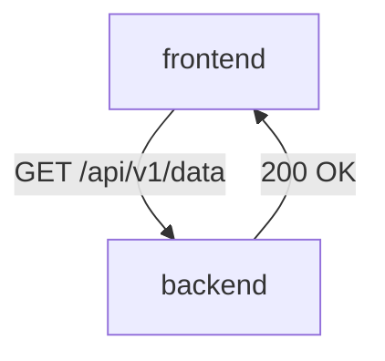
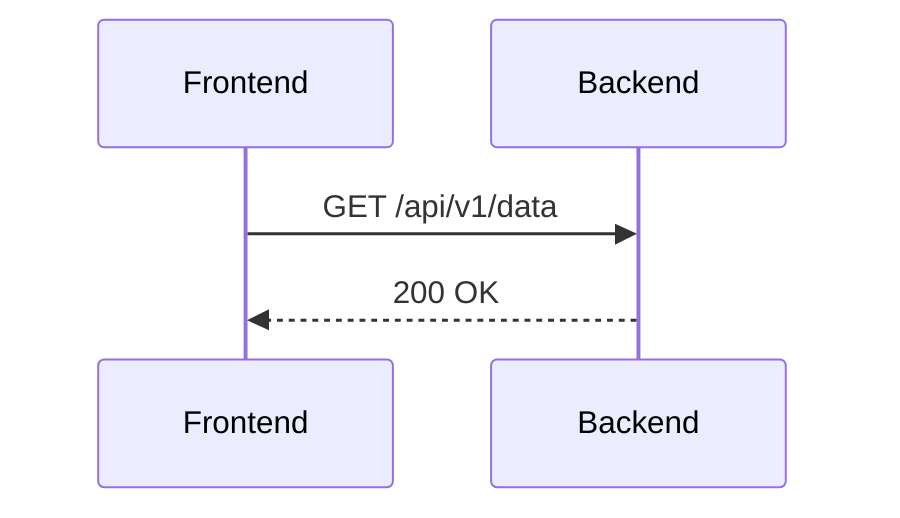

## Defining Traffic Rules

Defining traffic rules is a critical aspect of setting up authorization policies in Istio. These rules specify the conditions under which traffic is allowed or denied.

### Steps to Define Traffic Rules

1. **Identify Services**: Determine which services need to communicate with each other.
2. **Define Permissions**: Specify which services are allowed to make requests to other services.
3. **Configure Policies**: Create authorization policies that enforce the defined permissions.

### Example of Defining Traffic Rules

Consider a scenario where you have two services, `frontend` and `backend`, and you want to allow the `frontend` service to make GET requests to the `backend` service.

```yaml
apiVersion: security.istio.io/v1beta1
kind: AuthorizationPolicy
metadata:
  name: frontend-backend-policy
  namespace: default
spec:
  action: ALLOW
  rules:
    - from:
        - source:
            principals: ["cluster.local/ns/default/sa/frontend-sa"]
      to:
        - operation:
            methods: ["GET"]
            paths: ["/api/v1/*"]
```

In this example:
- `principals: ["cluster.local/ns/default/sa/frontend-sa"]` specifies that the `frontend` service account is allowed to make requests.
- `methods: ["GET"]` and `paths: ["/api/v1/*"]` specify that only GET requests to the `/api/v1/*` path are allowed.

### Common Pitfalls

- **Overly Permissive Policies**: Allowing too much traffic can increase the attack surface.
- **Insufficient Logging**: Not logging denied requests can make it difficult to identify and respond to security incidents.
- **Outdated Policies**: Failing to update policies when services change can lead to security vulnerabilities.

### How to Prevent / Defend

#### Detection

To detect unauthorized access attempts, you can configure Istio to log denied requests. This can be done by enabling detailed logging in the Mixer component.

```yaml
apiVersion: config.istio.io/v1alpha2
kind: telemetry
metadata:
  name: default
spec:
  accessLogFormat: |
    {
      "time": "%START_TIME%",
      "remote_address": "%REMOTE_ADDR%",
      "request_id": "%REQ(X-REQUEST-ID)%",
      "method": "%REQ(:METHOD)%",
      "path": "%REQ(:PATH)%",
      "status": "%RESPONSE_CODE%",
      "response_size": "%RESPONSE_SIZE%",
      "duration": "%DURATION%"
    }
```

#### Prevention

To prevent unauthorized access, ensure that all services are properly authenticated and authorized using mTLS. Additionally, regularly review and update authorization policies to reflect changes in your environment.

#### Secure Coding Fixes

Compare the insecure and secure versions of an authorization policy:

**Insecure Version**

```yaml
apiVersion: security.istio.io/v1beta1
kind: AuthorizationPolicy
metadata:
  name: insecure-policy
  namespace: default
spec:
  action: ALLOW
  rules:
    - from:
        - source:
            principals: ["*"]
      to:
        - operation:
            methods: ["*"]
            paths: ["*"]
```

**Secure Version**

```yaml
apiVersion: security.istio.io/v1beta1
kind: AuthorizationPolicy
metadata:
  name: secure-policy
  namespace: default
spec:
  action: ALLOW
  rules:
    - from:
        - source:
            principals: ["cluster.local/ns/default/sa/frontend-sa"]
      to:
        - operation:
            methods: ["GET"]
            paths: ["/api/v1/*"]
```

### Complete Example: Full HTTP Request and Response

Consider a scenario where a `frontend` service makes a GET request to a `backend` service.

**HTTP Request**

```http
GET /api/v1/data HTTP/1.1
Host: backend.default.svc.cluster.local
User-Agent: curl/7.64.1
Accept: */*
Authorization: Bearer <token>
```

**HTTP Response**

```http
HTTP/1.1 200 OK
Date: Mon, 01 Jan 2024 00:00:00 GMT
Content-Type: application/json
Content-Length: 18

{"data": "example"}
```

### Mermaid Diagrams

#### Network Topology



#### Sequence Diagram



---
<!-- nav -->
[[10-Configuring Authorization Policies in Istio|Configuring Authorization Policies in Istio]] | [[DevSecOps/DevSecOps Bootcamp/06-Container & Kubernetes Security/04-Service Mesh with Istio/Authorization in Istio Deep Dive/00-Overview|Overview]] | [[12-Detailed Explanation of Authorization Policies|Detailed Explanation of Authorization Policies]]
