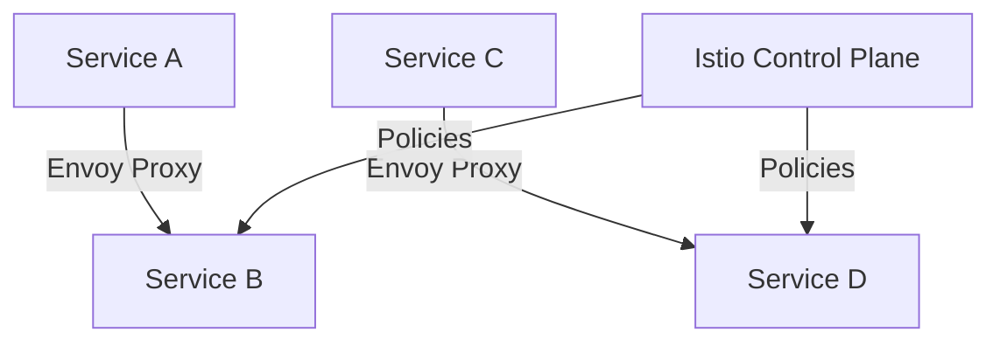
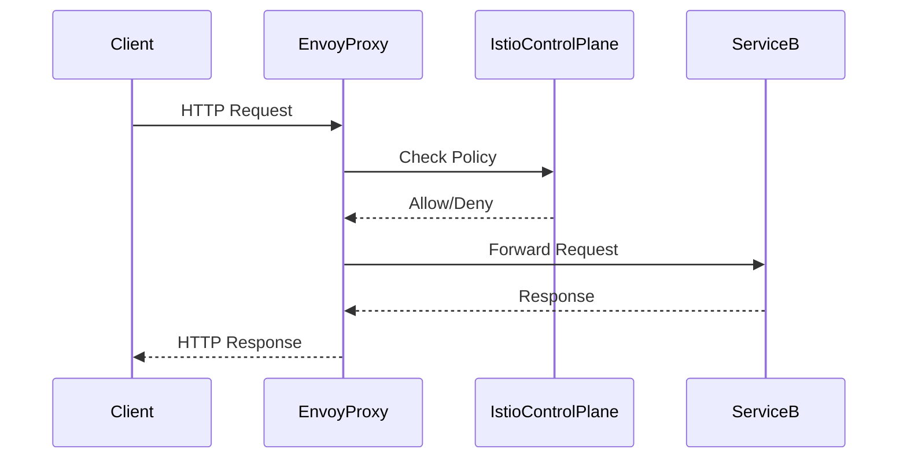

## Detailed Explanation of Authorization Policies

Authorization policies in Istio are used to define who can access what resources and under what conditions. These policies are applied at the service mesh level, ensuring consistent and fine-grained control over access.

### Principles of Authorization

In the context of Istio, a "principle" refers to the entity that is being authenticated and authorized. This can be a user, a service account, or a role. In Kubernetes, service accounts and roles are commonly used as principles.

#### Kubernetes Service Accounts

A Kubernetes service account is a way to identify processes running inside pods. Each pod can have a service account associated with it, which provides identity and permissions for the processes running in that pod.

```yaml
apiVersion: v1
kind: Pod
metadata:
  name: my-pod
spec:
  serviceAccountName: my-service-account
  ...
```

#### Kubernetes Roles

Kubernetes roles define a set of permissions that can be assigned to a service account. A role can be bound to a service account using a role binding.

```yaml
apiVersion: rbac.authorization.k8s.io/v1
kind: Role
metadata:
  namespace: default
  name: my-role
rules:
- apiGroups: [""] # "" indicates the core API group
  resources: ["pods"]
  verbs: ["get", "watch", "list"]
---
apiVersion: rbac.authorization.k8s.io/v1
kind: RoleBinding
metadata:
  name: my-role-binding
  namespace: default
subjects:
- kind: ServiceAccount
  name: my-service-account
roleRef:
  kind: Role
  name: my-role
  apiGroup: rbac.authorization.k8s.io
```

### Negative Configurations

One powerful feature of Istio authorization policies is the ability to specify negative configurations. This means you can define exceptions to general rules. For example, you might want to allow access to all namespaces except for a specific one.

#### Example: Excluding a Namespace

```yaml
apiVersion: security.istio.io/v1beta1
kind: AuthorizationPolicy
metadata:
  name: deny-namespace
  namespace: default
spec:
  action: DENY
  rules:
  - from:
    - source:
        notNamespaces: ["restricted-namespace"]
```

In this example, the `notNamespaces` field specifies that the policy should deny access to the `restricted-namespace`.

#### Example: Excluding an IP Address

Similarly, you can exclude specific IP addresses from access.

```yaml
apiVersion: security.istio.io/v1beta1
kind: AuthorizationPolicy
metadata:
  name: deny-ip
  namespace: default
spec:
  action: DENY
  rules:
  - from:
    - source:
        notIpBlocks: ["192.168.1.1/32"]
```

Here, the `notIpBlocks` field specifies that the policy should deny access from the IP address `192.168.1.1`.

### Operation Attribute

The `operation` attribute in Istio authorization policies allows for even finer control over what actions are permitted. This can include specifying HTTP methods, paths, and ports.

#### Example: Denying POST Requests

```yaml
apiVersion: security.istio.io/v1beta1
kind: AuthorizationPolicy
metadata:
  name: deny-post
  namespace: default
spec:
  action: DENY
  rules:
  - from:
    - source:
        notPrincipals: ["service-account@default.svc.cluster.local"]
    to:
    - operation:
        methods: ["POST"]
        paths: ["/api/v1/*"]
```

In this example, the policy denies `POST` requests to paths matching `/api/v1/*` from the specified service account.

### Path and Port Configuration

You can also specify which paths and ports are allowed or denied.

#### Example: Allowing Specific Paths

```yaml
apiVersion: security.istio.io/v1beta1
kind: AuthorizationPolicy
metadata:
  name: allow-paths
  namespace: default
spec:
  action: ALLOW
  rules:
  - from:
    - source:
        principals: ["service-account@default.svc.cluster.local"]
    to:
    - operation:
        paths: ["/api/v1/*"]
```

Here, the policy allows access to paths matching `/api/v1/*` for the specified service account.

#### Example: Allowing Specific Ports

```yaml
apiVersion: security.istio.io/v1beta1
kind: AuthorizationPolicy
metadata:
  name: allow-ports
  namespace: default
spec:
  action: ALLOW
  rules:
  - from:
    - source:
        principals: ["service-account@default.svc.cluster.local"]
    to:
    - operation:
        ports: ["8080"]
```

In this example, the policy allows access to port `8080` for the specified service account.

### Complete Example

Let's put together a complete example that combines all these concepts.

#### Example: Complex Authorization Policy

```yaml
apiVersion: security.istio.io/v1beta1
kind: AuthorizationPolicy
metadata:
  name: complex-policy
  namespace: default
spec:
  action: ALLOW
  rules:
  - from:
    - source:
        notNamespaces: ["restricted-namespace"]
        notIpBlocks: ["192.168.1.1/32"]
        principals: ["service-account@default.svc.cluster.local"]
    to:
    - operation:
        methods: ["GET", "PUT"]
        paths: ["/api/v1/*"]
        ports: ["8080"]
```

This policy allows `GET` and `PUT` requests to paths matching `/api/v1/*` on port `8080` for the specified service account, excluding the `restricted-namespace` and the IP address `192.168.1.1`.

### HTTP Request and Response Examples

To illustrate how these policies work in practice, let's look at some HTTP requests and responses.

#### Example HTTP Request

```http
POST /api/v1/resource HTTP/1.1
Host: example.com
Content-Type: application/json
Authorization: Bearer <token>

{
  "data": "some data"
}
```

#### Example HTTP Response

```http
HTTP/1.1 403 Forbidden
Content-Type: application/json

{
  "error": "Forbidden"
}
```

In this example, the `POST` request to `/api/v1/resource` is denied because the policy explicitly forbids `POST` requests.

### Real-World Examples and Breaches

Recent breaches and vulnerabilities have highlighted the importance of proper authorization policies. For instance, the Capital One breach in 2019 exposed sensitive customer data due to misconfigured access controls. Properly configured authorization policies in a service mesh like Istio could have prevented such a breach.

### How to Prevent / Defend

#### Detection

To detect unauthorized access attempts, you can monitor logs and metrics generated by Istio. Istio provides detailed telemetry data that can be analyzed to identify suspicious activity.

#### Prevention

To prevent unauthorized access, ensure that your authorization policies are correctly configured and regularly reviewed. Use tools like `istioctl` to validate and audit your policies.

#### Secure Coding Fixes

Compare the insecure and secure versions of a policy to understand the differences.

##### Insecure Policy

```yaml
apiVersion: security.istio.io/v1beta1
kind: AuthorizationPolicy
metadata:
  name: insecure-policy
  namespace: default
spec:
  action: ALLOW
  rules:
  - from:
    - source:
        principals: ["*"]
    to:
    - operation:
        methods: ["*"]
        paths: ["*"]
        ports: ["*"]
```

##### Secure Policy

```yaml
apiVersion: security.istio.io/v1beta1
kind: AuthorizationPolicy
metadata:
  name: secure-policy
  namespace: default
spec:
  action: ALLOW
  rules:
  - from:
    - source:
        notNamespaces: ["restricted-namespace"]
        notIpBlocks: ["192.168.1.1/32"]
        principals: ["service-account@default.ssvc.cluster.local"]
    to:
    - operation:
        methods: ["GET", "PUT"]
        paths: ["/api/v1/*"]
        ports: ["8080"]
```

#### Configuration Hardening

Ensure that your Kubernetes RBAC and Istio policies are tightly controlled. Regularly review and update your policies to reflect changes in your environment.

### Mermaid Diagrams

#### Service Mesh Topology



#### Authorization Policy Flow



### Practice Labs

For hands-on experience with Istio authorization policies, consider the following labs:

- **PortSwigger Web Security Academy**: Offers practical exercises on web security, including service mesh concepts.
- **OWASP Juice Shop**: A deliberately insecure web application for practicing web security skills.
- **DVWA (Damn Vulnerable Web Application)**: Another web application for learning web security.
- **WebGoat**: An interactive web application for learning about web security.

These labs provide a safe environment to experiment with Istio and other service mesh technologies.

---
<!-- nav -->
[[11-Defining Traffic Rules|Defining Traffic Rules]] | [[DevSecOps/DevSecOps Bootcamp/06-Container & Kubernetes Security/04-Service Mesh with Istio/Authorization in Istio Deep Dive/00-Overview|Overview]] | [[DevSecOps/DevSecOps Bootcamp/06-Container & Kubernetes Security/04-Service Mesh with Istio/Authorization in Istio Deep Dive/13-Hands-On Labs|Hands-On Labs]]
