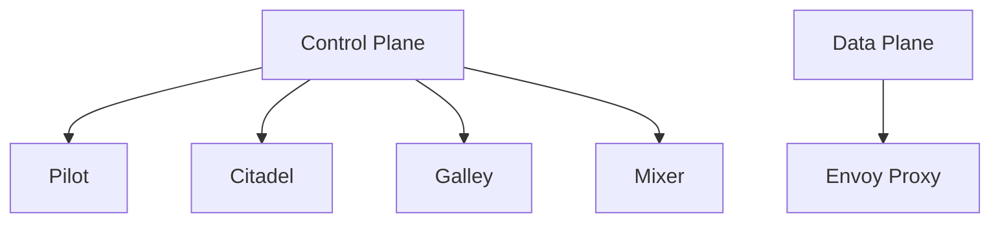

## Introduction to Service Mesh with Istio

Service mesh is a dedicated infrastructure layer for handling service-to-service communication. It provides a way to manage and monitor the interactions between microservices in a distributed system. One of the most popular service mesh implementations is Istio, which offers advanced features such as traffic management, observability, and security.

### What is Istio?

Istio is an open-source service mesh that provides a uniform way to secure, control, and observe interactions between microservices. It is designed to work with any platform and supports a variety of deployment environments, including Kubernetes, VMs, and bare metal servers.

#### Key Components of Istio

- **Envoy Proxy**: A high-performance proxy that sits between services and handles all network communication.
- **Pilot**: Manages the routing rules and configurations for Envoy proxies.
- **Citadel**: Provides secure communication between services using mutual TLS.
- **Galley**: Validates and distributes configuration data to Envoy proxies.
- **Mixer**: Enforces policies and collects telemetry data.

### Why Use Istio?

Istio simplifies the management of complex microservice architectures by providing:

- **Traffic Management**: Control and route traffic between services.
- **Observability**: Monitor and trace service interactions.
- **Security**: Secure communication between services using mutual TLS and authorization policies.

### Recent Real-World Examples

In recent years, several high-profile breaches have highlighted the importance of securing microservices. For instance, the 2021 SolarWinds breach involved unauthorized access to internal systems, emphasizing the need for robust security measures in service-to-service communication.

### Background Theory

To understand how Istio works, it’s essential to grasp the underlying concepts of service meshes and their components.

#### Service Mesh Architecture

A service mesh typically consists of a control plane and a data plane. The control plane manages the configuration and policies, while the data plane handles the actual traffic.



### Configuring Authorization Policies in Istio

Authorization policies in Istio allow you to define rules that govern which services can communicate with each other. This is crucial for maintaining the security and integrity of your microservices architecture.

#### Step-by-Step Configuration

Let’s walk through the process of configuring an authorization policy in Istio.

1. **Create a Customization File**:
   - You need to create a YAML file that defines the authorization policy.
   - This file will be applied to the cluster to enforce the policy.

2. **Commit the Configuration**:
   - Once the file is created, you need to commit it to the cluster.
   - This ensures that the policy is enforced across all services.

3. **Refresh the Cluster**:
   - After committing the configuration, you should refresh the cluster to apply the changes.

4. **Test the Policy**:
   - Finally, you need to test the policy to ensure it is working as expected.

#### Example Configuration

Here is an example of an authorization policy that denies traffic from `MyPod` to the `Argo CD` service.

```yaml
apiVersion: security.istio.io/v1beta1
kind: AuthorizationPolicy
metadata:
  name: deny-my-pod
  namespace: online-boutique
spec:
  action: DENY
  rules:
  - from:
    - source:
        principals: ["cluster.local/ns/online-boutique/sa/default"]
    to:
    - operation:
        methods: ["GET"]
        paths: ["/"]
```

This policy denies traffic from `MyPod`, which is running in the `online-boutique` namespace, to the `Argo CD` service.

### Full HTTP Request and Response

When you attempt to access the `Argo CD` service from `MyPod`, you will receive a `403 Forbidden` error due to the authorization policy.

#### HTTP Request

```http
GET / HTTP/1.1
Host: argocd-server.argocd.svc.cluster.local
User-Agent: curl/7.64.1
Accept: */*
```

#### HTTP Response

```http
HTTP/1.1 403 Forbidden
Content-Type: application/json
Date: Tue, 01 Aug 2023 12:00:00 GMT
Content-Length: 32

{"error":"Forbidden","code":403}
```

### How to Prevent / Defend

#### Detection

To detect unauthorized access attempts, you can set up monitoring and logging for your service mesh. This includes:

- **Logging**: Enable detailed logging for all service interactions.
- **Monitoring**: Set up alerts for unusual traffic patterns.

#### Prevention

To prevent unauthorized access, you can implement the following measures:

- **Secure Communication**: Use mutual TLS to encrypt all service-to-service communication.
- **Authorization Policies**: Define strict authorization policies to control access between services.

#### Secure Coding Fixes

Here is an example of a vulnerable authorization policy and its secure counterpart.

##### Vulnerable Policy

```yaml
apiVersion: security.istio.io/v1beta1
kind: AuthorizationPolicy
metadata:
  name: allow-all
  namespace: online-boutique
spec:
  action: ALLOW
  rules:
  - from:
    - source:
        principals: ["*"]
    to:
    - operation:
        methods: ["*"]
        paths: ["*"]
```

This policy allows all traffic from any source, which is insecure.

##### Secure Policy

```yaml
apiVersion: security.istio.io/v1beta1
kind: AuthorizationPolicy
metadata:
  name: deny-my-pod
  namespace: online-boutique
spec:
  action: DENY
  rules:
  - from:
    - source:
        principals: ["cluster.local/ns/online-boutique/sa/default"]
    to:
    - operation:
        methods: ["GET"]
        paths: ["/"]
```

This policy denies traffic from `MyPod` to the `Argo CD` service, ensuring that only authorized services can communicate.

### Common Pitfalls

When configuring authorization policies in Istio, there are several common pitfalls to avoid:

- **Overly Permissive Policies**: Ensure that your policies are not too permissive, as this can lead to security vulnerabilities.
- **Incomplete Coverage**: Make sure that your policies cover all necessary services and interactions.
- **Misconfigured Rules**: Double-check your rules to ensure they are correctly defined and applied.

### Hands-On Labs

For hands-on practice with Istio and service mesh configurations, consider the following labs:

- **PortSwigger Web Security Academy**: Offers comprehensive training on web security, including service mesh configurations.
- **OWASP Juice Shop**: A deliberately insecure web application for practicing security skills.
- **Kubernetes Goat**: A Kubernetes-based security training platform.

These labs provide practical experience in configuring and managing service meshes, helping you to master the concepts and techniques covered in this chapter.

### Conclusion

Configuring authorization policies in Istio is a critical aspect of securing your microservices architecture. By understanding the underlying concepts and following best practices, you can effectively manage and secure service-to-service communication in your distributed systems.

---
<!-- nav -->
[[DevSecOps/DevSecOps Bootcamp/06-Container & Kubernetes Security/04-Service Mesh with Istio/Configure Authorization Policies/02-Introduction to Service Mesh with Istio Part 10|Introduction to Service Mesh with Istio Part 10]] | [[DevSecOps/DevSecOps Bootcamp/06-Container & Kubernetes Security/04-Service Mesh with Istio/Configure Authorization Policies/00-Overview|Overview]] | [[DevSecOps/DevSecOps Bootcamp/06-Container & Kubernetes Security/04-Service Mesh with Istio/Configure Authorization Policies/04-Introduction to Service Mesh with Istio Part 2|Introduction to Service Mesh with Istio Part 2]]
