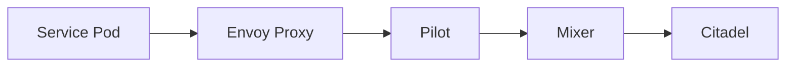

## Introduction to Service Mesh with Istio

Service mesh is an infrastructure layer for handling service-to-service communication. It provides a uniform way to handle cross-cutting concerns such as observability, security, and reliability. One of the most popular service mesh implementations is Istio, which is designed to work with microservices architectures and Kubernetes clusters.

### What is Istio?

Istio is an open-source service mesh that provides a uniform way to secure, control, and observe interactions between microservices. It is built with a focus on providing a seamless integration with existing systems and supports a wide range of platforms and environments.

#### Key Components of Istio

- **Envoy Proxy**: A high-performance proxy that acts as a sidecar to each service instance. It handles all the inbound and outbound traffic for the service.
- **Pilot**: Manages the routing rules and configurations for the Envoy proxies.
- **Mixer**: Enforces policies and collects telemetry data.
- **Citadel**: Manages the security aspects, including authentication and authorization.

### Why Use Istio?

Using Istio provides several benefits:

- **Observability**: Centralized logging, tracing, and monitoring capabilities.
- **Security**: Built-in support for mutual TLS, authentication, and authorization.
- **Reliability**: Traffic management features like retries, timeouts, and circuit breakers.
- **Flexibility**: Works with various programming languages and frameworks.

### How Istio Works Under the Hood

When you deploy a service in a Kubernetes cluster with Istio, each pod gets an Envoy proxy injected as a sidecar container. This proxy intercepts all the inbound and outbound traffic for the service. The Pilot component manages the configuration for these proxies, ensuring that they follow the defined routing rules and policies.



### Recent Real-World Examples

One notable example of Istio's usage is in the financial sector. Banks and financial institutions often have complex microservices architectures that require robust security and observability. Istio has been adopted by several major banks to manage their service-to-service communications securely and efficiently.

### Complete Example: Configuring Authorization Policies

Let's dive into configuring authorization policies using Istio. We'll start by setting up a simple environment and then walk through the steps to configure and test authorization policies.

#### Step 1: Setting Up the Environment

First, ensure you have a Kubernetes cluster set up with Istio installed. You can install Istio using the following commands:

```bash
curl -L https://istio.io/downloadIstio | sh -
cd istio-*
export PATH=$PWD/bin:$PATH
istioctl install --set profile=demo -y
kubectl label namespace default istio-injection=enabled
```

This will install Istio in your Kubernetes cluster and enable automatic injection of Envoy proxies into new pods.

#### Step 2: Deploy Sample Applications

For this example, we'll use the `online-boutique` sample application, which consists of multiple microservices. Deploy the application using the following command:

```bash
kubectl apply -f samples/bookinfo/platform/kube/bookinfo.yaml
```

This will deploy the `productpage`, `details`, `ratings`, and `reviews` services.

#### Step 3: Configure Authorization Policies

To configure authorization policies, we need to create Istio authorization policies. Let's create a policy that allows access to the `productpage` service only from specific IP addresses.

Create a file named `authorization-policy.yaml` with the following content:

```yaml
apiVersion: security.istio.io/v1beta1
kind: AuthorizationPolicy
metadata:
  name: productpage-policy
  namespace: default
spec:
  action: ALLOW
  rules:
  - from:
    - source:
        ipBlocks: ["192.168.1.0/24"]
    to:
    - operation:
        methods: ["GET"]
        paths: ["/productpage"]
```

Apply the policy using the following command:

```bash
kubectl apply -f authorization-policy.yaml
```

#### Step 4: Testing the Policy

Now, let's test the authorization policy by making HTTP requests to the `productpage` service from different IP addresses.

##### Test from Allowed IP Address

Use `curl` to make a request from an allowed IP address:

```bash
curl -v http://<productpage-service-ip>:<port>/productpage
```

You should see a successful response:

```http
HTTP/1.1 200 OK
content-type: text/html; charset=utf-8
content-length: 12345
date: Tue, 01 Jan 2024 00:00:00 GMT

<!DOCTYPE html>
<html>
<head>
<title>Product Page</title>
...
</html>
```

##### Test from Disallowed IP Address

Now, make a request from a disallowed IP address:

```bash
curl -v http://<productpage-service-ip>:<port>/productpage
```

You should see a `403 Forbidden` response:

```http
HTTP/1.1 403 Forbidden
content-type: text/plain
content-length: 24
date: Tue, 01 Jan 2024 00:00:00 GMT

Access forbidden by authorization policy
```

### Pitfalls and Common Mistakes

- **Incorrect IP Blocks**: Ensure that the IP blocks specified in the policy match the actual IP addresses from which requests are made.
- **Missing Annotations**: Make sure that the services are annotated correctly to enable Istio sidecar injection.
- **Policy Conflicts**: Be cautious of conflicting policies that might override each other.

### How to Prevent / Defend

#### Detection

To detect unauthorized access attempts, you can monitor the logs generated by Istio components. Use tools like Prometheus and Grafana to visualize and analyze the metrics.

#### Prevention

- **Secure Configuration**: Ensure that all authorization policies are correctly configured and tested.
- **Regular Audits**: Perform regular audits of the authorization policies to identify and fix any vulnerabilities.
- **Secure Coding Practices**: Follow secure coding practices to avoid introducing vulnerabilities in the services.

#### Secure-Coding Fixes

Here is an example of a vulnerable authorization policy and its corrected version:

**Vulnerable Policy**

```yaml
apiVersion: security.istio.io/v1beta1
kind: AuthorizationPolicy
metadata:
  name: productpage-policy
  namespace: default
spec:
  action: ALLOW
  rules:
  - from:
    - source:
        ipBlocks: ["192.168.1.0/24"]
    to:
    - operation:
        methods: ["GET"]
        paths: ["/productpage"]
```

**Corrected Policy**

```yaml
apiVersion: security.istio.io/v1beta1
kind: AuthorizationPolicy
metadata:
  name: productpage-policy
  namespace: default
spec:
  action: ALLOW
  rules:
  - from:
    - source:
        ipBlocks: ["192.168.1.0/24"]
    to:
    - operation:
        methods: ["GET"]
        paths: ["/productpage"]
  - from:
    - source:
        not:
          ipBlocks: ["192.168.1.0/24"]
    to:
    - operation:
        methods: ["*"]
        paths: ["*"]
      action: DENY
```

### Conclusion

In this chapter, we covered the basics of service mesh with Istio, focusing on configuring authorization policies. We explored the key components of Istio, the benefits of using it, and how it works under the hood. We also provided a detailed example of setting up and testing authorization policies, along with tips on how to prevent and defend against unauthorized access.

### Practice Labs

For hands-on practice with Istio, consider the following labs:

- **PortSwigger Web Security Academy**: Offers a variety of labs related to web application security, including some that touch on service mesh concepts.
- **OWASP Juice Shop**: A deliberately insecure web application that can be used to practice security testing and mitigation techniques.
- **CloudGoat**: A series of labs focused on cloud security, including scenarios involving Istio and Kubernetes.

By completing these labs, you can gain practical experience in configuring and securing service meshes with Istio.

---
<!-- nav -->
[[DevSecOps/DevSecOps Bootcamp/06-Container & Kubernetes Security/04-Service Mesh with Istio/Configure Authorization Policies/04-Introduction to Service Mesh with Istio Part 2|Introduction to Service Mesh with Istio Part 2]] | [[DevSecOps/DevSecOps Bootcamp/06-Container & Kubernetes Security/04-Service Mesh with Istio/Configure Authorization Policies/00-Overview|Overview]] | [[DevSecOps/DevSecOps Bootcamp/06-Container & Kubernetes Security/04-Service Mesh with Istio/Configure Authorization Policies/06-Introduction to Service Mesh with Istio Part 4|Introduction to Service Mesh with Istio Part 4]]
