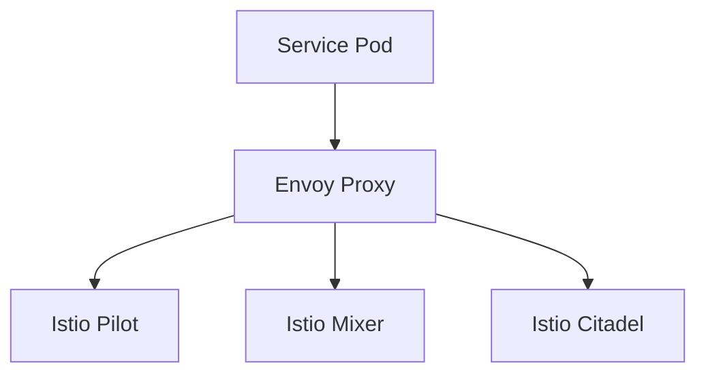

## Introduction to Service Mesh with Istio

Service mesh is a dedicated infrastructure layer for handling service-to-service communication. It provides a robust solution for managing traffic between services, enforcing security policies, and monitoring service interactions. One of the most popular service mesh implementations is Istio, which offers advanced features such as traffic management, observability, and security.

### What is Istio?

Istio is an open-source service mesh that provides a uniform way to secure, connect, and monitor microservices. It is designed to work with any platform and supports a wide range of programming languages and frameworks. Istio consists of several components:

- **Envoy Proxy**: A high-performance proxy that sits between services and handles all network communication.
- **Pilot**: Manages the routing and load balancing of traffic between services.
- **Mixer**: Enforces policies and collects telemetry data.
- **Citadel**: Manages identity and credentials for services.

### Why Use Istio?

Using Istio provides several benefits:

- **Traffic Management**: Istio allows you to control traffic between services, enabling features like canary deployments, A/B testing, and circuit breaking.
- **Security**: Istio enforces security policies at the service level, including mutual TLS, authentication, and authorization.
- **Observability**: Istio provides detailed metrics and tracing data, helping you understand the behavior of your services.

### How Does Istio Work?

Istio works by injecting Envoy proxies into each service pod. These proxies handle all incoming and outgoing traffic, allowing Istio to enforce policies and collect telemetry data. The following diagram illustrates the architecture of Istio:

### Recent Real-World Examples

One notable example of Istio being used in production is at Lyft. Lyft uses Istio to manage traffic between their microservices, providing a robust and scalable infrastructure. Another example is at IBM, where Istio is used to secure and manage traffic in their cloud-native applications.

---
<!-- nav -->
[[DevSecOps/DevSecOps Bootcamp/06-Container & Kubernetes Security/04-Service Mesh with Istio/Configure Authorization Policies/06-Introduction to Service Mesh with Istio Part 4|Introduction to Service Mesh with Istio Part 4]] | [[DevSecOps/DevSecOps Bootcamp/06-Container & Kubernetes Security/04-Service Mesh with Istio/Configure Authorization Policies/00-Overview|Overview]] | [[DevSecOps/DevSecOps Bootcamp/06-Container & Kubernetes Security/04-Service Mesh with Istio/Configure Authorization Policies/08-Introduction to Service Mesh with Istio Part 6|Introduction to Service Mesh with Istio Part 6]]
