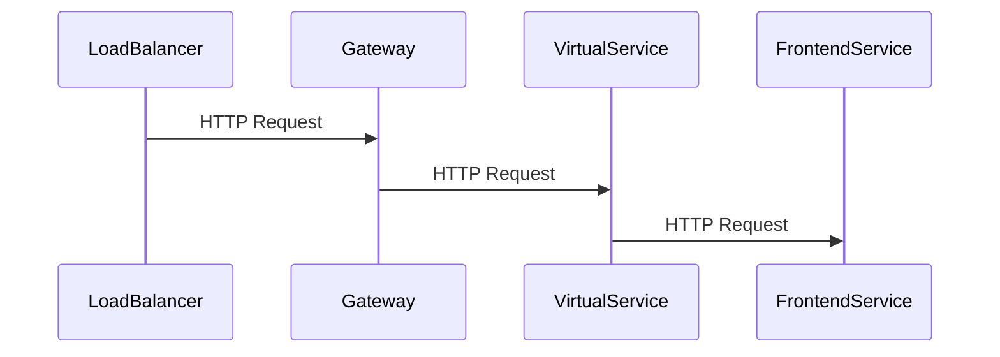

## Introduction to Service Mesh with Istio

Service mesh is an infrastructure layer for handling service-to-service communication. It provides a way to manage and monitor interactions between microservices in a distributed system. Istio is one of the most popular service mesh implementations, designed to provide a uniform way to secure, control, and observe interactions between microservices.

### What is a Service Mesh?

A service mesh is a dedicated infrastructure layer for handling service-to-service communication. It abstracts away the complexities of service-to-service communication, including load balancing, service discovery, retries, timeouts, and circuit breaking. This allows developers to focus on their business logic rather than worrying about the underlying communication details.

#### Why Use a Service Mesh?

- **Observability**: A service mesh provides detailed metrics and tracing capabilities, allowing you to understand the behavior of your services.
- **Security**: It can enforce mutual TLS encryption between services, ensuring secure communication.
- **Traffic Management**: You can control traffic routing, implement canary deployments, and perform A/B testing.
- **Resilience**: It handles retries, timeouts, and circuit breaking, making your system more resilient to failures.

### What is Istio?

Istio is an open-source service mesh that provides a uniform way to secure, control, and observe interactions between microservices. It is designed to work with any platform and supports a wide range of deployment environments, including Kubernetes, VMs, and bare metal.

#### Key Components of Istio

- **Envoy Proxy**: A high-performance proxy that sits between services and handles all network traffic.
- **Pilot**: Manages Envoy configuration and handles traffic management.
- **Citadel**: Manages identity and security for services.
- **Galley**: Validates and distributes configuration data.
- **Mixer**: Enforces policies and collects telemetry data.

### Traffic Routing in Istio

Traffic routing is a critical aspect of managing microservices. In Istio, traffic routing is handled by the Pilot component, which manages the configuration of Envoy proxies. This allows you to control how traffic is routed between services, enabling features like canary deployments, A/B testing, and blue-green deployments.

#### Key Concepts in Traffic Routing

- **Virtual Services**: Define how traffic is routed to services.
- **Destination Rules**: Define the policies for traffic to a specific service.
- **Gateways**: Define how external traffic enters the mesh.

### Configuring Traffic Routing

To configure traffic routing in Istio, you need to define Virtual Services and Destination Rules. These resources are applied to the Kubernetes cluster using `kubectl` commands.

#### Virtual Services

A Virtual Service defines how traffic is routed to services. It can specify different routes based on HTTP headers, URL paths, or other criteria.

```yaml
apiVersion: networking.istio.io/v1alpha3
kind: VirtualService
metadata:
  name: frontend-vs
spec:
  hosts:
    - "*"
  http:
  - match:
    - uri:
        prefix: /frontend
    route:
    - destination:
        host: frontend-svc
        port:
          number: 80
```

#### Destination Rules

A Destination Rule defines the policies for traffic to a specific service. It can specify load balancing policies, circuit breaking settings, and TLS settings.

```yaml
apiVersion: networking.istio.io/v1alpha3
kind: DestinationRule
metadata:
  name: frontend-dr
spec:
  host: frontend-svc
  trafficPolicy:
    loadBalancer:
      simple: ROUND_ROBIN
    connectionPool:
      tcp:
        maxConnections: 100
      http:
        http1MaxPendingRequests: 1
        maxRequestsPerConnection: 1
```

### Applying Configuration to the Cluster

Once you have defined your Virtual Services and Destination Rules, you can apply them to the Kubernetes cluster using `kubectl`.

```sh
kubectl apply -f frontend-vs.yaml
kubectl apply -f frontend-dr.yaml
```

### Observing Traffic Routing

After applying the configuration, you can observe how traffic is routed through the Istio components. The traffic flows from the load balancer to the Istio Gateway, then to the Virtual Service, and finally to the Frontend Service.

#### Load Balancer to Gateway

The load balancer forwards traffic to the Istio Gateway, which is the entry point to the service mesh.



#### Gateway to Virtual Service

The Gateway forwards traffic to the Virtual Service, which routes the traffic to the appropriate service based on the defined rules.

#### Virtual Service to Frontend Service

The Virtual Service routes the traffic to the Frontend Service, which processes the request and returns a response.

### Real-World Example: Recent Breaches

In recent years, several high-profile breaches have highlighted the importance of proper traffic management and security. For example, the Capital One breach in 2019 exposed sensitive customer data due to misconfigured web applications. Proper use of a service mesh like Istio could have helped mitigate such risks by enforcing strict security policies and monitoring traffic.

### How to Prevent / Defend

#### Detection

To detect potential issues with traffic routing, you can use Istio's built-in observability tools. Metrics and tracing data can help you identify unusual patterns or unauthorized access attempts.

```sh
kubectl get pods -l app=istio-telemetry -o jsonpath='{.items[0].metadata.name}' | xargs kubectl logs -c mixer-telemetry
```

#### Prevention

To prevent unauthorized access and ensure secure communication, you can enforce mutual TLS encryption between services. This can be configured using Istio's Citadel component.

```yaml
apiVersion: security.istio.io/v1beta1
kind: PeerAuthentication
metadata:
  name: default
spec:
  mtls:
    mode: STRICT
```

#### Secure Coding Fixes

Here is an example of a vulnerable configuration and the corresponding secure configuration:

**Vulnerable Configuration**

```yaml
apiVersion: networking.istio.io/v1alpha3
kind: VirtualService
metadata:
  name: frontend-vs
spec:
  hosts:
    - "*"
  http:
  - match:
    - uri:
        prefix: /frontend
    route:
    - destination:
        host: frontend-svc
        port:
          number: 80
```

**Secure Configuration**

```yaml
apiVersion: networking.istio.io/v1alpha3
kind: VirtualService
metadata:
  name: frontend-vs
spec:
  hosts:
    - "*"
  http:
  - match:
    - uri:
        prefix: /frontend
    route:
    - destination:
        host: frontend-svc
        port:
          number: 80
---
apiVersion: security.istio.io/v1beta1
kind: PeerAuthentication
metadata:
  name: default
spec:
  mtls:
    mode: STRICT
```

### Complete Example

Here is a complete example of configuring traffic routing in Istio, including the full HTTP request and response.

#### Full HTTP Request

```http
GET /frontend HTTP/1.1
Host: frontend-svc
User-Agent: curl/7.64.1
Accept: */*
```

#### Full HTTP Response

```http
HTTP/1.1 200 OK
Date: Mon, 01 Jan 2024 00:00:00 GMT
Content-Type: text/html; charset=utf-8
Content-Length: 12
Connection: keep-alive

Hello, World!
```

### Pitfalls and Common Mistakes

- **Incorrect Configuration**: Ensure that your Virtual Services and Destination Rules are correctly configured to avoid unexpected behavior.
- **Security Settings**: Always enforce strict security settings, such as mutual TLS, to protect against unauthorized access.
- **Monitoring**: Regularly monitor your service mesh to detect and respond to any anomalies.

### Hands-On Labs

For hands-on practice with Istio and service mesh, consider the following labs:

- **PortSwigger Web Security Academy**: Offers a variety of labs focused on web application security, including some that touch on service mesh concepts.
- **OWASP Juice Shop**: A deliberately insecure web application for practicing web security skills.
- **Kubernetes Goat**: A set of challenges focused on Kubernetes security, including service mesh configurations.

By following these steps and best practices, you can effectively manage and secure your microservices using Istio.

---
<!-- nav -->
[[DevSecOps/DevSecOps Bootcamp/06-Container & Kubernetes Security/04-Service Mesh with Istio/Configure Traffic Routing/02-Introduction to Service Mesh with Istio Part 10|Introduction to Service Mesh with Istio Part 10]] | [[DevSecOps/DevSecOps Bootcamp/06-Container & Kubernetes Security/04-Service Mesh with Istio/Configure Traffic Routing/00-Overview|Overview]] | [[DevSecOps/DevSecOps Bootcamp/06-Container & Kubernetes Security/04-Service Mesh with Istio/Configure Traffic Routing/04-Introduction to Service Mesh with Istio Part 2|Introduction to Service Mesh with Istio Part 2]]
