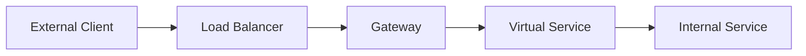
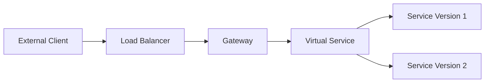

## Introduction to Service Mesh with Istio

In the realm of modern distributed systems, a service mesh plays a crucial role in managing communication between microservices. One of the most popular service meshes is Istio, which provides a robust framework for managing service-to-service interactions, including traffic management, observability, and security. This chapter delves into the configuration of traffic routing using Istio's Gateway and Virtual Service concepts.

### What is a Service Mesh?

A service mesh is a dedicated infrastructure layer for handling service-to-service communication. It abstracts away the complexities of inter-service communication, providing features such as load balancing, service discovery, retries, timeouts, and circuit breaking. Additionally, it offers advanced capabilities like encryption, mutual TLS authentication, and fine-grained access control.

### Why Use Istio?

Istio is an open-source service mesh that can be used with any platform, including Kubernetes. It provides a comprehensive set of features for managing microservices, including:

- **Traffic Management**: Control how services communicate with each other.
- **Observability**: Collect metrics, logs, and traces for monitoring and debugging.
- **Security**: Secure service-to-service communication with mutual TLS and policy enforcement.

### Key Components of Istio

Istio consists of several key components:

- **Envoy Proxy**: A high-performance proxy that sits alongside each service.
- **Pilot**: Manages service discovery and traffic routing.
- **Mixer**: Enforces policies and collects telemetry data.
- **Citadel**: Manages identity and credentials for mutual TLS.

### Gateway and Virtual Service

Two fundamental concepts in Istio's traffic management are the Gateway and Virtual Service. These components work together to route traffic from external clients to internal services.

#### Gateway

The Gateway is a Kubernetes Custom Resource Definition (CRD) that defines how external traffic reaches your services. It acts as a bridge between the load balancer and the front-end services, sitting on the edge of the Kubernetes cluster.

**What is a Gateway?**

A Gateway is a configuration object that specifies how external traffic is routed to services within the cluster. It defines the protocols and ports that the external traffic uses to access the services.

**Why Use a Gateway?**

Using a Gateway allows you to decouple the external traffic configuration from the internal service configuration. This separation of concerns makes it easier to manage and scale your services.

**How Does a Gateway Work?**

When external traffic arrives at the load balancer, it is forwarded to the Gateway. The Gateway then routes the traffic to the appropriate Virtual Service based on the defined rules.



#### Virtual Service

A Virtual Service is another CRD that defines the routing rules for incoming traffic. It specifies how traffic should be directed to different versions of a service, allowing for advanced traffic management patterns such as canary deployments and A/B testing.

**What is a Virtual Service?**

A Virtual Service is a configuration object that defines the routing rules for incoming traffic. It specifies how traffic should be directed to different versions of a service based on various criteria such as headers, query parameters, and user agents.

**Why Use a Virtual Service?**

Using a Virtual Service allows you to define complex routing rules without modifying the underlying services. This makes it easier to manage and test new versions of services without disrupting existing traffic.

**How Does a Virtual Service Work?**

When traffic arrives at the Gateway, it is forwarded to the Virtual Service based on the defined rules. The Virtual Service then routes the traffic to the appropriate internal service.



### Configuring Traffic Routing

To configure traffic routing using Istio, you need to define both a Gateway and a Virtual Service. These configurations are typically stored in Kubernetes manifest files and deployed using GitOps practices.

#### Example Configuration

Let's walk through an example of configuring a Gateway and a Virtual Service to route traffic to a front-end service.

##### Gateway Configuration

First, we define a Gateway that listens on port 80 for HTTP traffic.

```yaml
apiVersion: networking.istio.io/v1alpha3
kind: Gateway
metadata:
  name: frontend-gateway
spec:
  selector:
    istio: ingressgateway
  servers:
  - port:
      number: 80
      name: http
      protocol: HTTP
    hosts:
    - "*"
```

This Gateway listens on port  80 and forwards traffic to the `frontend` service.

##### Virtual Service Configuration

Next, we define a Virtual Service that routes traffic to the `frontend` service.

```yaml
apiVersion: networking.istio.io/v1alpha3
kind: VirtualService
metadata:
  name: frontend-vs
spec:
  hosts:
  - "*"
  gateways:
  - frontend-gateway
  http:
  - match:
    - uri:
        prefix: /
    route:
    - destination:
        host: frontend
        port:
          number: 8080
```

This Virtual Service routes traffic to the `frontend` service on port 8080.

#### Deploying the Configuration

The Gateway and Virtual Service configurations are typically stored in a GitOps repository and deployed using tools like Flux or Argo CD.

```yaml
# Example GitOps deployment
---
apiVersion: apps/v1
kind: Deployment
metadata:
  name: frontend-deployment
spec:
  replicas: 3
  template:
    spec:
      containers:
      - name: frontend
        image: my-registry/frontend:latest
        ports:
        - containerPort: 8080
```

### Pitfalls and Best Practices

#### Common Pitfalls

- **Incorrect Routing Rules**: Ensure that the routing rules in the Virtual Service are correctly configured to avoid misrouting traffic.
- **Missing Gateway**: Ensure that the Gateway is correctly defined and deployed to avoid issues with external traffic reaching the services.
- **Security Vulnerabilities**: Ensure that mutual TLS is enabled to secure service-to-service communication.

#### Best Practices

- **Use GitOps for Configuration Management**: Store and deploy the Gateway and Virtual Service configurations using GitOps practices to ensure consistency and traceability.
- **Monitor Traffic**: Use Istio's built-in observability features to monitor traffic and detect issues early.
- **Test Changes**: Test changes to the Gateway and Virtual Service configurations in a staging environment before deploying them to production.

### Real-World Examples

#### Recent CVEs and Breaches

- **CVE-2021-25282**: A vulnerability in Istio's Envoy proxy allowed attackers to bypass mutual TLS authentication. This highlights the importance of keeping Istio and its components up to date.
- **Breaches in Financial Services**: Several financial institutions have experienced breaches due to misconfigured service meshes. Ensuring proper configuration and monitoring is crucial to prevent such incidents.

### How to Prevent / Defend

#### Detection

- **Monitoring**: Use Istio's built-in monitoring and logging features to detect unusual traffic patterns and potential security issues.
- **Alerting**: Set up alerts for critical events such as unauthorized access attempts and unexpected traffic spikes.

#### Prevention

- **Secure Configuration**: Ensure that the Gateway and Virtual Service configurations are correctly set up to prevent misrouting and unauthorized access.
- **Mutual TLS**: Enable mutual TLS to secure service-to-service communication and prevent man-in-the-middle attacks.

#### Secure Coding Fixes

##### Vulnerable Code

```yaml
apiVersion: networking.istio.io/v1alpha3
kind: VirtualService
metadata:
  name: insecure-vs
spec:
  hosts:
  - "*"
  gateways:
  - insecure-gateway
  http:
  - match:
    - uri:
        prefix: /
    route:
    - destination:
        host: insecure-service
        port:
          number: 8080
```

##### Fixed Code

```yaml
apiVersion: networking.istio.io/v1alpha3
kind: VirtualService
metadata:
  name: secure-vs
spec:
  hosts:
  - "*"
  gateways:
  - secure-gateway
  http:
  - match:
    - uri:
        prefix: /
    route:
    - destination:
        host: secure-service
        port:
          number: 8080
```

### Hands-On Labs

For hands-on practice with Istio's Gateway and Virtual Service configurations, consider the following labs:

- **PortSwigger Web Security Academy**: Offers interactive labs on web application security, including service mesh configurations.
- **OWASP Juice Shop**: Provides a vulnerable web application for practicing security techniques, including service mesh configurations.
- **Kubernetes Goat**: Focuses on Kubernetes security and includes labs on service mesh configurations.

By following these steps and best practices, you can effectively configure traffic routing using Istio's Gateway and Virtual Service components, ensuring secure and efficient communication between microservices.

---
<!-- nav -->
[[DevSecOps/DevSecOps Bootcamp/06-Container & Kubernetes Security/04-Service Mesh with Istio/Configure Traffic Routing/03-Introduction to Service Mesh with Istio Part 11|Introduction to Service Mesh with Istio Part 11]] | [[DevSecOps/DevSecOps Bootcamp/06-Container & Kubernetes Security/04-Service Mesh with Istio/Configure Traffic Routing/00-Overview|Overview]] | [[DevSecOps/DevSecOps Bootcamp/06-Container & Kubernetes Security/04-Service Mesh with Istio/Configure Traffic Routing/05-Introduction to Service Mesh with Istio Part 3|Introduction to Service Mesh with Istio Part 3]]
