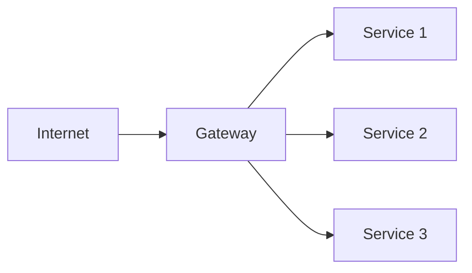
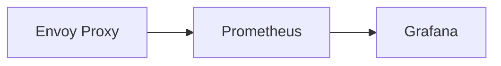

## Introduction to Service Mesh with Istio

Service mesh is a dedicated infrastructure layer for handling service-to-service communication. It provides a way to manage and monitor interactions between microservices in a distributed system. One of the most popular service mesh implementations is Istio, which is designed to work seamlessly with Kubernetes clusters. This chapter will focus on configuring traffic routing using Istio, specifically through the creation of Virtual Services and Gateways.

### What is a Service Mesh?

A service mesh is a dedicated infrastructure layer for handling service-to-service communication. It abstracts away the complexities of service discovery, load balancing, retries, timeouts, and other aspects of service communication. By centralizing these concerns, a service mesh allows developers to focus on their business logic rather than the plumbing of their applications.

#### Why Use a Service Mesh?

1. **Service Discovery**: Automatically discovers and routes traffic to services.
2. **Load Balancing**: Distributes traffic evenly across instances of a service.
3. **Fault Tolerance**: Implements retries, circuit breakers, and timeouts.
4. **Security**: Enforces mutual TLS encryption and authentication.
5. **Observability**: Provides detailed metrics and tracing for monitoring.

### Istio Overview

Istio is an open-source service mesh that provides a uniform way to secure, connect, and monitor microservices. It is designed to work with any platform and supports a wide range of deployment environments, including Kubernetes.

#### Key Components of Istio

1. **Envoy Proxy**: A high-performance proxy that sits between services and handles all network traffic.
2. **Pilot**: Manages service discovery and routing.
3. **Mixer**: Handles policy enforcement and telemetry collection.
4. **Citadel**: Manages identity and security for services.

### Configuring Traffic Routing with Istio

Traffic routing in Istio is managed through two main resources: Virtual Services and Gateways. These resources allow you to define how traffic is routed within your service mesh.

#### Virtual Services

A Virtual Service defines the rules for routing HTTP requests to services within the mesh. It allows you to specify how traffic should be directed based on various criteria such as URL paths, headers, and query parameters.

##### Example: Creating a Virtual Service

Let's create a Virtual Service for a frontend application. The frontend service is exposed via a Gateway, which acts as a single entry point for external traffic.

```yaml
apiVersion: networking.istio.io/v1alpha3
kind: VirtualService
metadata:
  name: frontend-vs
spec:
  hosts:
    - "*"
  gateways:
    - frontend-gateway
  http:
    - match:
        - uri:
            exact: /
      route:
        - destination:
            host: frontend
            port:
              number: 8080
```

In this example:
- `hosts` specifies the target hosts for the Virtual Service.
- `gateways` specifies the Gateway to which this Virtual Service is attached.
- `http` defines the HTTP routing rules.
- `match` specifies the conditions under which the rule applies.
- `route` defines where the traffic should be directed.

#### Gateways

A Gateway defines a load balancer that routes traffic to services within the mesh. It acts as the entry point for external traffic and can be configured to handle different types of traffic (HTTP, HTTPS, etc.).

##### Example: Creating a Gateway

Here’s an example of a Gateway configuration:

```yaml
apiVersion: networking.istio.io/v1alpha3
kind: Gateway
metadata:
  name: frontend-gateway
spec:
  selector:
    istio: ingressgateway
  servers:
    - port:
        number: 80
        name: http
        protocol: HTTP
      hosts:
        - "*"
```

In this example:
- `selector` specifies the label selector for the Gateway.
- `servers` defines the ports and protocols that the Gateway will listen on.
- `hosts` specifies the target hosts for the Gateway.

### Minimizing Attack Surface

By using a Gateway and Virtual Services, you can minimize the attack surface of your cluster. Instead of exposing multiple endpoints directly to the internet, you expose a single Gateway that routes traffic to the appropriate services.

#### Example: Reducing Attack Surface

Consider a scenario where you have multiple services exposed directly to the internet. Without a Gateway, each service would need to handle its own security and load balancing. With a Gateway, you can centralize these concerns and reduce the number of exposed endpoints.



In this diagram:
- The Gateway (`B`) acts as a single entry point for external traffic.
- Traffic is then routed to the appropriate services (`C`, `D`, `E`).

### Deploying Virtual Services and Gateways

To deploy the Virtual Service and Gateway, you need to apply the YAML configurations to your Kubernetes cluster.

#### Applying the Configuration

```sh
kubectl apply -f frontend-vs.yaml
kubectl apply -f frontend-gateway.yaml
```

### Monitoring and Observability

Istio provides detailed metrics and tracing for monitoring the health and performance of your services. You can use tools like Prometheus and Grafana to visualize these metrics.

#### Example: Monitoring with Prometheus

Prometheus can scrape metrics from Envoy proxies and provide insights into the behavior of your services.



In this diagram:
- Envoy proxies (`A`) emit metrics.
- Prometheus (`B`) scrapes these metrics.
- Grafana (`C`) visualizes the metrics.

### Real-World Examples and CVEs

#### Example: CVE-2021-25285

CVE-2021-25285 is a vulnerability in Istio that allows an attacker to bypass authorization policies. This vulnerability highlights the importance of keeping your service mesh up to date and properly configured.

#### How to Prevent / Defend

1. **Keep Istio Updated**: Regularly update Istio to the latest version to ensure you have the latest security patches.
2. **Use Strict Authorization Policies**: Define strict authorization policies to control access to services.
3. **Monitor Metrics**: Use tools like Prometheus and Grafana to monitor the health and performance of your services.
4. **Secure Configuration**: Ensure that your Virtual Services and Gateways are configured securely.

#### Secure Configuration Example

Here’s an example of a secure Virtual Service configuration:

```yaml
apiVersion: networking.istio.io/v1alpha3
kind: VirtualService
metadata:
  name: frontend-vs
spec:
  hosts:
    - "*"
  gateways:
    - frontend-gateway
  http:
    - match:
        - uri:
            exact: /
      route:
        - destination:
            host: frontend
            port:
              number: 8080
      timeout: 30s
      retries:
        attempts: 3
        perTryTimeout: 5s
```

In this example:
- `timeout` sets a timeout for the request.
- `retries` defines retry behavior for failed requests.

### Common Pitfalls and Best Practices

#### Common Pitfalls

1. **Incorrect Namespace Configuration**: Ensure that your Virtual Services and Gateways are deployed in the correct namespace.
2. **Incomplete Configuration**: Make sure that all necessary fields are defined in your configurations.
3. **Security Misconfigurations**: Avoid misconfigurations that could lead to security vulnerabilities.

#### Best Practices

1. **Use Namespaces**: Organize your services into namespaces to keep configurations clean and organized.
2. **Regular Updates**: Keep Istio and your services updated to the latest versions.
3. **Detailed Logging and Monitoring**: Implement detailed logging and monitoring to detect and respond to issues quickly.

### Hands-On Labs

For hands-on practice with Istio, consider the following labs:

- **PortSwigger Web Security Academy**: Offers a variety of labs focused on web security, including some that touch on service mesh concepts.
- **OWASP Juice Shop**: A deliberately insecure web app for practicing web security skills.
- **CloudGoat**: A set of labs focused on cloud security, including some that involve Istio and Kubernetes.

These labs provide practical experience in configuring and securing service meshes with Istio.

### Conclusion

Configuring traffic routing with Istio involves creating Virtual Services and Gateways to manage and secure service-to-service communication. By following best practices and regularly updating your configurations, you can ensure that your service mesh remains secure and performant.

---
<!-- nav -->
[[DevSecOps/DevSecOps Bootcamp/06-Container & Kubernetes Security/04-Service Mesh with Istio/Configure Traffic Routing/07-Introduction to Service Mesh with Istio Part 5|Introduction to Service Mesh with Istio Part 5]] | [[DevSecOps/DevSecOps Bootcamp/06-Container & Kubernetes Security/04-Service Mesh with Istio/Configure Traffic Routing/00-Overview|Overview]] | [[DevSecOps/DevSecOps Bootcamp/06-Container & Kubernetes Security/04-Service Mesh with Istio/Configure Traffic Routing/09-Introduction to Service Mesh with Istio Part 7|Introduction to Service Mesh with Istio Part 7]]
