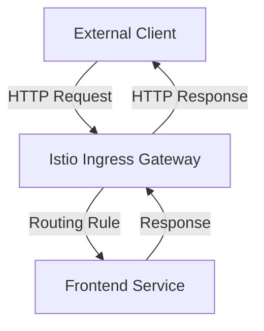

## Introduction to Service Mesh with Istio

In the realm of modern microservices architecture, managing and securing the communication between services becomes increasingly complex. A service mesh like Istio provides a robust solution to manage and secure inter-service communication. This chapter delves into the configuration of traffic routing using Istio, focusing on the setup and management of gateways and virtual services.

### What is a Service Mesh?

A service mesh is a dedicated infrastructure layer for handling service-to-service communication. It abstracts away the complexity of managing service interactions, providing features such as load balancing, service discovery, and traffic management. Istio is one of the most popular service meshes, offering advanced capabilities like automatic encryption, policy enforcement, and observability.

### Why Use Istio for Traffic Routing?

Istio simplifies the process of routing traffic between services by providing a declarative way to define routing rules. This allows developers and operators to focus on business logic rather than the intricacies of network configurations. Additionally, Istio integrates seamlessly with Kubernetes, making it an ideal choice for containerized environments.

### Basic Concepts

Before diving into the specifics of configuring traffic routing, it's essential to understand some fundamental concepts:

- **Gateway**: A gateway defines how external traffic enters the mesh. It acts as a load balancer and can handle various protocols.
- **Virtual Service**: A virtual service defines how traffic is routed within the mesh. It can specify routing rules based on URL paths, headers, and other criteria.
- **Service Entry**: A service entry allows external services to be integrated into the mesh, enabling communication with services outside the mesh.

### Setting Up the Gateway

The first step in configuring traffic routing is setting up the gateway. The gateway defines how external traffic enters the mesh and routes it to the appropriate services.

#### Gateway Configuration

Here’s an example of a basic gateway configuration:

```yaml
apiVersion: networking.istio.io/v1alpha3
kind: Gateway
metadata:
  name: my-gateway
spec:
  selector:
    istio: ingressgateway
  servers:
  - port:
      number: 80
      name: http
      protocol: HTTP
    hosts:
    - "*"
```

This configuration sets up a gateway named `my-gateway` that listens on port 80 for HTTP traffic. The `selector` field specifies which pod should handle the traffic, typically the `istio-ingressgateway`.

#### Explanation of Key Fields

- **selector**: Specifies the label selector for the pods that will handle the traffic. In this case, it selects the `istio-ingressgateway`.
- **servers**: Defines the ports and protocols that the gateway will listen on. Here, it listens on port  80 for HTTP traffic.
- **hosts**: Specifies the hostnames that the gateway will route traffic to. The wildcard `*` means it will accept traffic for any hostname.

### Configuring Virtual Services

Once the gateway is set up, the next step is to configure virtual services. A virtual service defines how traffic is routed within the mesh.

#### Virtual Service Configuration

Here’s an example of a virtual service configuration:

```yaml
apiVersion: networking.istio.io/v1alpha3
kind: VirtualService
metadata:
  name: my-virtual-service
spec:
  hosts:
  - "*"
  gateways:
  - my-gateway
  http:
  - match:
    - uri:
        prefix: "/"
    route:
    - destination:
        host: frontend-service
        port:
          number: 80
```

This configuration sets up a virtual service named `my-virtual-service` that routes traffic to the `frontend-service` on port 80.

#### Explanation of Key Fields

- **hosts**: Specifies the hostnames that the virtual service will route traffic to. The wildcard `*` means it will accept traffic for any hostname.
- **gateways**: Specifies the gateways that the virtual service will use. Here, it uses the `my-gateway` defined earlier.
- **http**: Defines the HTTP routing rules. The `match` field specifies the conditions under which the rule applies, and the `route` field specifies where the traffic should be sent.

### Complete Example

Let’s put everything together with a complete example. We’ll create a gateway and a virtual service that routes traffic to a frontend service.

#### Full Configuration

```yaml
# Gateway configuration
apiVersion: networking.istio.io/v1alpha3
kind: Gateway
metadata:
  name: my-gateway
spec:
  selector:
    istio: ingressgateway
  servers:
  - port:
      number: 80
      name: http
      protocol: HTTP
    hosts:
    - "*"

# Virtual service configuration
apiVersion: networking.istio.io/v1alpha3
kind: VirtualService
metadata:
  name: my-virtual-service
spec:
  hosts:
  - "*"
  gateways:
  - my-gateway
  http:
  - match:
    - uri:
        prefix: "/"
    route:
    - destination:
        host: frontend-service
        port:
          number: 80
```

### Applying the Configuration

To apply the configuration, you can use `kubectl`:

```bash
kubectl apply -f gateway.yaml
kubectl apply -f virtual-service.yaml
```

### Understanding the Flow

Let’s visualize the flow of traffic using a mermaid diagram:



### Common Pitfalls and How to Avoid Them

#### Incorrect Gateway Configuration

One common pitfall is incorrectly configuring the gateway. Ensure that the `selector` matches the label of the ingress gateway pod. Also, verify that the `port` and `protocol` fields are correctly specified.

#### Misconfigured Virtual Service

Another common issue is misconfiguring the virtual service. Ensure that the `hosts` and `gateways` fields match the gateway configuration. Also, verify that the `match` and `route` fields are correctly specified.

### Real-World Examples

#### Recent CVEs and Breaches

While Istio itself has not been the subject of major CVEs, misconfiguration of Istio components can lead to security vulnerabilities. For example, if the gateway is misconfigured to allow unrestricted access, it can expose services to unauthorized access.

#### Secure Configuration

To prevent such issues, ensure that the gateway and virtual service configurations are properly secured. Use specific hostnames instead of wildcards, and restrict access to only necessary services.

### How to Prevent / Defend

#### Detection

Regularly audit your Istio configurations to ensure they are correctly set up. Use tools like `istioctl` to validate the configurations.

#### Prevention

- **Use Specific Hostnames**: Avoid using wildcards in the `hosts` field of the gateway and virtual service configurations.
- **Restrict Access**: Limit access to only necessary services and use proper authentication mechanisms.
- **Monitor Traffic**: Use Istio’s built-in monitoring and logging capabilities to track traffic and detect anomalies.

#### Secure-Coding Fixes

Here’s an example of a vulnerable configuration and its secure counterpart:

**Vulnerable Configuration**

```yaml
apiVersion: networking.istio.io/v1alpha3
kind: Gateway
metadata:
  name: my-gateway
spec:
  selector:
    istio: ingressgateway
  servers:
  - port:
      number: 80
      name: http
      protocol: HTTP
    hosts:
    - "*"
```

**Secure Configuration**

```yaml
apiVersion: networking.istio.io/v1alpha3
kind: Gateway
metadata:
  name: my-gateway
spec:
  selector:
    istio: ingressgateway
  servers:
  - port:
      number: 80
      name: http
      protocol: HTTP
    hosts:
    - "example.com"
```

### Conclusion

Configuring traffic routing with Istio involves setting up gateways and virtual services. By understanding the key concepts and following best practices, you can effectively manage and secure inter-service communication in a microservices architecture.

### Practice Labs

For hands-on experience with Istio, consider the following labs:

- **PortSwigger Web Security Academy**: Offers practical exercises on web security, including service mesh configurations.
- **OWASP Juice Shop**: Provides a vulnerable web application for practicing security techniques.
- **Kubernetes Goat**: Focuses on Kubernetes security and can be used to practice Istio configurations.

By completing these labs, you can gain a deeper understanding of how to configure and secure traffic routing with Istio.

---
<!-- nav -->
[[DevSecOps/DevSecOps Bootcamp/06-Container & Kubernetes Security/04-Service Mesh with Istio/Configure Traffic Routing/08-Introduction to Service Mesh with Istio Part 6|Introduction to Service Mesh with Istio Part 6]] | [[DevSecOps/DevSecOps Bootcamp/06-Container & Kubernetes Security/04-Service Mesh with Istio/Configure Traffic Routing/00-Overview|Overview]] | [[DevSecOps/DevSecOps Bootcamp/06-Container & Kubernetes Security/04-Service Mesh with Istio/Configure Traffic Routing/10-Introduction to Service Mesh with Istio Part 8|Introduction to Service Mesh with Istio Part 8]]
