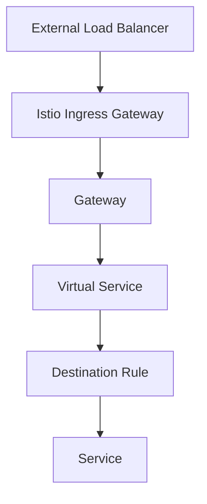

## Configuring Traffic Routing

### Gateway Configuration

The **Gateway** is a Kubernetes custom resource definition (CRD) that defines how external traffic enters the mesh. It specifies the protocols and ports that the mesh will listen on and routes traffic to the appropriate services.

#### Example Gateway Configuration

```yaml
apiVersion: networking.istio.io/v1alpha3
kind: Gateway
metadata:
  name: my-gateway
spec:
  selector:
    istio: ingressgateway # use istio default controller
  servers:
  - port:
      number: 80
      name: http
      protocol: HTTP
    hosts:
    - "*"
```

This configuration sets up a Gateway that listens on port 80 for HTTP traffic. The `selector` field specifies that this Gateway should be used by the `istio-ingressgateway` service.

### Virtual Services

A **Virtual Service** defines the routing rules for incoming traffic. It specifies how requests are routed to different versions of a service based on various criteria such as headers, query parameters, or user-defined conditions.

#### Example Virtual Service Configuration

```yaml
apiVersion: networking.istio.io/v1alpha3
kind: VirtualService
metadata:
  name: my-virtual-service
spec:
  hosts:
  - "*"
  gateways:
  - my-gateway
  http:
  - match:
    - uri:
        exact: /hello
    route:
    - destination:
        host: hello-world.default.svc.cluster.local
        port:
          number: 8080
```

This Virtual Service routes traffic to the `hello-world` service when the URI matches `/hello`.

### Destination Rules

A **Destination Rule** defines policies that apply to traffic intended for a service. It can specify load balancing strategies, connection pool sizes, and outlier detection settings.

#### Example Destination Rule Configuration

```yaml
apiVersion: networking.istio.io/v1alpha3
kind: DestinationRule
metadata:
  name: my-destination-rule
spec:
  host: hello-world.default.svc.cluster.local
  trafficPolicy:
    loadBalancer:
      simple: ROUND_ROBIN
```

This Destination Rule sets the load balancing strategy to `ROUND_ROBIN` for the `hello-world` service.

### Putting It All Together

To configure traffic routing, you need to define a Gateway, a Virtual Service, and a Destination Rule. Here’s a complete example:

#### Complete Configuration

```yaml
# Gateway
apiVersion: networking.istio.io/v1alpha3
kind: Gateway
metadata:
  name: my-gateway
spec:
  selector:
    istio: ingressgateway # use istio default controller
  servers:
  - port:
      number: 80
      name: http
      protocol: HTTP
    hosts:
    - "*"

# Virtual Service
apiVersion: networking.istio.io/v1alpha3
kind: VirtualService
metadata:
  name: my-virtual-service
spec:
  hosts:
  - "*"
  gateways:
  - my-gateway
  http:
  - match:
    - uri:
        exact: /hello
    route:
    - destination:
        host: hello-world.default.svc.cluster.local
        port:
          number: 8080

# Destination Rule
apiVersion: networking.istio.io/v1alpha3
kind: DestinationRule
metadata:
  name: my-destination-rule
spec:
  host: hello-world.default.svc.cluster.local
  trafficPolicy:
    loadBalancer:
      simple: ROUND_ROBIN
```

### How Traffic Flows Through Istio

Here’s a step-by-step breakdown of how traffic flows through Istio:

1. **Load Balancer**: External traffic is directed to the load balancer.
2. **Ingress Gateway**: The load balancer forwards traffic to the Istio Ingress Gateway.
3. **Gateway**: The Gateway determines which Virtual Service to use based on the incoming request.
4. **Virtual Service**: The Virtual Service routes the request to the appropriate service based on the defined rules.
5. **Destination Rule**: The Destination Rule applies policies to the traffic, such as load balancing and outlier detection.
6. **Service**: The traffic is finally delivered to the target service.

### Mermaid Diagram of Traffic Flow



### Common Pitfalls and How to Avoid Them

#### Misconfigured Gateway

- **Problem**: If the Gateway is misconfigured, traffic may not be properly routed into the mesh.
- **Solution**: Ensure that the Gateway is correctly configured with the correct port and protocol settings.

#### Incorrect Virtual Service Rules

- **Problem**: If the Virtual Service rules are incorrect, traffic may not be routed to the intended service.
- **Solution**: Double-check the Virtual Service configuration to ensure that the routing rules match the desired behavior.

#### Missing Destination Rule

- **Problem**: If a Destination Rule is missing, the traffic may not be load balanced or outliers detected.
- **Solution**: Always define a Destination Rule for each service to ensure proper traffic management.

### How to Prevent / Defend

#### Detection

- **Monitoring**: Use Istio's built-in monitoring tools to track traffic patterns and identify anomalies.
- **Logging**: Enable logging for all services to capture detailed information about incoming and outgoing traffic.

#### Prevention

- **Secure Configuration**: Ensure that all Istio configurations are securely set up to prevent unauthorized access.
- **Regular Audits**: Regularly audit Istio configurations to ensure they remain secure and up-to-date.

#### Secure Coding Fixes

##### Vulnerable Code

```yaml
apiVersion: networking.istio.io/v1alpha3
kind: Gateway
metadata:
  name: my-gateway
spec:
  selector:
    istio: ingressgateway # use istio default controller
  servers:
  - port:
      number: 80
      name: http
      protocol: HTTP
    hosts:
    - "*"
```

##### Fixed Code

```yaml
apiVersion: networking.istio.io/v1alpha3
kind: Gateway
metadata:
  name: my-gateway
spec:
  selector:
    istio: ingressgateway # use istio default controller
  servers:
  - port:
      number: 80
      name: http
      protocol: HTTP
    hosts:
    - "example.com"
```

### Real-World Examples

#### Recent CVEs and Breaches

- **CVE-2021-25282**: This vulnerability in Istio allowed attackers to bypass authentication mechanisms. Ensure that Istio is kept up-to-date to mitigate such risks.
- **Breaches**: Several organizations have experienced breaches due to misconfigured Istio Gateways. Always follow best practices for configuring Istio.

### Hands-On Labs

For hands-on practice with Istio, consider the following labs:

- **PortSwigger Web Security Academy**: Offers exercises on securing web applications with Istio.
- **OWASP Juice Shop**: Provides a vulnerable web application that can be secured using Istio.
- **Kubernetes Goat**: Focuses on securing Kubernetes clusters, including Istio configurations.

By following these steps and best practices, you can effectively manage and secure traffic routing in your Istio-based service mesh.

---
<!-- nav -->
[[DevSecOps/DevSecOps Bootcamp/06-Container & Kubernetes Security/04-Service Mesh with Istio/Configure Traffic Routing/12-Introduction to Service Mesh with Istio|Introduction to Service Mesh with Istio]] | [[DevSecOps/DevSecOps Bootcamp/06-Container & Kubernetes Security/04-Service Mesh with Istio/Configure Traffic Routing/00-Overview|Overview]] | [[14-Connecting to the Kubernetes Cluster|Connecting to the Kubernetes Cluster]]
