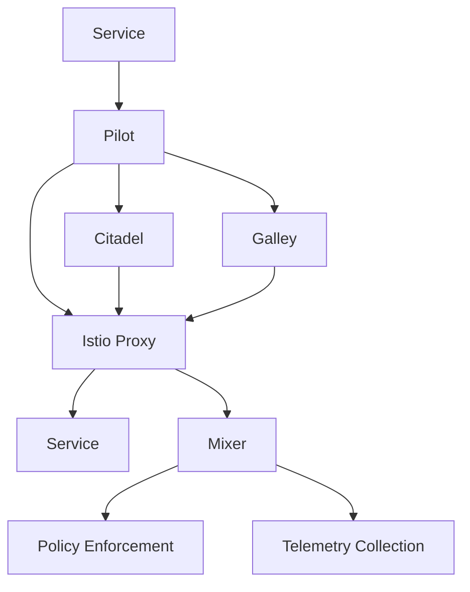

## Connecting to the Kubernetes Cluster

To begin configuring traffic routing with Istio, we first need to ensure that we have access to the Kubernetes cluster. This involves connecting to the cluster using the Kubernetes admin user, which is typically done by assuming the Kubernetes admin role on AWS.

### Setting Up the Kubernetes Admin User

The first step is to set up the Kubernetes admin user. This involves exporting the key pair for the Kubernetes admin user. Here’s how you can do it:

```bash
export KUBECONFIG=/path/to/kubeconfig
```

This command sets the `KUBECONFIG` environment variable to the path where your Kubernetes configuration file is located. This file contains the necessary credentials to access the cluster.

### Validating the Kubernetes Admin Role

Once the `KUBECONFIG` is set, you should validate that you have switched to the Kubernetes admin role. You can do this by checking the current context in the `kubeconfig` file:

```bash
kubectl config current-context
```

This command will display the current context, which should indicate that you are using the Kubernetes admin role.

### Assuming the External Admin Role

Next, you need to assume the external admin role. This is typically done using AWS STS (Security Token Service):

```bash
aws sts assume-role --role-arn arn:aws:iam::123456789012:role/KubernetesAdmin --role-session-name KubernetesAdminSession
```

This command assumes the specified role and returns temporary credentials. You can then use these credentials to interact with the cluster.

### Retrieving the KubeConfig File

Finally, you need to retrieve the `KubeConfig` file. This file contains the necessary configuration details to connect to the Kubernetes cluster:

```bash
aws eks update-kubeconfig --name <cluster-name> --region <region>
```

This command updates the `KubeConfig` file with the necessary details to connect to the specified EKS cluster.

### Verifying the Connection

Now that you have connected to the cluster, you can verify the connection by listing the nodes in the cluster:

```bash
kubectl get nodes
```

This command lists all the nodes in the cluster, confirming that you have successfully connected to the cluster.

### Understanding Node Groups

In an EKS cluster, nodes are organized into node groups. Each node group represents a set of EC2 instances that run the Kubernetes worker nodes. In this case, we have two node groups:

- One for Istio nodes with T3 medium size.
- One for the initial node group.

These node groups are created based on the configuration provided during the cluster setup. The Istio nodes are specifically configured to support the Istio service mesh.

### Checking Namespaces

After verifying the nodes, you should check the namespaces that were created in the cluster. Namespaces are used to isolate different parts of the application within the same cluster. Common namespaces include:

- `default`: The default namespace for applications.
- `istio-system`: The namespace for Istio components.
- `istio-ingress`: The namespace for Istio ingress components.

You can list the namespaces using the following command:

```bash
kubectl get namespaces
```

This command will display all the namespaces in the cluster.

### Inspecting Istio Components

Once you have identified the namespaces, you can inspect the components deployed in the `istio-system` namespace. This namespace contains the core Istio components such as the control plane and data plane.

To list the components in the `istio-system` namespace, use the following command:

```bash
kubectl get all -n istio-system
```

This command will display all the pods, services, deployments, and other resources in the `istio-system` namespace.

### Understanding Istio Architecture

Istio is a service mesh that provides a uniform way to secure, connect, and monitor microservices. The architecture of Istio consists of several key components:

- **Pilot**: Manages the service discovery and routing for the mesh.
- **Citadel**: Provides secure communication between services.
- **Galley**: Validates and distributes configuration information.
- **Mixer**: Enforces policies and collects telemetry data.

Here is a simplified diagram of the Istio architecture:



### Pitfalls and Best Practices

When working with Istio, there are several common pitfalls to avoid:

- **Incorrect Configuration**: Ensure that the configuration files are correctly formatted and contain the necessary settings.
- **Security Vulnerabilities**: Regularly update Istio components to the latest versions to mitigate known vulnerabilities.
- **Resource Constraints**: Monitor resource usage to ensure that the cluster has sufficient capacity to handle the load.

### How to Prevent / Defend

#### Detection

To detect issues with Istio, you can use monitoring tools like Prometheus and Grafana. These tools provide detailed metrics and visualizations to help identify problems.

#### Prevention

To prevent issues, follow these best practices:

- **Regular Updates**: Keep Istio components updated to the latest versions.
- **Secure Configurations**: Use secure configurations and avoid hardcoding sensitive information.
- **Monitoring and Logging**: Implement comprehensive monitoring and logging to detect and respond to issues promptly.

#### Secure Coding Fixes

Here is an example of a vulnerable Istio configuration and the corresponding secure configuration:

**Vulnerable Configuration:**

```yaml
apiVersion: networking.istio.io/v1alpha3
kind: VirtualService
metadata:
  name: my-service
spec:
  hosts:
  - my-service.example.com
  http:
  - route:
    - destination:
        host: my-service
        port:
          number: 80
```

**Secure Configuration:**

```yaml
apiVersion: networking.istio.io/v1alpha3
kind: VirtualService
metadata:
  name: my-service
spec:
  hosts:
  - my-service.example.com
  http:
  - match:
    - uri:
        prefix: /secure
    route:
    - destination:
        host: my-service
        port:
          number: 80
```

### Real-World Examples

Recent real-world examples of issues related to Istio include:

- **CVE-2021-25285**: A vulnerability in Istio's Envoy proxy that could allow remote code execution.
- **CVE-2021-25286**: A vulnerability in Istio's Mixer component that could allow unauthorized access to sensitive data.

These vulnerabilities highlight the importance of keeping Istio components updated and implementing secure configurations.

### Conclusion

Connecting to the Kubernetes cluster and configuring traffic routing with Istio involves several steps, including setting up the Kubernetes admin user, assuming the external admin role, retrieving the `KubeConfig` file, and inspecting the namespaces and components. By following best practices and implementing secure configurations, you can effectively manage and secure your Istio service mesh.

### Practice Labs

For hands-on practice with Istio, consider the following labs:

- **PortSwigger Web Security Academy**: Offers exercises on securing microservices with Istio.
- **OWASP Juice Shop**: Provides a vulnerable web application that can be secured using Istio.
- **Kubernetes Goat**: Focuses on Kubernetes security and includes scenarios involving Istio.

These labs provide practical experience in configuring and securing Istio in a real-world environment.

---
<!-- nav -->
[[13-Configuring Traffic Routing|Configuring Traffic Routing]] | [[DevSecOps/DevSecOps Bootcamp/06-Container & Kubernetes Security/04-Service Mesh with Istio/Configure Traffic Routing/00-Overview|Overview]] | [[DevSecOps/DevSecOps Bootcamp/06-Container & Kubernetes Security/04-Service Mesh with Istio/Configure Traffic Routing/15-Practice Questions & Answers|Practice Questions & Answers]]
