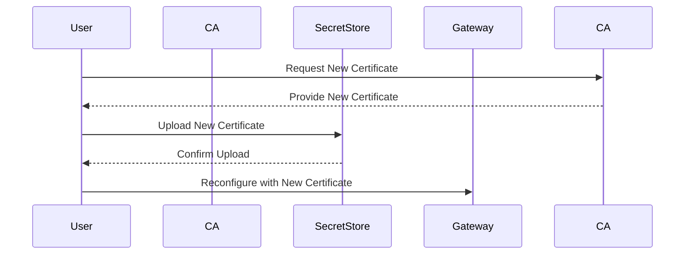
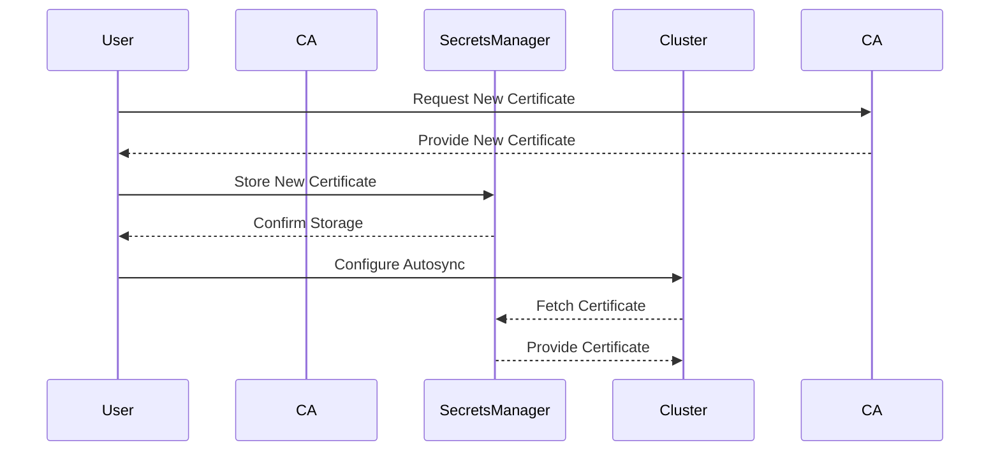

## Introduction to Service Mesh with Istio

Service mesh is a dedicated infrastructure layer for handling service-to-service communication. One of the most popular service mesh implementations is Istio, which provides a robust framework for managing traffic, enforcing policies, and securing communication between services. In this chapter, we will focus on configuring a secure gateway using Istio, specifically addressing the management of TLS certificates.

### What is a Service Mesh?

A service mesh is a dedicated infrastructure layer for handling service-to-service communication. It abstracts away the complexity of service interactions, providing features such as load balancing, service discovery, retries, circuit breaking, and monitoring. Istio is an open-source service mesh that can be deployed on various platforms, including Kubernetes.

### Why Use Istio?

Istio offers several advantages:

- **Traffic Management**: Control and monitor traffic between services.
- **Security**: Enforce mutual TLS (mTLS) for secure communication.
- **Observability**: Collect metrics and logs for monitoring and debugging.
- **Policy Enforcement**: Implement fine-grained access control and rate limiting.

### TLS Certificates in Istio

Transport Layer Security (TLS) is crucial for securing communication between services. In Istio, TLS certificates are used to establish secure connections between services. Managing these certificates is essential for maintaining the security and reliability of your service mesh.

### Certificate Rotation

Certificate rotation is the process of replacing old certificates with new ones. This is necessary to ensure that certificates do not expire and to mitigate the risk of compromised keys. However, rotating certificates manually can be cumbersome and error-prone.

#### Manual Certificate Rotation

Manually rotating certificates involves several steps:

1. **Generate a New Certificate**:
   - Create a new certificate with a specified validity period.
   
2. **Upload the Certificate to the Secret Store**:
   - Store the new certificate securely in a secret store like Kubernetes Secrets or AWS Secrets Manager.
   
3. **Reconfigure the Components**:
   - Update the configuration of components like the Gateway to use the new certificate.



#### Challenges with Manual Rotation

Manual certificate rotation is inconvenient and error-prone. Many organizations opt for long-lived certificates (e.g., 10-year validity) to avoid frequent rotations. However, this approach increases the risk of certificate compromise.

### Automated Certificate Management

Automated certificate management simplifies the process of rotating certificates. Tools like AWS Secrets Manager and Kubernetes Secrets can be used to manage certificates automatically.

#### Using AWS Secrets Manager

AWS Secrets Manager is a service that helps you protect access to your applications, services, and IT resources without the upfront investment and on-going maintenance costs of operating your own infrastructure. It enables you to easily rotate, manage, and retrieve database credentials, API keys, and other secrets throughout their lifecycle.

##### Steps to Automate Certificate Management

1. **Generate a New Certificate**:
   - Use a script or tool to generate a new certificate.
   
2. **Store the Certificate in AWS Secrets Manager**:
   - Use the AWS CLI or SDK to store the certificate in Secrets Manager.
   
3. **Configure Autosync**:
   - Set up an automated process to fetch the certificate from Secrets Manager and sync it with the cluster.



### Example: Rotating Certificates with Istio

Let's walk through an example of rotating certificates in an Istio environment.

#### Step 1: Generate a New Certificate

First, generate a new certificate with a short validity period (e.g., 30 days).

```bash
openssl req -newkey rsa:2048 -nodes -keyout tls.key -x509 -days 30 -out tls.crt -subj "/CN=example.com"
```

This command generates a new RSA key and a corresponding X.509 certificate with a validity period of 30 days.

#### Step 2: Store the Certificate in AWS Secrets Manager

Next, store the certificate in AWS Secrets Manager.

```bash
aws secretsmanager create-secret --name my-tls-secret --secret-string file://tls.crt
aws secretsmanager put-secret-value --secret-id my-tls-secret --secret-string file://tls.key
```

These commands create a new secret in Secrets Manager and store the certificate and key.

#### Step 3: Configure Autosync

Set up an automated process to fetch the certificate from Secrets Manager and sync it with the cluster.

```yaml
apiVersion: batch/v1
kind: Job
metadata:
  name: sync-certificates
spec:
  template:
    spec:
      containers:
      - name: sync-certificates
        image: my-sync-image
        command: ["sh", "-c"]
        args:
        - |
          aws secretsmanager get-secret-value --secret-id my-tls-secret > tls.crt
          kubectl create secret generic tls-secret --from-file=tls.crt --from-file=tls.key
      restartPolicy: OnFailure
```

This Kubernetes Job fetches the certificate from Secrets Manager and creates a Kubernetes Secret.

#### Step 4: Reconfigure the Gateway

Finally, update the Gateway configuration to use the new certificate.

```yaml
apiVersion: networking.istio.io/v1alpha3
kind: Gateway
metadata:
  name: my-gateway
spec:
  selector:
    istio: ingressgateway
  servers:
  - port:
      number: 443
      name: https
      protocol: HTTPS
    tls:
      mode: SIMPLE
      serverCertificate: /etc/istio/ingressgateway-certs/tls.crt
      privateKey: /etc/istio/ingressgateway-certs/tls.key
    hosts:
    - "*"
```

This configuration specifies the path to the new certificate and key.

### Pitfalls and Best Practices

#### Common Mistakes

- **Long-Lived Certificates**: Using long-lived certificates increases the risk of compromise.
- **Manual Rotation**: Manually rotating certificates is error-prone and time-consuming.
- **Inconsistent Configuration**: Ensuring that all components are consistently configured with the new certificate is crucial.

#### Best Practices

- **Short-Lived Certificates**: Use short-lived certificates (e.g., 30 days) to minimize the risk of compromise.
- **Automated Rotation**: Automate the certificate rotation process to reduce errors and improve efficiency.
- **Consistent Configuration**: Ensure that all components are consistently configured with the new certificate.

### How to Prevent / Defend

#### Detection

Monitor the expiration dates of certificates and set up alerts for upcoming expirations.

```bash
openssl x509 -noout -enddate -in tls.crt
```

This command checks the expiration date of the certificate.

#### Prevention

Implement an automated process for generating and rotating certificates.

```bash
#!/bin/bash
while true; do
  openssl req -newkey rsa:2048 -nodes -keyout tls.key -x509 -days 30 -out tls.crt -subj "/CN=example.com"
  aws secretsmanager put-secret-value --secret-id my-tls-secret --secret-string file://tls.crt
  aws secretsmanager put-secret-value --secret-id my-tls-secret --secret-string file://tls.key
  sleep 2592000 # Sleep for 30 days
done
```

This script generates a new certificate every 30 days and updates the secret in Secrets Manager.

#### Secure Coding Fixes

Compare the insecure and secure versions of the certificate management process.

**Insecure Version**

```bash
# Manually generate and upload certificate
openssl req -newkey rsa:2048 -nodes -keyout tls.key -x509 -days 1095 -out tls.crt -subj "/CN=example.com"
kubectl create secret generic tls-secret --from-file=tls.crt --from-file=tls.key
```

**Secure Version**

```bash
# Automatically generate and upload certificate
#!/bin/bash
while true; do
  openssl req -newkey rsa:2048 -nodes -keyout tls.key -x509 -days 30 -out tls.crt -subj "/CN=example.com"
  aws secretsmanager put-secret-value --secret-id my-tls-secret --secret-string file://tls.crt
  aws secretsmanager put-secret-value --secret-id my-tls-secret --secret-string file://tls.key
  kubectl create secret generic tls-secret --from-file=tls.crt --from-file=tls.key
  sleep 2592000 # Sleep for 30 days
done
```

### Real-World Examples

#### Recent Breaches

- **CVE-2021-21974**: A vulnerability in the Apache Tomcat server allowed attackers to bypass authentication and gain unauthorized access. This highlights the importance of securing communication channels with TLS.

#### Secure Configuration

Ensure that your service mesh is configured securely by following best practices for TLS certificate management.

### Conclusion

Managing TLS certificates in a service mesh like Istio is critical for maintaining the security and reliability of your infrastructure. By automating the certificate rotation process, you can reduce the risk of compromise and improve operational efficiency. Always follow best practices for secure coding and configuration to protect your services.

### Practice Labs

For hands-on practice with Istio and service mesh configurations, consider the following labs:

- **PortSwigger Web Security Academy**: Offers interactive labs for learning web application security.
- **OWASP Juice Shop**: A deliberately insecure web application for practicing web security skills.
- **Kubernetes Goat**: A Kubernetes-based security training platform for learning Kubernetes security.

These labs provide practical experience with configuring and securing service meshes in real-world scenarios.

---
<!-- nav -->
[[DevSecOps/DevSecOps Bootcamp/06-Container & Kubernetes Security/04-Service Mesh with Istio/Configure a Secure Gateway/00-Overview|Overview]] | [[DevSecOps/DevSecOps Bootcamp/06-Container & Kubernetes Security/04-Service Mesh with Istio/Configure a Secure Gateway/02-Introduction to Service Mesh with Istio Part 2|Introduction to Service Mesh with Istio Part 2]]
