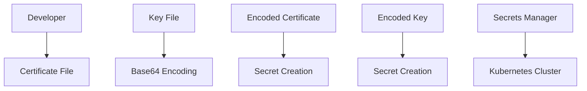

## Introduction to Service Mesh with Istio

Service mesh is a dedicated infrastructure layer for handling service-to-service communication. It provides a way to manage and monitor interactions between services in a microservices architecture. One of the most popular service mesh implementations is Istio, which adds a layer of control and observability to your service interactions.

### What is Istio?

Istio is an open-source service mesh that provides a uniform way to secure, connect, and monitor microservices. It is designed to work with any platform and supports a variety of deployment environments, including Kubernetes, VMs, and bare metal.

#### Why Use Istio?

- **Security**: Istio provides mutual TLS encryption between services, ensuring that data remains confidential and integrity is maintained.
- **Observability**: Istio includes built-in monitoring and tracing capabilities, allowing you to track the performance and behavior of your services.
- **Traffic Management**: Istio allows you to manage traffic routing, retries, timeouts, and circuit breaking, making it easier to handle complex service interactions.

### Setting Up Secrets for Istio

In the context of Istio, secrets are used to manage sensitive information such as TLS certificates and keys. These secrets are stored securely and can be accessed by Istio components to ensure secure communication between services.

#### Creating Secrets in Kubernetes

To configure a secure gateway in Istio, you need to create secrets containing the TLS certificates and keys. These secrets are then referenced by Istio to enable secure communication.

##### Step-by-Step Guide

1. **Create the Certificate Secret**

   First, you need to create a secret containing the TLS certificate. This involves creating a Kubernetes secret and populating it with the certificate contents.

   ```yaml
   apiVersion: v1
   kind: Secret
   metadata:
     name: istio-tls-cert
     namespace: default
   type: Opaque
   data:
     tls.crt: <base64-encoded-certificate>
   ```

   Here, `tls.crt` is the key that holds the base64-encoded certificate contents. You can generate the base64 encoding using the following command:

   ```sh
   cat /path/to/certificate.pem | base64
   ```

   Replace `/path/to/certificate.pem` with the actual path to your certificate file.

2. **Create the Key Secret**

   Similarly, you need to create a secret containing the TLS key.

   ```yaml
   apiVersion: v1
   kind: Secret
   metadata:
     name: istio-tls-key
     namespace: default
   type: Opaque
   data:
     tls.key: <base64-encoded-key>
   ```

   Here, `tls.key` is the key that holds the base64-encoded key contents. You can generate the base64 encoding using the following command:

   ```sh
   cat /path/to/key.pem | base64
   ```

   Replace `/path/to/key.pem` with the actual path to your key file.

3. **Store the Secrets**

   Once you have created the secrets, you can apply them to your Kubernetes cluster using `kubectl`.

   ```sh
   kubectl apply -f istio-tls-cert.yaml
   kubectl apply -f istio-tls-key.yaml
   ```

### Managing Secrets Securely

It is crucial to manage secrets securely to prevent unauthorized access. Here are some best practices:

- **Remove Local Copies**: After creating the secrets, remove the local copies of the certificate and key files to avoid accidental exposure.
- **Use Centralized Secret Storage**: Store secrets in a centralized secret management system like HashiCorp Vault or AWS Secrets Manager.
- **Audit Access**: Regularly audit access to secrets to ensure that only authorized personnel have access.

### Real-World Example: Recent Breaches

One notable breach involving mismanaged secrets was the Capital One data breach in 2019. In this case, an attacker gained unauthorized access to sensitive data due to misconfigured cloud storage permissions. This highlights the importance of properly managing and securing secrets.

### How to Prevent / Defend

#### Detection

- **Monitor Access Logs**: Regularly review access logs to detect any unauthorized access attempts.
- **Use Security Tools**: Utilize tools like Kubernetes Audit Logging to monitor and log access to secrets.

#### Prevention

- **Secure Secret Storage**: Use a centralized secret management solution to securely store and manage secrets.
- **Limit Access**: Ensure that only authorized personnel have access to secrets by implementing strict access controls.

#### Secure Coding Fixes

Here is an example of how to securely manage secrets in a Kubernetes environment:

**Vulnerable Code:**

```yaml
apiVersion: v1
kind: Secret
metadata:
  name: insecure-secret
type: Opaque
data:
  password: cGFzc3dvcmQ=  # Base64 encoded "password"
```

**Secure Code:**

```yaml
apiVersion: v1
kind: Secret
metadata:
  name: secure-secret
type: Opaque
data:
  password: cGFzc3dvcmQ=  # Base64 encoded "password"
---
apiVersion: rbac.authorization.k8s.io/v1
kind: Role
metadata:
  name: secret-reader
rules:
- apiGroups: [""]
  resources: ["secrets"]
  verbs: ["get", "watch", "list"]
---
apiVersion: rbac.authorization.k8s.io/v1
kind: RoleBinding
metadata:
  name: secret-reader-binding
subjects:
- kind: User
  name: alice
roleRef:
  kind: Role
  name: secret-reader
  apiGroup: rbac.authorization.k8s.io
```

In the secure code example, access to the secret is restricted to specific users through RBAC (Role-Based Access Control).

### Mermaid Diagrams

#### Secret Management Architecture



This diagram illustrates the process of creating and storing secrets in a Kubernetes cluster.

### Conclusion

Properly managing secrets is crucial for maintaining the security of your service mesh with Istio. By following best practices and using secure coding techniques, you can ensure that your secrets remain protected and your services communicate securely.

### Practice Labs

For hands-on experience with configuring secure gateways in Istio, consider the following labs:

- **PortSwigger Web Security Academy**: Offers practical exercises on securing web applications.
- **OWASP Juice Shop**: Provides a vulnerable web application for practicing security techniques.
- **CloudGoat**: Focuses on cloud security and offers scenarios for practicing secure configurations in cloud environments.

These labs provide real-world scenarios to help you master the concepts covered in this chapter.

---
<!-- nav -->
[[DevSecOps/DevSecOps Bootcamp/06-Container & Kubernetes Security/04-Service Mesh with Istio/Configure a Secure Gateway/01-Introduction to Service Mesh with Istio Part 1|Introduction to Service Mesh with Istio Part 1]] | [[DevSecOps/DevSecOps Bootcamp/06-Container & Kubernetes Security/04-Service Mesh with Istio/Configure a Secure Gateway/00-Overview|Overview]] | [[DevSecOps/DevSecOps Bootcamp/06-Container & Kubernetes Security/04-Service Mesh with Istio/Configure a Secure Gateway/03-Introduction to Service Mesh with Istio Part 3|Introduction to Service Mesh with Istio Part 3]]
