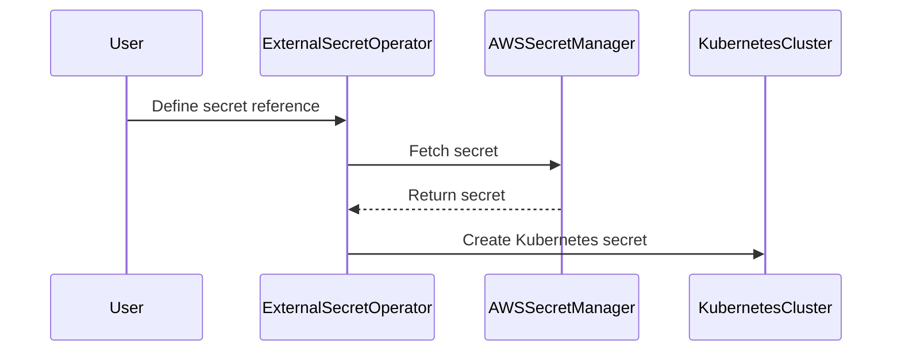

## Introduction to Service Mesh with Istio

Service mesh is a dedicated infrastructure layer for handling service-to-service communication. One of the most popular implementations of a service mesh is Istio, which provides advanced traffic management, policy enforcement, and observability features. A critical aspect of Istio is configuring a secure gateway to ensure that all incoming and outgoing traffic is encrypted and authenticated. This chapter will delve into the configuration of a secure gateway using Istio, focusing on the integration with a secret store like AWS Secret Manager.

### Background Theory

A service mesh like Istio operates at the network level, intercepting and managing all communication between services. This includes routing, load balancing, monitoring, and security. To ensure secure communication, Istio uses TLS (Transport Layer Security) for encryption. TLS certificates and keys are crucial components that enable this encryption.

### Key Concepts

#### Secrets Management

In Kubernetes, secrets are used to store sensitive information such as passwords, tokens, and TLS certificates. These secrets are stored in a secure manner and can be referenced by pods and services. However, managing secrets within the Kubernetes cluster itself can be challenging due to the risk of exposure. Therefore, integrating with an external secret store like AWS Secret Manager is a common practice.

#### External Secrets Operator

The External Secrets Operator is a Kubernetes operator that allows you to fetch secrets from external secret stores and inject them into your Kubernetes cluster. This operator simplifies the process of managing secrets by abstracting away the complexity of interacting with external secret stores.

### Configuring a Secure Gateway

To configure a secure gateway in Istio, you need to manage TLS certificates and keys securely. This involves fetching these secrets from an external secret store and creating Kubernetes secrets with them.

#### Step-by-Step Configuration

1. **Define the Secret Reference**

   The first step is to define the reference to the secret stored in AWS Secret Manager. This involves specifying the name of the secret and the attributes that will be used to fetch the secret.

   ```yaml
   apiVersion: externalsecrets.io/v1beta1
   kind: ExternalSecret
   metadata:
     name: istio-tls-secret
     namespace: istio-system
   spec:
     backendType: awssecretstore
     dataFrom:
       - extract:
           key: dev/IstioTLSKeySecret
           name: istio-tls-key
         remoteRef:
           key: dev/IstioTLSKeySecret
       - extract:
           key: dev/IstioTLSCertSecret
           name: istio-tls-cert
         remoteRef:
           key: dev/IstioTLSCertSecret
   ```

   Here, `dev/IstioTLSKeySecret` and `dev/IstioTLSCertSecret` are the names of the secrets stored in AWS Secret Manager. The `extract` field specifies the key and name of the secret that will be fetched.

2. **Fetch the Secrets**

   The External Secrets Operator will fetch the secrets from AWS Secret Manager and create Kubernetes secrets with the specified names (`istio-tls-key` and `istio-tls-cert`). These secrets will contain the TLS key and certificate.

3. **Create the Kubernetes Secret**

   The External Secrets Operator will create a Kubernetes secret with the fetched data. The `target` configuration specifies the name and type of the Kubernetes secret.

   ```yaml
   apiVersion: v1
   kind: Secret
   metadata:
     name: frontend-tls
     namespace: istio-system
   type: kubernetes.io/tls
   data:
     tls.key: <base64-encoded-key>
     tls.crt: <base64-encoded-cert>
   ```

   Here, `frontend-tls` is the name of the Kubernetes secret, and `kubernetes.io/tls` is the type of the secret. The `data` field contains the base64-encoded key and certificate.

### Full Example

Let's put together a complete example of configuring a secure gateway in Istio.

#### Step 1: Define the Secret Reference

```yaml
apiVersion: externalsecrets.io/v1beta1
kind: ExternalSecret
metadata:
  name: istio-tls-secret
  namespace: istio-system
spec:
  backendType: awssecretstore
  dataFrom:
    - extract:
        key: dev/IstioTLSKeySecret
        name: istio-tls-key
      remoteRef:
        key: dev/IstioTLSKeySecret
    - extract:
        key: dev/IstioTLSCertSecret
        name: istio-tls-cert
      remoteRef:
        key: dev/IstioTLSCertSecret
```

#### Step 2: Fetch the Secrets

The External Secrets Operator will fetch the secrets from AWS Secret Manager and create Kubernetes secrets with the specified names (`istio-tls-key` and `istio-tls-cert`).

#### Step 3: Create the Kubernetes Secret

```yaml
apiVersion: v1
kind: Secret
metadata:
  name: frontend-tls
  namespace: istio-system
type: kubernetes.io/tls
data:
  tls.key: <base64-encoded-key>
  tls.crt: <base64-encoded-cert>
```

### Mermaid Diagrams

#### Secret Fetching Process



### Common Pitfalls and How to Avoid Them

#### Incorrect Secret Names

Ensure that the names of the secrets in AWS Secret Manager match the names specified in the ExternalSecret configuration. Mismatched names will result in errors.

#### Missing Permissions

Ensure that the External Secrets Operator has the necessary permissions to access the secrets in AWS Secret Manager. This typically involves setting up an IAM role with the required permissions.

### Real-World Examples

#### Recent Breaches

In a recent breach, a company had their Kubernetes secrets exposed due to misconfigured permissions. By integrating with an external secret store and using the External Secrets Operator, the company could have prevented this exposure.

### How to Prevent / Defend

#### Detection

Regularly audit the permissions and configurations of your secret stores and Kubernetes clusters. Tools like `kube-bench` can help automate this process.

#### Prevention

1. **Secure Permissions**: Ensure that only authorized entities have access to the secrets in the external secret store.
2. **Use External Secrets Operator**: Automate the fetching and creation of Kubernetes secrets using the External Secrets Operator.
3. **Monitor Access**: Implement logging and monitoring to detect unauthorized access attempts.

#### Secure Coding Fixes

**Vulnerable Code**

```yaml
apiVersion: v1
kind: Secret
metadata:
  name: insecure-tls
type: Opaque
data:
  tls.key: <base64-encoded-key>
  tls.crt: <base64-encoded-cert>
```

**Fixed Code**

```yaml
apiVersion: v1
kind: Secret
metadata:
  name: frontend-tls
type: kubernetes.io/tls
data:
  tls.key: <base64-encoded-key>
  tls.crt: <base64-encoded-cert>
```

### Conclusion

Configuring a secure gateway in Istio involves managing TLS certificates and keys securely. By integrating with an external secret store like AWS Secret Manager and using the External Secrets Operator, you can ensure that your secrets are managed securely and efficiently. This chapter has provided a comprehensive guide to configuring a secure gateway in Istio, including background theory, step-by-step instructions, real-world examples, and best practices for prevention and detection.

### Practice Labs

For hands-on experience with configuring a secure gateway in Istio, consider the following labs:

- **PortSwigger Web Security Academy**: Offers a variety of labs related to web application security, including some that touch on service mesh configurations.
- **OWASP Juice Shop**: A deliberately insecure web application for security training purposes. While it doesn't focus specifically on Istio, it can help you understand the broader context of web application security.
- **CloudGoat**: Provides a set of labs focused on cloud security, including some that involve configuring secure gateways in service meshes.

These labs will help you apply the concepts learned in this chapter to real-world scenarios.

---
<!-- nav -->
[[DevSecOps/DevSecOps Bootcamp/06-Container & Kubernetes Security/04-Service Mesh with Istio/Configure a Secure Gateway/02-Introduction to Service Mesh with Istio Part 2|Introduction to Service Mesh with Istio Part 2]] | [[DevSecOps/DevSecOps Bootcamp/06-Container & Kubernetes Security/04-Service Mesh with Istio/Configure a Secure Gateway/00-Overview|Overview]] | [[DevSecOps/DevSecOps Bootcamp/06-Container & Kubernetes Security/04-Service Mesh with Istio/Configure a Secure Gateway/04-Introduction to Service Mesh with Istio Part 4|Introduction to Service Mesh with Istio Part 4]]
