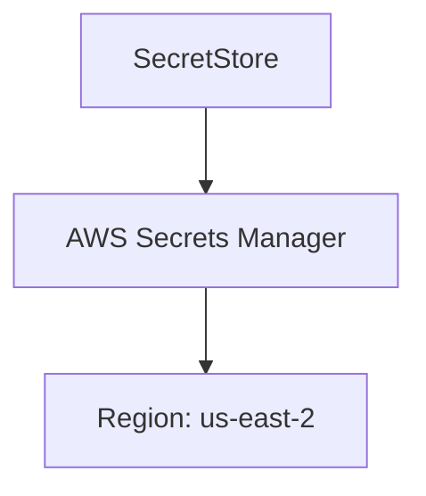
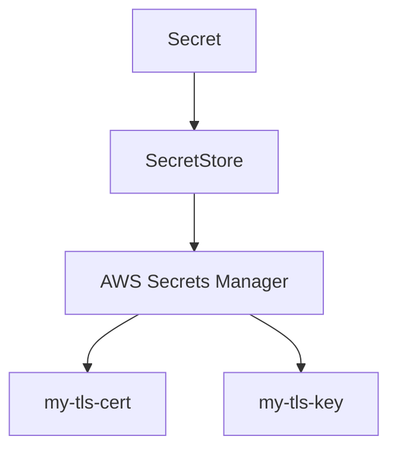
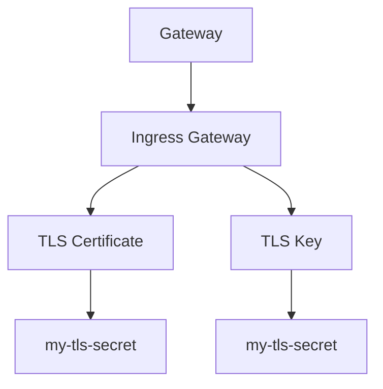

## Introduction to Service Mesh with Istio

Service mesh is a dedicated infrastructure layer for handling service-to-service communication. One of the most popular service mesh implementations is Istio, which provides a robust framework for managing traffic, enforcing policies, and securing communications between services. In this chapter, we will focus on configuring a secure gateway using Istio, specifically dealing with secrets management and ensuring that the correct region is used for fetching secrets.

### Background Theory

A service mesh like Istio operates at the network level, intercepting and controlling all traffic between microservices. This allows for fine-grained control over traffic routing, load balancing, and security policies. A key component of Istio is the **Gateway**, which acts as an entry point for external traffic into the mesh. Configuring a secure gateway involves setting up TLS certificates and keys to ensure encrypted communication.

### Secrets Management in Istio

In Istio, secrets such as TLS certificates and keys can be managed using various secret stores. One common approach is to use AWS Secrets Manager, which securely stores and manages secrets such as passwords, API keys, and certificates. To use these secrets in Istio, you need to configure the secret store to connect to the appropriate region where the secrets are stored.

#### Secret Store Configuration

The secret store configuration in Istio is typically done using a `SecretStore` resource. This resource specifies the type of secret store (e.g., AWS Secrets Manager) and the region where the secrets are located. Here is an example of a `SecretStore` configuration:

```yaml
apiVersion: secrets.k8s.io/v1alpha1
kind: SecretStore
metadata:
  name: aws-secrets-manager
spec:
  provider:
    aws:
      region: us-east-2
```

In this configuration, the `SecretStore` is set to use AWS Secrets Manager in the `us-east-2` region. This ensures that Istio can fetch secrets from the correct region.

### Fetching Secrets from AWS Secrets Manager

To fetch secrets from AWS Secrets Manager, you need to define a `Secret` resource in Istio. This resource references the secret store and the specific secret name. Here is an example of a `Secret` resource:

```yaml
apiVersion: secrets.k8s.io/v1alpha1
kind: Secret
metadata:
  name: my-tls-secret
spec:
  type: kubernetes.io/tls
  data:
    tls.crt:
      secretRef:
        name: my-tls-cert
        store: aws-secrets-manager
    tls.key:
      secretRef:
        name: my-tls-key
        store: aws-secrets-manager
```

In this configuration, the `Secret` resource references the `aws-secrets-manager` secret store and fetches the `my-tls-cert` and `my-tls-key` secrets from it.

### Configuring the Gateway

Once the secrets are fetched, you can configure the Istio Gateway to use them. The Gateway resource defines the external endpoint for incoming traffic and specifies the TLS settings. Here is an example of a Gateway configuration:

```yaml
apiVersion: networking.istio.io/v1alpha3
kind: Gateway
metadata:
  name: my-gateway
spec:
  selector:
    istio: ingressgateway
  servers:
  - port:
      number: 443
      name: https
      protocol: HTTPS
    tls:
      mode: SIMPLE
      serverCertificate: /etc/istio/secret/my-tls-secret/tls.crt
      privateKey: /etc/istio/secret/my-tls-secret/tls.key
    hosts:
    - "*"
```

In this configuration, the Gateway listens on port 443 and uses the TLS certificate and key fetched from the secret store.

### Troubleshooting Region Issues

One common issue when working with secrets in different regions is ensuring that the correct region is specified in the secret store configuration. If the region is incorrect, Istio will not be able to fetch the secrets and will return an error indicating that the secret could not be found.

#### Example Scenario

Suppose you have configured the secret store to use the `us-east-1` region, but the secrets are actually stored in the `us-east-2` region. When Istio tries to fetch the secrets, it will look in the `us-east-1` region and fail to find them. To resolve this issue, you need to update the secret store configuration to use the correct region.

Here is an example of the incorrect configuration:

```yaml
apiVersion: secrets.k8s.io/v1alpha1
kind: SecretStore
metadata:
  name: aws-secrets-manager
spec:
  provider:
    aws:
      region: us-east-1
```

And here is the corrected configuration:

```yaml
apiVersion: secrets.k8s.io/v1alpha1
kind: SecretStore
metadata:
  name: aws-secrets-manager
spec:
  provider:
    aws:
      region: us-east-2
```

By updating the region in the secret store configuration, Istio will be able to fetch the secrets correctly.

### Real-World Examples

#### Recent CVEs and Breaches

One recent example of a breach involving misconfigured secrets is the **AWS S3 bucket exposure** incident. In this case, a company inadvertently exposed sensitive data stored in an S3 bucket due to misconfigured permissions. This highlights the importance of properly managing secrets and ensuring that they are securely stored and accessed.

Another example is the **GitHub token leak** incident, where a developer accidentally committed a GitHub personal access token to a public repository. This token was then used to gain unauthorized access to the developer's repositories. This incident underscores the need for proper secret management and the use of tools like secret managers to securely store and manage secrets.

### How to Prevent / Defend

#### Detection

To detect misconfigured secrets, you can use tools like **TruffleHog** or **GitGuardian** to scan your repositories for leaked secrets. These tools can help identify sensitive information that may have been accidentally committed to your codebase.

#### Prevention

To prevent misconfigured secrets, follow these best practices:

1. **Use Secret Managers**: Store secrets in a dedicated secret manager like AWS Secrets Manager or HashiCorp Vault.
2. **Environment-Specific Secrets**: Ensure that secrets are environment-specific and not hardcoded in your codebase.
3. **Least Privilege Principle**: Grant the minimum necessary permissions to access secrets.
4. **Regular Audits**: Regularly audit your secret configurations to ensure they are correctly set up.

#### Secure Coding Fixes

Here is an example of a vulnerable configuration and the corresponding secure configuration:

**Vulnerable Configuration:**

```yaml
apiVersion: secrets.k8s.io/v1alpha1
kind: SecretStore
metadata:
  name: aws-secrets-manager
spec:
  provider:
    aws:
      region: us-east-1
```

**Secure Configuration:**

```yaml
apiVersion: secrets.k8s.io/v1alpha1
kind: SecretStore
metadata:
  name: aws-secrets-manager
spec:
  provider:
    aws:
      region: us-east-2
```

By ensuring that the correct region is specified in the secret store configuration, you can prevent issues related to misconfigured secrets.

### Complete Example

Here is a complete example of configuring a secure gateway using Istio, including the secret store configuration, secret fetching, and gateway configuration:

#### Secret Store Configuration

```yaml
apiVersion: secrets.k8s.io/v1alpha1
kind: SecretStore
metadata:
  name: aws-secrets-manager
spec:
  provider:
    aws:
      region: us-east-2
```

#### Secret Configuration

```yaml
apiVersion: secrets.k8s.io/v1alpha1
kind: Secret
metadata:
  name: my-tls-secret
spec:
  type: kubernetes.io/tls
  data:
    tls.crt:
      secretRef:
        name: my-tls-cert
        store: aws-secrets-manager
    tls.key:
      secretRef:
        name: my-tls-key
        store: aws-secrets-manager
```

#### Gateway Configuration

```yaml
apiVersion: networking.istio.io/v1alpha3
kind: Gateway
metadata:
  name: my-gateway
spec:
  selector:
    istio: ingressgateway
  servers:
  - port:
      number: 443
      name: https
      protocol: HTTPS
    tls:
      mode: SIMPLE
      serverCertificate: /etc/istio/secret/my-tls-secret/tls.crt
      privateKey: /etc/istio/secret/my-tls-secret/tls.key
    hosts:
    - "*"
```

### Mermaid Diagrams

#### Secret Store Configuration Diagram



#### Secret Fetching Diagram



#### Gateway Configuration Diagram



### Hands-On Labs

For hands-on practice with configuring a secure gateway using Istio, consider the following labs:

- **PortSwigger Web Security Academy**: Offers a variety of labs related to web application security, including some that touch on service mesh concepts.
- **OWASP Juice Shop**: A deliberately insecure web application for security training purposes.
- **CloudGoat**: A collection of labs for practicing cloud security, including AWS-specific scenarios.

These labs provide practical experience in configuring and securing service meshes, helping you to apply the concepts learned in this chapter.

### Conclusion

Configuring a secure gateway using Istio involves managing secrets effectively and ensuring that the correct region is specified for fetching secrets. By following best practices and using tools like secret managers, you can prevent common issues related to misconfigured secrets and ensure that your service mesh is secure and reliable.

---
<!-- nav -->
[[DevSecOps/DevSecOps Bootcamp/06-Container & Kubernetes Security/04-Service Mesh with Istio/Configure a Secure Gateway/03-Introduction to Service Mesh with Istio Part 3|Introduction to Service Mesh with Istio Part 3]] | [[DevSecOps/DevSecOps Bootcamp/06-Container & Kubernetes Security/04-Service Mesh with Istio/Configure a Secure Gateway/00-Overview|Overview]] | [[DevSecOps/DevSecOps Bootcamp/06-Container & Kubernetes Security/04-Service Mesh with Istio/Configure a Secure Gateway/05-Introduction to Service Mesh with Istio Part 5|Introduction to Service Mesh with Istio Part 5]]
