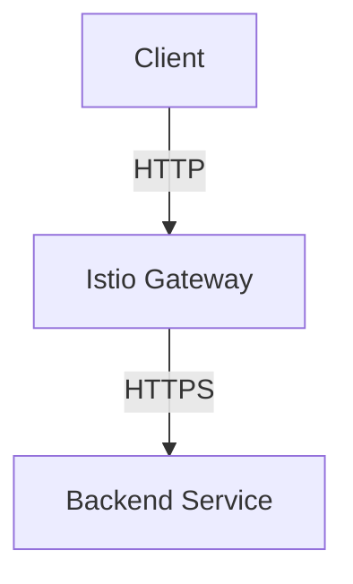
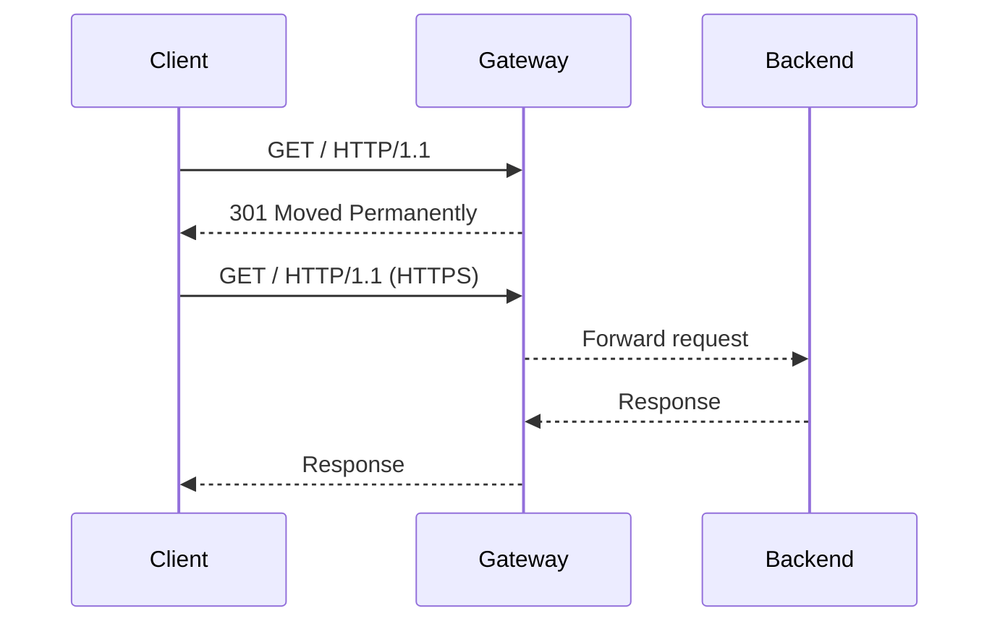

## Introduction to Service Mesh with Istio

Service mesh is a dedicated infrastructure layer for handling service-to-service communication. One of the most popular service mesh implementations is Istio, which provides advanced traffic management, policy enforcement, and observability features. In this chapter, we will focus on configuring a secure gateway using Istio, ensuring that all incoming traffic is properly redirected to HTTPS.

### What is a Service Mesh?

A service mesh is a dedicated infrastructure layer for handling service-to-service communication. It abstracts away the complexity of managing inter-service communication, providing features such as:

- Traffic management (load balancing, retries, timeouts)
- Policy enforcement (authentication, authorization, rate limiting)
- Observability (metrics, tracing, logging)

Istio is an open-source service mesh that can be deployed on various platforms, including Kubernetes. It consists of several components:

- **Envoy Proxy**: A high-performance proxy that sits between services, handling all network communication.
- **Pilot**: Manages Envoy configuration and routing rules.
- **Citadel**: Handles service-to-service authentication and certificate management.
- **Galley**: Manages configuration validation and distribution.
- **Mixer**: Enforces policies and collects telemetry data.

### Why Use Istio for Secure Gateway Configuration?

Using Istio for secure gateway configuration offers several benefits:

- **Centralized Management**: You can manage all traffic routing and security policies from a central location.
- **Automatic Encryption**: Istio can automatically encrypt traffic between services using mutual TLS.
- **Policy Enforcement**: You can enforce access control policies and rate limits at the gateway level.
- **Observability**: Istio provides detailed metrics and tracing capabilities to monitor traffic and troubleshoot issues.

### How Does Istio Work Under the Hood?

When you configure a secure gateway in Istio, the following steps occur:

1. **Traffic Routing**: Incoming traffic is directed to the Envoy proxy, which acts as a gateway.
2. **HTTP to HTTPS Redirection**: Any HTTP traffic is redirected to HTTPS using the configured gateway.
3. **TLS Termination**: The Envoy proxy terminates the TLS connection and forwards the decrypted traffic to the backend services.
4. **Policy Enforcement**: Access control policies and rate limits are enforced by the Mixer component.

### Real-World Example: Recent Breaches and CVEs

Recent breaches and CVEs have highlighted the importance of securing gateway configurations. For example:

- **CVE-2021-21974**: This vulnerability in Apache Struts allowed attackers to bypass authentication and execute arbitrary code. Properly configured gateways can help mitigate such risks by enforcing strict access controls.
- **CVE-2021-44228 (Log4Shell)**: This critical vulnerability in the Log4j library allowed remote code execution. Using Istio, you can enforce strict access controls and monitor traffic to detect and respond to such attacks.

### Complete Configuration for Secure Gateway

To configure a secure gateway in Istio, you need to create a `Gateway` resource and a `VirtualService` resource. These resources define how incoming traffic is handled and redirected.

#### Step-by-Step Configuration

1. **Create a Gateway Resource**:
   - Define the host and port for the gateway.
   - Specify the TLS settings to enable HTTPS redirection.

```yaml
apiVersion: networking.istio.io/v1alpha3
kind: Gateway
metadata:
  name: secure-gateway
spec:
  selector:
    istio: ingressgateway
  servers:
  - port:
      number: 80
      name: http
      protocol: HTTP
    hosts:
    - "*"
    tls:
      mode: SIMPLE
      serverCertificate: /etc/istio/ingressgateway-certs/tls.crt
      privateKey: /etc/istio/ingressgateway-certs/tls.key
```

2. **Create a VirtualService Resource**:
   - Define the host and rewrite rules to redirect HTTP traffic to HTTPS.

```yaml
apiVersion: networking.istio.io/v1alpha3
kind: VirtualService
metadata:
  name: http-to-https
spec:
  hosts:
  - "*"
  gateways:
  - secure-gateway
  http:
  - match:
    - uri:
        prefix: /
    redirect:
      uri: https://{hostname}{uri}
```

#### Full HTTP Request and Response

Here is an example of a full HTTP request and response:

```http
GET / HTTP/1.1
Host: example.com
Connection: keep-alive
Upgrade-Insecure-Requests: 1
User-Agent: Mozilla/5.0 (Windows NT 10.0; Win64; x64) AppleWebKit/537.36 (KHTML, like Gecko) Chrome/91.0.4472.124 Safari/537.36
Accept: text/html,application/xhtml+xml,application/xml;q=0.9,image/avif,image/webp,image/apng,*/*;q=0.8,application/signed-exchange;v=b3;q=0.9
Accept-Encoding: gzip, deflate, br
Accept-Language: en-US,en;q=0.9
Cookie: session_id=abc123

HTTP/1.1 301 Moved Permanently
Date: Mon, 01 Aug 2022 12:00:00 GMT
Server: envoy
Content-Length: 0
Location: https://example.com/
```

### Mermaid Diagrams

#### Network Topology



#### Request/Response Flow



### Common Pitfalls and How to Avoid Them

#### Misconfigured TLS Settings

One common pitfall is misconfiguring the TLS settings, leading to insecure connections. Ensure that the `mode` is set to `SIMPLE` and that the correct certificates are provided.

#### Incorrect Host Matching

Another issue is incorrect host matching in the `VirtualService`. Ensure that the `hosts` field matches the desired domain.

### How to Prevent / Defend

#### Detection

- **Monitoring**: Use Istio's built-in monitoring tools to track traffic patterns and detect anomalies.
- **Logging**: Enable detailed logging to capture all incoming requests and responses.

#### Prevention

- **Strict Access Controls**: Enforce strict access controls using Istio's policy enforcement features.
- **Rate Limiting**: Implement rate limiting to prevent abuse.

#### Secure Coding Fixes

Here is an example of a vulnerable configuration and the corrected secure version:

**Vulnerable Configuration**

```yaml
apiVersion: networking.istio.io/v1alpha3
kind: Gateway
metadata:
  name: insecure-gateway
spec:
  selector:
    istio: ingressgateway
  servers:
  - port:
      number: 80
      name: http
      protocol: HTTP
    hosts:
    - "*"
```

**Secure Configuration**

```yaml
apiVersion: networking.istio.io/v1alpha3
kind: Gateway
metadata:
  name: secure-gateway
spec:
  selector:
    istio: ingressgateway
  servers:
  - port:
      number: 80
      name: http
      protocol: HTTP
    hosts:
    - "*"
    tls:
      mode: SIMPLE
      serverCertificate: /etc/istio/ingressgateway-certs/tls.crt
      privateKey: /etc/istio/ingressgateway-certs/tls.key
```

### Configuration Hardening

- **Use Strong Certificates**: Ensure that strong, up-to-date certificates are used.
- **Enable Mutual TLS**: Configure mutual TLS to ensure secure communication between services.

### Hands-On Labs

For hands-on practice with Istio and secure gateway configuration, consider the following labs:

- **PortSwigger Web Security Academy**: Offers interactive labs on web application security, including service mesh configurations.
- **OWASP Juice Shop**: Provides a vulnerable web application for practicing security configurations.
- **Kubernetes Goat**: Focuses on Kubernetes security and includes scenarios for configuring secure gateways.

By following these steps and best practices, you can ensure that your service mesh is configured securely and efficiently.

---
<!-- nav -->
[[DevSecOps/DevSecOps Bootcamp/06-Container & Kubernetes Security/04-Service Mesh with Istio/Configure a Secure Gateway/05-Introduction to Service Mesh with Istio Part 5|Introduction to Service Mesh with Istio Part 5]] | [[DevSecOps/DevSecOps Bootcamp/06-Container & Kubernetes Security/04-Service Mesh with Istio/Configure a Secure Gateway/00-Overview|Overview]] | [[07-Introduction to Service Mesh with Istio|Introduction to Service Mesh with Istio]]
