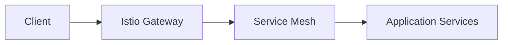
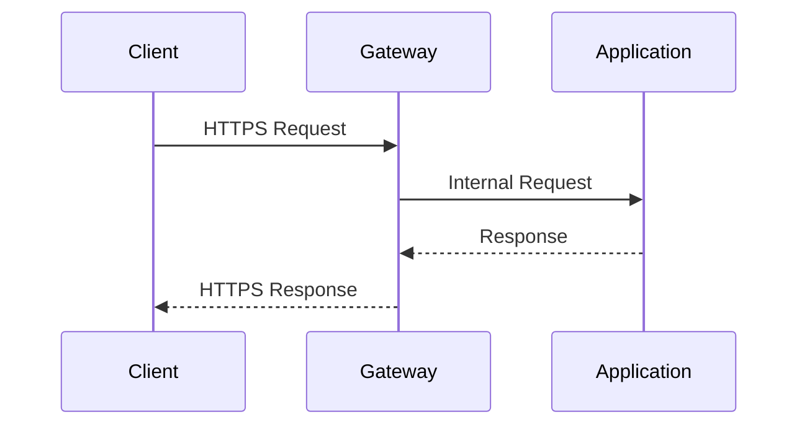

## Configuring a Secure Gateway with Istio

### Introduction to Service Mesh and Istio

A service mesh is a dedicated infrastructure layer for handling service-to-service communication. It provides a way to manage and secure the interactions between microservices in a distributed system. One of the most popular service mesh implementations is Istio, which is designed to work seamlessly with Kubernetes.

Istio provides a number of features such as traffic management, policy enforcement, and observability. A key component of Istio is the **Gateway**, which acts as an entry point for external traffic into the mesh. To ensure secure communication, the Gateway can be configured to use HTTPS, which requires a TLS certificate.

### Generating a TLS Certificate

To secure the connection, we need to generate a TLS certificate. In this context, we will generate a self-signed certificate. Self-signed certificates are not issued by a trusted Certificate Authority (CA), but they can still provide encryption and are often used in development and testing environments.

#### Steps to Generate a Self-Signed Certificate

1. **Install OpenSSL**: Ensure that OpenSSL is installed on your system. This can typically be done via package managers like `apt` or `brew`.

    ```bash
    sudo apt-get install openssl
    ```

2. **Generate a Private Key**:

    ```bash
    openssl genpkey -algorithm RSA -out private.key -aes256
    ```

    This command generates a private key using the RSA algorithm and encrypts it with AES-256.

3. **Generate a Certificate Signing Request (CSR)**:

    ```bash
    openssl req -new -key private.key -out csr.csr
    ```

    This command creates a CSR based on the private key.

4. **Generate the Self-Signed Certificate**:

    ```bash
    openssl x509 -req -days 365 -in csr.csr -signkey private.key -out certificate.crt
    ```

    This command signs the CSR with the private key and generates a self-signed certificate valid for 365 days.

### Storing Sensitive Data Securely

Sensitive data such as TLS certificates should be stored securely. In a production environment, it is recommended to use a secrets manager like AWS Secrets Manager. However, for demonstration purposes, we will store the certificate in a Kubernetes Secret.

#### Creating a Kubernetes Secret

Kubernetes Secrets allow you to store sensitive information such as passwords, tokens, and certificates. Here’s how to create a Secret with the generated TLS certificate:

1. **Create a Secret Manifest**:

    ```yaml
    apiVersion: v1
    kind: Secret
    metadata:
      name: tls-secret
    type: kubernetes.io/tls
    data:
      tls.crt: <base64 encoded certificate>
      tls.key: <base64 encoded private key>
    ```

    Replace `<base64 encoded certificate>` and `<base64 encoded private key>` with the base64-encoded versions of your certificate and private key.

2. **Base64 Encode the Files**:

    ```bash
    cat certificate.crt | base64
    cat private.key | base64
    ```

3. **Apply the Secret**:

    ```bash
    kubectl apply -f secret.yaml
    ```

### Configuring the Gateway with the TLS Certificate

The Gateway resource in Istio defines how external traffic is routed into the mesh. To configure the Gateway to use HTTPS, we need to reference the Kubernetes Secret containing the TLS certificate.

#### Gateway Configuration Example

```yaml
apiVersion: networking.istio.io/v1alpha3
kind: Gateway
metadata:
  name: my-gateway
spec:
  selector:
    istio: ingressgateway
  servers:
  - port:
      number: 443
      name: https
      protocol: HTTPS
    tls:
      mode: SIMPLE
      serverCertificate: /etc/istio/ingressgateway-certs/tls.crt
      privateKey: /etc/istio/ingressgateway-certs/tls.key
    hosts:
    - "*"
```

This configuration sets up the Gateway to listen on port 443 (HTTPS) and uses the TLS certificate and private key stored in the specified paths.

### Full HTTP Request and Response Example

Here’s an example of a full HTTP request and response using the configured Gateway:

#### HTTP Request

```http
GET / HTTP/1.1
Host: example.com
Accept: */*
```

#### HTTP Response

```http
HTTP/1.1 200 OK
Date: Mon, 27 Mar 2023 12:00:00 GMT
Content-Type: text/html; charset=UTF-8
Content-Length: 1234

<!DOCTYPE html>
<html>
<head>
    <title>Welcome</title>
</head>
<body>
    <h1>Hello, World!</h1>
</body>
</html>
```

### Mermaid Diagrams

#### Network Topology



#### Request/Response Flow



### Common Pitfalls and How to Prevent Them

#### Pitfall: Exposing Private Keys

One common pitfall is accidentally exposing private keys. This can happen if the private key is not properly encrypted or if it is stored in an insecure location.

##### How to Prevent

- **Encrypt Private Keys**: Always encrypt private keys using strong encryption algorithms like AES-256.
- **Use Secrets Manager**: Store sensitive data like private keys in a secrets manager like AWS Secrets Manager.
- **Limit Access**: Restrict access to the private key to only authorized personnel and services.

#### Pitfall: Using Weak Certificates

Using weak or expired certificates can lead to security vulnerabilities.

##### How to Prevent

- **Regularly Renew Certificates**: Ensure that certificates are renewed before they expire.
- **Use Strong Algorithms**: Use strong cryptographic algorithms like RSA-2048 or higher.
- **Monitor Certificate Expiry**: Implement monitoring to alert when certificates are nearing expiry.

### Real-World Examples and CVEs

#### Example: CVE-2021-21277

CVE-2021-21277 is a vulnerability in Istio that allows an attacker to bypass authentication and authorization checks. This vulnerability highlights the importance of securing the Gateway and ensuring proper configuration.

##### How to Detect and Mitigate

- **Update Istio**: Ensure that Istio is updated to the latest version.
- **Enable Mutual TLS**: Enable mutual TLS to ensure that both client and server authenticate each other.
- **Audit Configurations**: Regularly audit configurations to ensure that they are secure and up-to-date.

### Practice Labs

For hands-on practice with configuring a secure Gateway in Istio, consider the following labs:

- **PortSwigger Web Security Academy**: Offers a variety of labs related to web security, including some that touch on service mesh concepts.
- **OWASP Juice Shop**: A deliberately insecure web application for security training.
- **CloudGoat**: A series of labs focused on cloud security, including AWS-specific configurations.

These labs provide practical experience in setting up and securing a service mesh with Istio.

### Conclusion

Configuring a secure Gateway in Istio involves generating a TLS certificate, storing it securely, and configuring the Gateway to use HTTPS. By following these steps and being aware of common pitfalls, you can ensure that your service mesh is secure and resilient against potential threats.

---
<!-- nav -->
[[08-Configuring a Secure Gateway with Istio Part 1|Configuring a Secure Gateway with Istio Part 1]] | [[DevSecOps/DevSecOps Bootcamp/06-Container & Kubernetes Security/04-Service Mesh with Istio/Configure a Secure Gateway/00-Overview|Overview]] | [[DevSecOps/DevSecOps Bootcamp/06-Container & Kubernetes Security/04-Service Mesh with Istio/Configure a Secure Gateway/10-Practice Questions & Answers|Practice Questions & Answers]]
