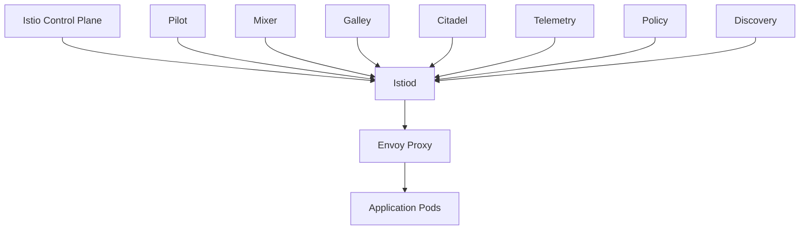

## Introduction to Service Mesh with Istio

Service mesh is an infrastructure layer for handling service-to-service communication. It provides a way to manage and monitor interactions between services in a microservices architecture. One of the most popular service mesh implementations is Istio, which is designed to work seamlessly with Kubernetes clusters. In this section, we will cover the installation of Istio using Helm, a package manager for Kubernetes.

### What is Helm?

Helm is a package manager for Kubernetes that simplifies the deployment and management of applications. It uses charts, which are collections of files that describe a related set of Kubernetes resources. A chart can be used to deploy a single application or a complex multi-component application.

#### Why Use Helm?

- **Consistency**: Helm ensures that deployments are consistent across different environments.
- **Reusability**: Charts can be reused across different projects.
- **Version Control**: Helm allows you to manage different versions of your applications.
- **Ease of Use**: Helm simplifies the process of deploying and managing Kubernetes resources.

### Installing Istio Using Helm

To install Istio in a Kubernetes cluster using Helm, we need to define the Helm release configurations for the Istio components. These components include the control plane, data plane, and other auxiliary services.

#### Step-by-Step Installation Process

1. **Define Helm Release Configurations**:
   - We need to specify the Helm release name, repository URL, chart name, and version.
   - The Helm release name is the identifier for the Istio installation within the cluster.
   - The repository URL points to the location of the Helm charts for Istio.
   - The chart name specifies the specific chart to be installed.
   - The version ensures that we are installing a consistent version of Istio.

2. **Namespace Configuration**:
   - We need to specify the namespace where Istio components will be deployed.
   - If the namespace does not exist, we can configure Helm to create it.

Let's walk through these steps in detail.

### Detailed Configuration Example

#### Helm Release Name

The Helm release name is the identifier for the Istio installation within the cluster. We can name it anything we want, but for consistency, we will use `IstioD`.

```yaml
releaseName: IstioD
```

#### Repository URL and Chart Name

The repository URL points to the location of the Helm charts for Istio. The chart name specifies the specific chart to be installed. For this example, we will use the `istio` chart.

```yaml
repositoryUrl: https://istio-release.storage.googleapis.com/charts
chartName: istio
```

#### Version Specification

We need to fix the version to ensure consistency with the demo. This version should be checked against the official Istio documentation.

```yaml
version: 1.11.4
```

#### Namespace Configuration

We need to specify the namespace where Istio components will be deployed. If the namespace does not exist, we can configure Helm to create it.

```yaml
namespace: istio-system
createNamespace: true
```

### Complete Helm Configuration

Combining all the above configurations, we get the following Helm configuration:

```yaml
# helm-config.yaml
releaseName: IstioD
repositoryUrl: https://istio-release.storage.googleapis.com/charts
chartName: istio
version: 1.11.4
namespace: istio-system
createNamespace: true
```

### Installing Istio Using Helm

To install Istio using the above configuration, we can use the following Helm command:

```sh
helm install IstioD istio/istio --version 1.11.4 --namespace istio-system --create-namespace
```

### Detailed Explanation of the Command

- `helm install`: This command installs a new release of a chart.
- `IstioD`: This is the release name.
- `istio/istio`: This specifies the repository and chart name.
- `--version 1.11.4`: This specifies the version of the chart to be installed.
- `--namespace istio-system`: This specifies the namespace where the components will be deployed.
- `--create-namespace`: This flag creates the namespace if it does not exist.

### Mermaid Diagram of Istio Components

Here is a mermaid diagram illustrating the Istio components and their relationships:



### Common Pitfalls and How to Avoid Them

#### Incorrect Version Specification

- **Problem**: Specifying an incorrect version can lead to compatibility issues.
- **Solution**: Always verify the version against the official Istio documentation.

#### Missing Namespace Creation

- **Problem**: If the namespace does not exist and `--create-namespace` is not specified, the installation will fail.
- **Solution**: Ensure that the namespace is either pre-created or the `--create-namespace` flag is used.

### Real-World Examples and CVEs

#### CVE-2021-25281: Istio Envoy Proxy Vulnerability

- **Description**: A vulnerability in the Envoy proxy component of Istio could allow an attacker to bypass security policies.
- **Impact**: An attacker could potentially access sensitive data or execute unauthorized actions.
- **Mitigation**: Ensure that all Istio components are up to date and apply the necessary security patches.

### How to Prevent / Defend

#### Detection

- **Monitoring**: Use tools like Prometheus and Grafana to monitor Istio components for unusual activity.
- **Logging**: Enable detailed logging for Istio components to detect any suspicious behavior.

#### Prevention

- **Secure Configuration**: Follow the official Istio security guidelines for configuring components.
- **Regular Updates**: Keep all Istio components up to date with the latest security patches.

#### Secure Coding Fixes

Here is an example of a vulnerable Istio configuration and its secure counterpart:

**Vulnerable Configuration**

```yaml
apiVersion: networking.istio.io/v1alpha3
kind: VirtualService
metadata:
  name: my-virtual-service
spec:
  hosts:
  - my-host
  http:
  - match:
    - uri:
        prefix: /my-prefix
    route:
    - destination:
        host: my-backend
```

**Secure Configuration**

```yaml
apiVersion: networking.istio.io/v1alpha3
kind: VirtualService
metadata:
  name: my-virtual-service
spec:
  hosts:
  - my-host
  http:
  - match:
    - uri:
        prefix: /my-prefix
    route:
    - destination:
        host: my-backend
      weight: 100
  - match:
    - uri:
        exact: /my-exact-path
    route:
    - destination:
        host: my-backend
      weight: 100
```

### Hands-On Labs

For hands-on practice with Istio and Helm, consider the following labs:

- **PortSwigger Web Security Academy**: Offers a comprehensive set of labs covering various aspects of web security.
- **OWASP Juice Shop**: A deliberately insecure web application for security training.
- **Kubernetes Goat**: A Kubernetes-based security training platform.

These labs provide practical experience in deploying and securing Istio in a Kubernetes environment.

### Conclusion

In this section, we covered the installation of Istio using Helm, including detailed explanations of each step, potential pitfalls, real-world examples, and secure coding practices. By following these guidelines, you can ensure a successful and secure deployment of Istio in your Kubernetes cluster.

---
<!-- nav -->
[[DevSecOps/DevSecOps Bootcamp/06-Container & Kubernetes Security/04-Service Mesh with Istio/Install Istio in K8s cluster/00-Overview|Overview]] | [[DevSecOps/DevSecOps Bootcamp/06-Container & Kubernetes Security/04-Service Mesh with Istio/Install Istio in K8s cluster/02-Introduction to Service Mesh with Istio Part 10|Introduction to Service Mesh with Istio Part 10]]
