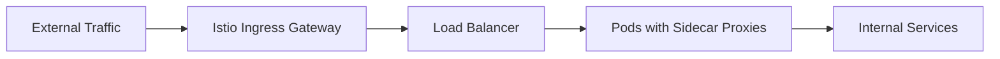
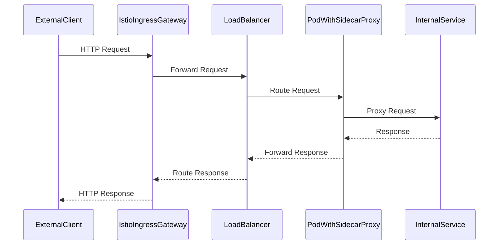

## Introduction to Service Mesh with Istio

In this section, we delve into the intricacies of setting up and configuring Istio within a Kubernetes (K8s) cluster. Istio is a service mesh that provides a robust set of features for managing and securing microservices-based applications. A service mesh is a dedicated infrastructure layer that handles the communication between services in a distributed system. Istio, in particular, offers advanced traffic management, observability, and security capabilities.

### What is Istio?

Istio is an open-source service mesh that provides a uniform way to secure, connect, and monitor microservices. It is designed to work with any platform and supports a wide range of deployment environments, including Kubernetes, VMs, and bare metal. Istio’s key components include:

- **Pilot**: Manages service discovery and routing.
- **Mixer**: Enforces policies and collects telemetry data.
- **Citadel**: Manages identity and credentials.
- **Galley**: Validates and distributes configuration.

### Why Use Istio?

Istio addresses several critical challenges in modern microservices architectures:

- **Traffic Management**: Enables sophisticated traffic routing, such as canary deployments, A/B testing, and fault injection.
- **Observability**: Provides detailed metrics, tracing, and logging for all services.
- **Security**: Implements mutual TLS, authentication, and authorization across services.

### How Istio Works

At its core, Istio uses sidecar proxies to intercept and control all network traffic between services. These sidecars are typically instances of Envoy, a high-performance proxy developed by Lyft. Each pod in the cluster runs an Envoy sidecar, which acts as a network gateway for the service.

### Installing Istio in a Kubernetes Cluster

To install Istio in a Kubernetes cluster, follow these steps:

1. **Download Istio**:
   ```bash
   curl -L https://istio.io/downloadIstio | sh -
   ```

2. **Install Istio Control Plane**:
   ```bash
   cd istio-1.11.0
   ./bin/istioctl install --set profile=demo -y
   ```

3. **Verify Installation**:
   ```bash
   kubectl get svc -n istio-system
   ```

### Configuring Ingress Gateway

One of the crucial configurations when setting up Istio is the Ingress Gateway. The Ingress Gateway is responsible for routing external traffic into the cluster and managing load balancing.

#### Ingress Gateway Configuration

The Ingress Gateway is deployed as a Kubernetes service and is configured to listen on specific ports. To ensure proper communication, we need to configure the security groups associated with the load balancer.

```yaml
apiVersion: networking.k8s.io/v1
kind: Ingress
metadata:
  name: istio-ingress
  namespace: istio-system
spec:
  rules:
  - host: myapp.example.com
    http:
      paths:
      - path: /
        pathType: Prefix
        backend:
          service:
            name: myapp-service
            port:
              number: 80
```

#### Security Group Configuration

To allow traffic from the load balancer to the internal services, we need to configure the security group associated with the load balancer. This involves allowing inbound traffic on specific port ranges.

```yaml
---
apiVersion: v1
kind: Service
metadata:
  name: istio-ingressgateway
  namespace: istio-system
spec:
  type: LoadBalancer
  ports:
  - name: http
    port: 80
    targetPort: 80
  - name: https
    port: 443
    targetPort: 443
  selector:
    app: istio-ingressgateway
```

#### Example Security Group Rule

```json
{
  "GroupId": "sg-0123456789abcdef0",
  "IpPermissions": [
    {
      "FromPort": 80,
      "ToPort": 80,
      "IpProtocol": "tcp",
      "UserIdGroupPairs": [
        {
          "GroupId": "sg-0123456789abcdef1"
        }
      ]
    },
    {
      "FromPort": 443,
      "ToPort":  443,
      "IpProtocol": "tcp",
      "UserIdGroupPairs": [
        {
          "GroupId": "sg-0123456789abcdef1"
        }
      ]
    }
  ]
}
```

### Sidecar Injection

Another critical aspect of Istio is the automatic injection of sidecar proxies into microservices. This ensures that all network traffic is intercepted and managed by Istio.

#### Labeling Namespace for Sidecar Injection

To enable sidecar injection in a specific namespace, we need to add a label to the namespace. This label tells Istio to inject sidecar proxies into all pods created in that namespace.

```bash
kubectl label namespace online-boutique istio-injection=enabled
```

#### Example Deployment with Sidecar Injection

```yaml
apiVersion: apps/v1
kind: Deployment
metadata:
  name: myapp-deployment
  namespace: online-boutique
spec:
  replicas: 3
  selector:
    matchLabels:
      app: myapp
  template:
    metadata:
      labels:
        app: myapp
    spec:
      containers:
      - name: myapp-container
        image: myapp-image:latest
        ports:
        - containerPort: 8080
```

### Pitfalls and Common Mistakes

1. **Incorrect Security Group Configuration**: Ensure that the security group rules correctly allow traffic on the required ports.
2. **Missing Labels for Sidecar Injection**: Always verify that the correct labels are applied to the namespaces where sidecar injection is required.
3. **Misconfigured Ingress Gateway**: Double-check the configuration of the Ingress Gateway to ensure it matches the desired traffic routing and load balancing requirements.

### How to Prevent / Defend

#### Detection

- **Monitoring**: Use Istio’s built-in monitoring tools to track the health and performance of your services.
- **Logging**: Enable detailed logging to capture all network traffic and identify any anomalies.

#### Prevention

- **Secure Configuration**: Follow best practices for configuring security groups and ensuring that only necessary traffic is allowed.
- **Regular Audits**: Conduct regular audits of your Istio configuration to identify and mitigate potential security risks.

#### Secure Code Fix

##### Vulnerable Configuration

```yaml
apiVersion: v1
kind: Service
metadata:
  name: myapp-service
  namespace: online-boutique
spec:
  ports:
  - port: 80
    targetPort: 8080
  selector:
    app: myapp
```

##### Corrected Configuration

```yaml
apiVersion: v1
kind: Service
metadata:
  name: myapp-service
  namespace: online-boutique
spec:
  ports:
  - port: 80
    targetPort: 8080
  selector:
    app: myapp
  type: LoadBalancer
```

### Real-World Examples

#### Recent CVEs and Breaches

- **CVE-2021-25285**: A vulnerability in Istio’s Mixer component allowed unauthorized access to sensitive data. This was mitigated by updating to the latest version of Istio.
- **Breaches in Microservices Architectures**: Several high-profile breaches have been attributed to misconfigurations in service meshes, highlighting the importance of proper setup and maintenance.

### Mermaid Diagrams

#### Network Topology



#### Request/Response Flow



### Practice Labs

For hands-on experience with Istio, consider the following labs:

- **PortSwigger Web Security Academy**: Offers comprehensive tutorials on web application security, including service mesh configurations.
- **OWASP Juice Shop**: A deliberately insecure web application for practicing security skills.
- **Kubernetes Goat**: A Kubernetes-based security training platform.

By following these detailed steps and best practices, you can effectively set up and manage Istio in your Kubernetes cluster, ensuring robust traffic management, observability, and security for your microservices-based applications.

---
<!-- nav -->
[[DevSecOps/DevSecOps Bootcamp/06-Container & Kubernetes Security/04-Service Mesh with Istio/Install Istio in K8s cluster/02-Introduction to Service Mesh with Istio Part 10|Introduction to Service Mesh with Istio Part 10]] | [[DevSecOps/DevSecOps Bootcamp/06-Container & Kubernetes Security/04-Service Mesh with Istio/Install Istio in K8s cluster/00-Overview|Overview]] | [[04-Introduction to Service Mesh with Istio Part 12|Introduction to Service Mesh with Istio Part 12]]
