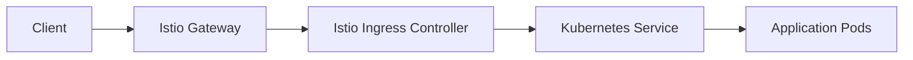
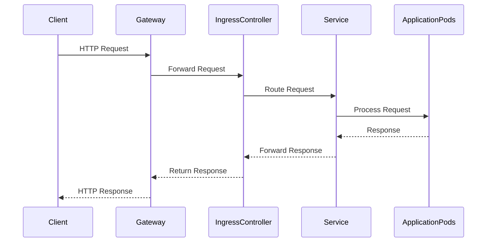

## Introduction to Service Mesh with Istio

Service mesh is an infrastructure layer for handling service-to-service communication. It provides a way to manage and monitor microservices, ensuring reliable and secure interactions between them. One of the most popular service mesh implementations is Istio, which is designed to work seamlessly with Kubernetes clusters.

### What is Istio?

Istio is an open-source service mesh that provides a uniform way to secure, control, and observe interactions between microservices. It is built on the Envoy proxy and integrates with Kubernetes to provide advanced traffic management, policy enforcement, and observability features.

#### Why Use Istio?

- **Traffic Management**: Istio allows you to route traffic between services, implement retries, timeouts, and circuit breakers.
- **Security**: It provides mutual TLS encryption, authentication, and authorization mechanisms.
- **Observability**: Istio offers detailed metrics, distributed tracing, and logging capabilities.
- **Policy Enforcement**: You can enforce policies such as rate limiting, request routing, and access control.

### Installing Istio in a Kubernetes Cluster

To install Istio in a Kubernetes cluster, you need to follow several steps. This process involves deploying the Istio control plane components and configuring the gateway components.

#### Prerequisites

Before installing Istio, ensure that your Kubernetes cluster meets the following requirements:

- Kubernetes version 1.16 or later.
- `kubectl` configured to interact with your cluster.
- A working DNS setup within your cluster.

#### Step-by-Step Installation

1. **Download Istio**

   First, download the Istio release package. You can do this using the following command:

   ```bash
   curl -L https://istio.io/downloadIstio | sh -
   ```

   This will download the latest stable version of Istio. Navigate to the extracted directory:

   ```bash
   cd istio-*
   ```

2. **Install Istio Control Plane**

   To install the Istio control plane, run the following command:

   ```bash
   ./bin/istioctl install --set profile=demo -y
   ```

   This command installs the Istio control plane with a demo profile, which includes all the necessary components.

3. **Verify Installation**

   After installation, verify that all Istio components are running correctly:

   ```bash
   kubectl get pods -n istio-system
   ```

   Ensure that all pods are in the `Running` state.

### Configuring the Gateway Components

Once Istio is installed, you need to configure the gateway components to expose your services externally. This involves creating a label selector and configuring the service annotations.

#### Label Selector

The label selector is used to identify the gateway resources. This is important because it allows you to connect the gateway components with the gateway service.

```yaml
apiVersion: networking.istio.io/v1alpha3
kind: Gateway
metadata:
  name: my-gateway
spec:
  selector:
    istio: ingressgateway
  servers:
  - port:
      number: 80
      name: http
      protocol: HTTP
    hosts:
    - "*"
```

In this example, the `selector` field specifies the label `istio: ingressgateway`. This label is used to identify the gateway service.

#### Service Annotations

Next, you need to configure the service annotations to create a load balancer type service. This will provision an AWS load balancer in the background.

```yaml
apiVersion: v1
kind: Service
metadata:
  name: my-service
  annotations:
    service.beta.kubernetes.io/aws-load-balancer-type: "nlb"
spec:
  type: LoadBalancer
  ports:
  - port: 80
    targetPort: 8080
  selector:
    app: my-app
```

In this example, the `annotations` field includes the `service.beta.kubernetes.io/aws-load-balancer-type` annotation, which specifies the type of load balancer to be created. The `type` field is set to `LoadBalancer`, indicating that a load balancer should be created.

### Full Example Configuration

Here is a complete example of the configuration files:

#### Gateway Configuration

```yaml
apiVersion: networking.istio.io/v1alpha3
kind: Gateway
metadata:
  name: my-gateway
spec:
  selector:
    istio: ingressgateway
  servers:
  - port:
      number: 80
      name: http
      protocol: HTTP
    hosts:
    - "*"
```

#### Service Configuration

```yaml
apiVersion: v1
kind: Service
metadata:
  name: my-service
  annotations:
    service.beta.kubernetes.io/aws-load-balancer-type: "nlb"
spec:
  type: LoadBalancer
  ports:
  - port: 80
    targetPort: 8080
  selector:
    app: my-app
```

### How to Prevent / Defend

#### Detection

To detect misconfigurations or vulnerabilities in your Istio setup, you can use tools like `istioctl` and `kubectl`.

- **Check Pod Statuses**: Use `kubectl get pods -n istio-system` to check the status of all Istio components.
- **Check Gateway Configuration**: Use `kubectl get gateway -o yaml` to inspect the gateway configuration.
- **Check Service Configuration**: Use `kubectl get svc -o yaml` to inspect the service configuration.

#### Prevention

- **Use Secure Annotations**: Ensure that all annotations are secure and properly configured.
- **Monitor Traffic**: Use Istio's built-in monitoring tools to track traffic and detect anomalies.
- **Regular Audits**: Regularly audit your Istio configuration to ensure it remains secure.

### Real-World Examples

#### Recent CVEs/Breaches

- **CVE-2021-25282**: This vulnerability affects Istio versions prior to 1.9.4 and allows an attacker to bypass mutual TLS authentication. Ensure you are using the latest version of Istio to mitigate this risk.
- **CVE-2021-25283**: This vulnerability affects Istio versions prior to 1.9.4 and allows an attacker to inject arbitrary HTTP headers. Again, ensure you are using the latest version of Istio.

### Mermaid Diagrams

#### Network Topology



#### Request/Response Flow



### Complete HTTP Messages

#### Full HTTP Request

```http
GET / HTTP/1.1
Host: my-service.example.com
User-Agent: curl/7.64.1
Accept: */*
```

#### Full HTTP Response

```http
HTTP/1.1 200 OK
Date: Mon, 20 Mar 2023 12:00:00 GMT
Content-Type: text/html; charset=UTF-8
Content-Length: 12
Connection: keep-alive

Hello, World!
```

### Practice Labs

For hands-on practice with Istio, consider the following labs:

- **PortSwigger Web Security Academy**: Offers a comprehensive course on web application security, including sections on service mesh and Istio.
- **OWASP Juice Shop**: A deliberately insecure web application for practicing web security skills.
- **Kubernetes Goat**: A hands-on lab for learning Kubernetes security.

By following these steps and using the provided examples, you can successfully install and configure Istio in your Kubernetes cluster, ensuring secure and reliable service-to-service communication.

---
<!-- nav -->
[[07-Introduction to Service Mesh with Istio Part 4|Introduction to Service Mesh with Istio Part 4]] | [[DevSecOps/DevSecOps Bootcamp/06-Container & Kubernetes Security/04-Service Mesh with Istio/Install Istio in K8s cluster/00-Overview|Overview]] | [[09-Introduction to Service Mesh with Istio Part 6|Introduction to Service Mesh with Istio Part 6]]
