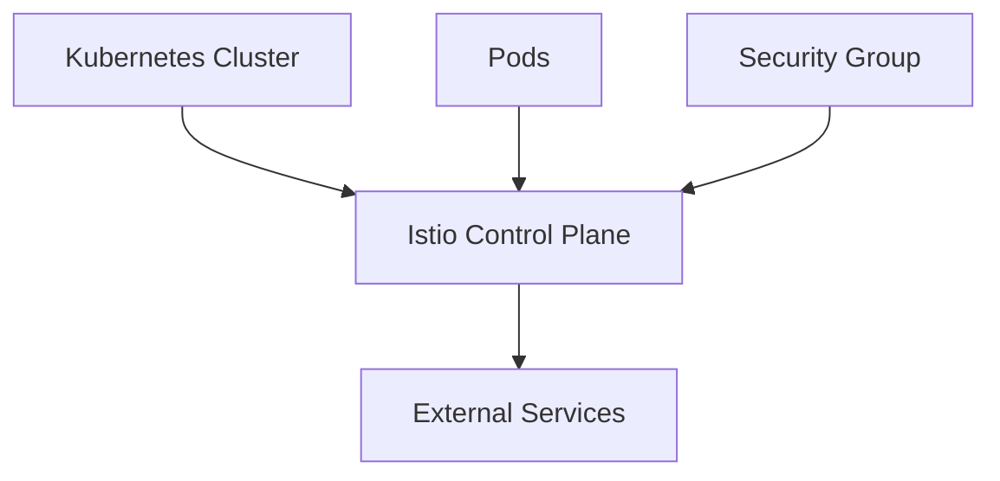
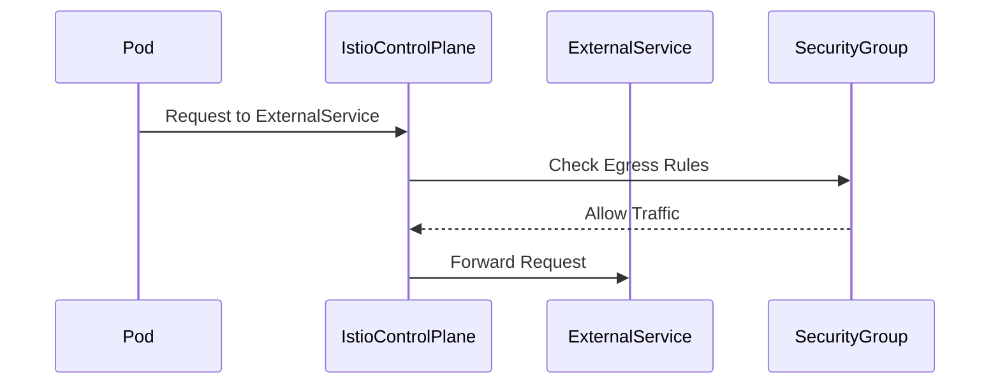

## Introduction to Service Mesh with Istio

Service mesh is an infrastructure layer for handling service-to-service communication. It provides a framework for managing the interactions between services in a microservices architecture. One of the most popular service mesh implementations is Istio, which is designed to work seamlessly with Kubernetes clusters. In this section, we will delve into the installation and configuration of Istio in a Kubernetes cluster, focusing particularly on defining egress rules for outbound traffic.

### Background Theory

A service mesh like Istio manages the communication between services in a distributed system. This includes load balancing, service discovery, encryption, and monitoring. By abstracting away these concerns, developers can focus on building their applications rather than worrying about the underlying infrastructure.

#### Key Concepts

- **Service Discovery**: Automatically discovering and connecting services within the cluster.
- **Load Balancing**: Distributing traffic evenly across multiple instances of a service.
- **Traffic Management**: Controlling how traffic flows through the system, including routing and retries.
- **Security**: Encrypting traffic and enforcing access policies.

### Installing Istio in a Kubernetes Cluster

To install Istio in a Kubernetes cluster, you typically follow these steps:

1. **Download Istio**: Obtain the latest release of Istio from the official website.
2. **Install Istio Components**: Use `istioctl` to install the control plane components.
3. **Configure Egress Rules**: Define rules for outbound traffic.

#### Step-by-Step Installation

1. **Download Istio**:
    ```sh
    curl -L https://istio.io/downloadIstio | sh -
    ```

2. **Install Istio**:
    ```sh
    cd istio-<version>
    sudo ./bin/istioctl install --set profile=demo -y
    ```

3. **Verify Installation**:
    ```sh
    kubectl get pods -n istio-system
    ```

### Configuring Egress Rules

Egress rules define how traffic leaves the Kubernetes cluster. This is crucial for allowing services to communicate with external systems, such as downloading Docker images or accessing APIs.

#### Defining Egress Rules

When configuring egress rules, you need to consider the following aspects:

- **IP Address Types**: IPv4 and IPv6.
- **Ports**: Allowing traffic on specific ports or all ports.
- **Security Groups**: Defining security groups to manage access.

#### Example Configuration

Let's walk through an example of configuring egress rules using a security group in a Kubernetes cluster.

1. **Create a Security Group**:
    ```yaml
    apiVersion: networking.k8s.io/v1
    kind: NetworkPolicy
    metadata:
      name: egress-policy
    spec:
      podSelector: {}
      policyTypes:
      - Egress
      egress:
      - to:
        - ipBlock:
            cidr: 0.0.0.0/0
            except:
            - 10.0.0.0/24
        ports:
        - protocol: TCP
          port: 80
        - protocol: TCP
          port: 443
    ```

2. **Apply the Security Group**:
    ```sh
    kubectl apply -f egress-policy.yaml
    ```

### Passing Security Group ID in Helm Chart Values

To ensure that the security group is correctly applied to the load balancer, you need to pass the security group ID in the Helm chart values configuration.

#### Example Helm Chart Configuration

1. **Define the Load Balancer Security Group ID**:
    ```yaml
    apiVersion: v1
    kind: ConfigMap
    metadata:
      name: istio-security-group
      namespace: istio-system
    data:
      lb_security_group_id: "<security_group_id>"
    ```

2. **Apply the ConfigMap**:
    ```sh
    kubectl apply -f istio-security-group.yaml
    ```

3. **Pass the Value to the Helm Chart**:
    ```yaml
    global:
      proxy:
        env:
          - name: ISTIO_SECURITY_GROUP_ID
            valueFrom:
              configMapKeyRef:
                name: istio-security-group
                key: lb_security_group_id
    ```

### Mermaid Diagrams

#### Network Topology



#### Sequence Diagram



### Common Pitfalls and How to Avoid Them

#### Pitfall 1: Incorrect Security Group Configuration

**Problem**: Misconfigured security groups can lead to unauthorized access or denial of legitimate traffic.

**Solution**: Always validate the security group configuration using tools like `kubectl describe` and `kubectl get`.

#### Pitfall 2: Missing Egress Rules

**Problem**: Without proper egress rules, services may not be able to communicate with external systems.

**Solution**: Ensure that egress rules are defined for all necessary IP addresses and ports.

### Real-World Examples

#### Recent CVEs and Breaches

- **CVE-2021-25282**: A vulnerability in Istio's Envoy proxy allowed attackers to bypass authentication mechanisms.
- **Breaches**: Several high-profile breaches have been attributed to misconfigured service meshes, leading to unauthorized access to external systems.

### How to Prevent / Defend

#### Detection

- **Monitoring**: Use tools like Prometheus and Grafana to monitor network traffic and detect anomalies.
- **Logging**: Enable detailed logging for all network activity and regularly review logs for suspicious behavior.

#### Prevention

- **Secure Configuration**: Follow best practices for configuring security groups and egress rules.
- **Regular Audits**: Conduct regular security audits to identify and mitigate potential vulnerabilities.

#### Secure Coding Fixes

**Vulnerable Code**:
```yaml
apiVersion: networking.k8s.io/v1
kind: NetworkPolicy
metadata:
  name: insecure-policy
spec:
  podSelector: {}
  policyTypes:
  - Egress
  egress:
  - to:
    - ipBlock:
        cidr: 0.0.0.0/0
```

**Fixed Code**:
```yaml
apiVersion: networking.k8s.io/v1
kind: NetworkPolicy
metadata:
  name: secure-policy
spec:
  podSelector: {}
  policyTypes:
  - Egress
  egress:
  - to:
    - ipBlock:
        cidr: 0.0.0.0/0
        except:
        - 10.0.0.0/24
  ports:
  - protocol: TCP
    port: 80
  - protocol: TCP
    port: 443
```

### Conclusion

Configuring egress rules in a Kubernetes cluster with Istio is essential for ensuring secure and reliable communication with external systems. By following best practices and using tools like Helm charts and security groups, you can effectively manage outbound traffic and prevent unauthorized access.

### Practice Labs

For hands-on experience with Istio and Kubernetes, consider the following labs:

- **PortSwigger Web Security Academy**: Offers interactive labs on web application security.
- **OWASP Juice Shop**: A deliberately insecure web application for practicing security skills.
- **Kubernetes Goat**: A vulnerable Kubernetes cluster for learning security concepts.

By completing these labs, you can gain practical experience in configuring and securing service meshes in Kubernetes environments.

---
<!-- nav -->
[[10-Introduction to Service Mesh with Istio Part 7|Introduction to Service Mesh with Istio Part 7]] | [[DevSecOps/DevSecOps Bootcamp/06-Container & Kubernetes Security/04-Service Mesh with Istio/Install Istio in K8s cluster/00-Overview|Overview]] | [[12-Introduction to Service Mesh with Istio Part 9|Introduction to Service Mesh with Istio Part 9]]
