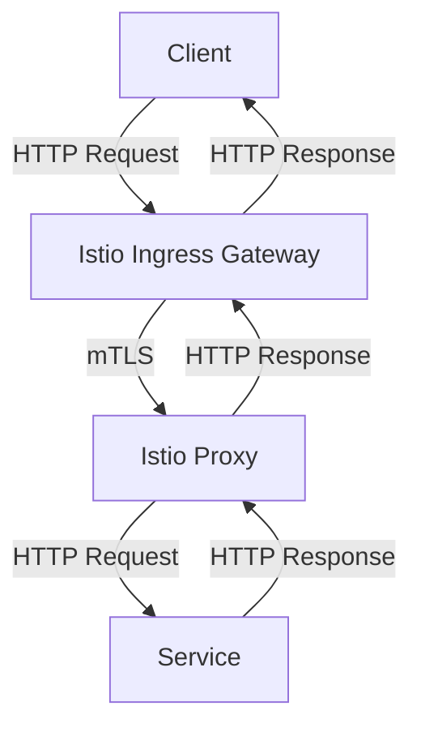
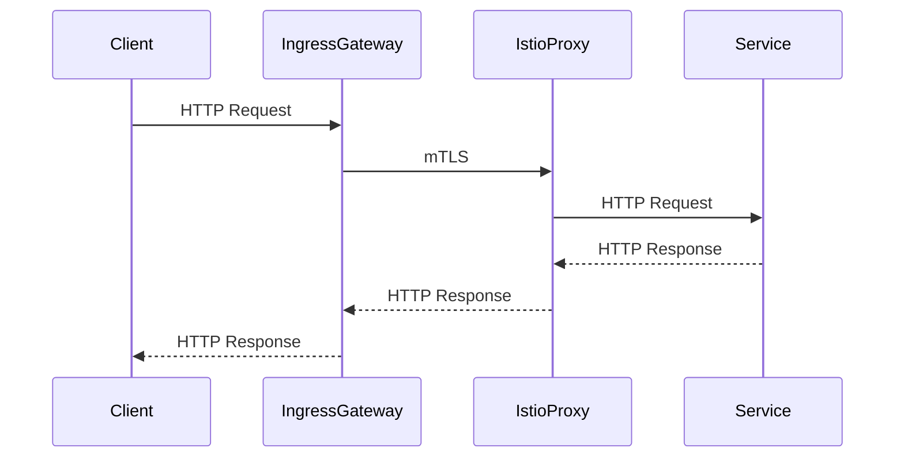

## Introduction to Service Mesh with Istio

### What is a Service Mesh?

A service mesh is a dedicated infrastructure layer for handling service-to-service communication. It provides a way to manage and monitor the interactions between microservices in a distributed system. A service mesh abstracts away the complexities of inter-service communication, including load balancing, service discovery, retries, timeouts, and encryption.

#### Why Use a Service Mesh?

In a microservices architecture, services communicate with each other over the network. This introduces several challenges:

- **Service Discovery**: How does one service know how to find another?
- **Load Balancing**: How do you distribute traffic evenly across instances of a service?
- **Fault Tolerance**: How do you handle failures gracefully?
- **Security**: How do you ensure secure communication between services?

A service mesh addresses these issues by providing a standardized way to manage these interactions. This allows developers to focus on their application logic rather than the plumbing required to make services work together.

### Introduction to Istio

Istio is an open-source service mesh that provides a uniform way to secure, connect, and monitor microservices. It is designed to work with any platform and supports a wide range of deployment environments, including Kubernetes, VMs, and bare metal.

#### Key Components of Istio

Istio consists of several key components:

- **Pilot**: Manages service discovery and routing.
- **Mixer**: Enforces policies and collects telemetry data.
- **Citadel**: Manages identity and security.
- **Envoy Proxy**: A high-performance proxy that sits between services and handles all network communication.

### Installing Istio in a Kubernetes Cluster

To install Istio in a Kubernetes cluster, we will follow a structured approach. We will start by creating a new feature branch in our infrastructure as code repository. This ensures that our changes are isolated and can be reviewed and merged independently.

#### Creating a New Feature Branch

First, we create a new feature branch in our Git repository. This branch will contain all the configuration specific to this chapter.

```bash
git checkout -b Istio
```

This command creates a new branch named `Istio` and switches to it.

### Infrastructure as Code with Terraform

We will use Terraform to manage our infrastructure as code. Terraform is a tool for building, changing, and combining infrastructure safely and efficiently. It uses a declarative language to describe the desired state of your infrastructure.

#### Creating the Terraform Configuration File

Next, we create a new Terraform configuration file named `Istio.tf`. This file will contain the configuration for installing Istio in our Kubernetes cluster.

```terraform
# Istio.tf
provider "kubernetes" {
  config_path = "~/.kube/config"
}

resource "helm_release" "istio" {
  name       = "istio"
  repository = "https://istio-release.storage.googleapis.com/charts"
  chart      = "istio"
  version    = "1.12.2"

  set {
    name  = "global.meshConfig.accessLogFile"
    value = "/dev/stdout"
  }

  set {
    name  = "gateways.istio-ingressgateway.type"
    value = "LoadBalancer"
  }
}
```

This configuration file defines the installation of Istio using a Helm chart. The `helm_release` resource specifies the name, repository, chart, and version of Istio to be installed. Additional settings are provided to customize the installation.

### Understanding the Istio Components

Istio consists of several components that work together to provide service mesh functionality. These components include:

- **Istio Control Plane**: Manages the configuration and behavior of the service mesh.
- **Istio Data Plane**: Handles the actual network communication between services.

#### Istio Control Plane Components

The control plane includes the following components:

- **Pilot**: Manages service discovery and routing.
- **Mixer**: Enforces policies and collects telemetry data.
- **Citadel**: Manages identity and security.

#### Istio Data Plane Component

The data plane component is Envoy Proxy, which sits between services and handles all network communication.

### Installing Istio Main Components

The first step in installing Istio is to install the main components that provide the service mesh capabilities. These components include:

- **IstioD**: The main component that gives us the service mesh capabilities.
- **Istio Base Helm Chart**: Provides the CRDs for configuring Istio service mesh.
- **Istio Ingress Gateway**: An entry point into the cluster.

#### Using Helm to Install Istio

Helm is a package manager for Kubernetes that simplifies the deployment and management of applications. We will use a Helm chart to install all the necessary Istio components.

```bash
helm repo add istio https://istio-release.storage.googleapis.com/charts
helm repo update
helm install istio-base istio/base --namespace istio-system
```

These commands add the Istio Helm repository, update the local cache, and install the Istio base chart into the `istio-system` namespace.

### Configuring Istio Service Mesh

Once the main components are installed, we can configure the service mesh using the CRDs provided by the Istio base Helm chart. This includes defining virtual services, destination rules, and other configurations.

#### Example Configuration

Here is an example configuration for a virtual service and a destination rule:

```yaml
apiVersion: networking.istio.io/v1alpha3
kind: VirtualService
metadata:
  name: myapp
spec:
  hosts:
  - myapp.example.com
  http:
  - match:
    - uri:
        exact: /hello
    route:
    - destination:
        host: myapp
        port:
          number: 8080

---
apiVersion: networking.istio.io/v1alpha3
kind: DestinationRule
metadata:
  name: myapp
spec:
  host: myapp
  trafficPolicy:
    loadBalancer:
      simple: ROUND_ROBIN
```

This configuration defines a virtual service that routes traffic to the `myapp` service and a destination rule that specifies the load balancing strategy.

### Deploying Istio Ingress Gateway

The Istio Ingress Gateway is a separate component that acts as an entry point into the cluster. It can be deployed as a LoadBalancer service to expose the gateway to external traffic.

#### Deploying the Ingress Gateway

To deploy the Istio Ingress Gateway, we can use the following Helm command:

```bash
helm install istio-ingressgateway istio/gateway --namespace istio-system
```

This command installs the Istio Ingress Gateway into the `istio-system` namespace.

### Monitoring and Observability

One of the key benefits of using a service mesh like Istio is the ability to monitor and observe the interactions between services. Istio provides built-in support for monitoring and observability through the Mixer component.

#### Enabling Telemetry Collection

To enable telemetry collection, we can configure the Mixer component to collect metrics and logs from the Envoy proxies.

```yaml
apiVersion: config.istio.io/v1alpha2
kind: Telemetry
metadata:
  name: default
spec:
  metrics:
  - name: envoy
    interval: 5s
  accessLogging:
  - name: envoy
    logAsJson: true
    logFormat: '{"time":"%START_TIME%", "method":"%REQ(:METHOD)%", "path":"%REQ(X-ENVOY-ORIGINAL-PATH?:PATH)%", "protocol":"%PROTOCOL%", "responseCode":%RESPONSE_CODE%, "bytesSent":%BYTES_SENT%, "duration":%DURATION%, "upstreamServiceTime":%UPSTREAM_SERVICE_TIME%}'
```

This configuration enables metrics collection at 5-second intervals and sets up access logging in JSON format.

### Security Considerations

Security is a critical aspect of any service mesh implementation. Istio provides several mechanisms to ensure secure communication between services.

#### Mutual TLS

Mutual TLS (mTLS) is a security mechanism that ensures that both the client and server are authenticated. Istio supports mTLS out of the box.

```yaml
apiVersion: security.istio.io/v1beta1
kind: PeerAuthentication
metadata:
  name: default
spec:
  mtls:
    mode: STRICT
```

This configuration enables strict mutual TLS for all services in the mesh.

### How to Prevent / Defend

#### Detection

To detect potential security issues in your Istio setup, you can use tools like `istioctl` to inspect the configuration and verify that security policies are correctly applied.

```bash
istioctl x precheck
```

This command checks for common misconfigurations and security issues.

#### Prevention

To prevent security issues, ensure that:

- **Strict mTLS** is enabled for all services.
- **Access logging** is configured to capture all relevant information.
- **Regular audits** are performed to verify that security policies are correctly applied.

#### Secure Coding Fixes

Here is an example of a vulnerable configuration and its secure counterpart:

**Vulnerable Configuration**

```yaml
apiVersion: security.istio.io/v1beta1
kind: PeerAuthentication
metadata:
  name: default
spec:
  mtls:
    mode: PERMISSIVE
```

**Secure Configuration**

```yaml
apiVersion: security.istio.io/v1beta1
kind: PeerAuthentication
metadata:
  name: default
spec:
  mtls:
    mode: STRICT
```

By switching from `PERMISSIVE` to `STRICT` mode, we ensure that all services in the mesh are authenticated using mTLS.

### Real-World Examples

#### Recent CVEs and Breaches

- **CVE-2021-25285**: A vulnerability in Istio's Envoy proxy allowed attackers to bypass authentication and authorization checks.
- **CVE-2021-25286**: Another vulnerability in Istio's Envoy proxy allowed attackers to inject arbitrary HTTP headers.

These vulnerabilities highlight the importance of keeping your Istio installation up to date and ensuring that security policies are correctly applied.

### Complete Example

Here is a complete example of installing Istio in a Kubernetes cluster using Terraform and Helm:

#### Terraform Configuration

```terraform
# Istio.tf
provider "kubernetes" {
  config_path = "~/.kube/config"
}

resource "helm_release" "istio" {
  name       = "istio"
  repository = "https://istio-release.storage.googleapis.com/charts"
  chart      = "istio"
  version    = "1.12.2"

  set {
    name  = "global.meshConfig.accessLogFile"
    value = "/dev/stdout"
  }

  set {
    name  = "gateways.istio-ingressgateway.type"
    value = "LoadBalancer"
  }
}
```

#### Helm Commands

```bash
helm repo add istio https://istio-release.storage.googleapis.com/charts
helm repo update
helm install istio-base istio/base --namespace istio-system
helm install istio-ingressgateway istio/gateway --namespace istio-system
```

#### Full HTTP Request and Response

Here is an example of a full HTTP request and response using Istio:

**Request**

```http
GET /hello HTTP/1.1
Host: myapp.example.com
User-Agent: curl/7.64.1
Accept: */*
```

**Response**

```http
HTTP/1.1 200 OK
Date: Mon, 01 Jan 2024 00:00:00 GMT
Content-Type: text/plain
Content-Length: 12

Hello, World!
```

### Mermaid Diagrams

#### Service Mesh Architecture



#### Request/Response Flow



### Practice Labs

For hands-on practice with Istio, consider the following labs:

- **PortSwigger Web Security Academy**: Offers a comprehensive set of labs covering various aspects of web security, including service mesh configurations.
- **OWASP Juice Shop**: A deliberately insecure web application for practicing web security skills.
- **Kubernetes Goat**: A set of Kubernetes security challenges designed to test and improve your Kubernetes security skills.

### Conclusion

In this chapter, we covered the installation and configuration of Istio in a Kubernetes cluster. We explored the key components of Istio, how to install and configure them using Terraform and Helm, and the importance of security considerations. By following the steps outlined in this chapter, you can effectively manage and secure your microservices architecture using Istio.

---
<!-- nav -->
[[12-Introduction to Service Mesh with Istio Part 9|Introduction to Service Mesh with Istio Part 9]] | [[DevSecOps/DevSecOps Bootcamp/06-Container & Kubernetes Security/04-Service Mesh with Istio/Install Istio in K8s cluster/00-Overview|Overview]] | [[14-Service Mesh with Istio Installing Istio in a Kubernetes Cluster|Service Mesh with Istio Installing Istio in a Kubernetes Cluster]]
