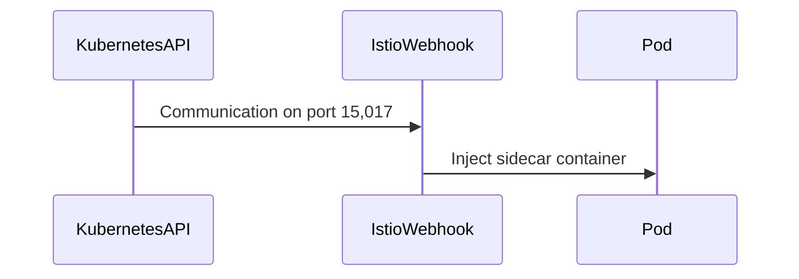
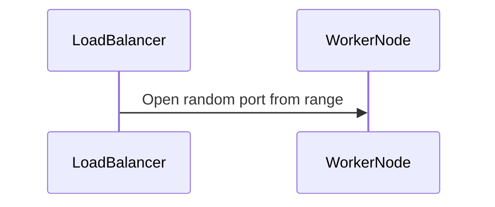

## Service Mesh with Istio: Installing Istio in a Kubernetes Cluster

### Introduction to Service Mesh and Istio

A service mesh is a dedicated infrastructure layer for handling service-to-service communication. It provides a way to manage and monitor the interactions between microservices in a distributed system. Istio is one of the most popular open-source service meshes designed to handle the complexities of modern microservice architectures.

#### What is Istio?

Istio is an open-source service mesh that provides a uniform way to secure, control, and observe interactions between microservices. It is built to work with any platform and supports a variety of deployment environments, including Kubernetes, VMs, and bare metal servers.

#### Why Use Istio?

- **Traffic Management**: Istio allows you to route traffic based on various criteria, such as version labels, percentage-based splits, and fault injection.
- **Security**: Istio provides mutual TLS encryption, authentication, and authorization for service-to-service communication.
- **Observability**: Istio includes built-in monitoring and tracing capabilities, allowing you to track the health and performance of your services.
- **Resilience**: Istio helps build resilient systems through features like retries, timeouts, and circuit breakers.

### Installing Istio in a Kubernetes Cluster

To install Istio in a Kubernetes cluster, you need to follow several steps, including setting up the necessary security groups and configuring the required ports.

#### Prerequisites

Before installing Istio, ensure that you have:

- A running Kubernetes cluster.
- `kubectl` installed and configured to interact with your cluster.
- Access to the Kubernetes API server.
- Network policies and security groups configured correctly.

### Configuring Security Groups

When deploying Istio in a Kubernetes cluster, you need to configure the security groups to allow the necessary traffic. This involves defining additional ingress and egress rules.

#### Ingress Rules

Ingress rules are used to control incoming traffic to the cluster. For Istio, you need to define specific ingress rules for the following ports:

- **Port 15,017**: This port is used for communication between the Kubernetes API server and the Istio Webhook component. The Webhook component is responsible for injecting sidecar containers into the pods.
- **Port 15,012**: This port is also used for communication between the Kubernetes API server and the Istio Webhook component.



#### Egress Rules

Egress rules are used to control outgoing traffic from the cluster. While not explicitly mentioned in the transcript, it is important to ensure that egress rules are properly configured to prevent unauthorized outbound traffic.

### Configuring Security Group Rules

To configure the security group rules, you need to add the necessary ingress rules for the specified ports. Here is an example of how to configure these rules using AWS Security Groups:

```yaml
# Example of AWS Security Group Configuration
Resources:
  MySecurityGroup:
    Type: "AWS::EC2::SecurityGroup"
    Properties:
      GroupName: "MySecurityGroup"
      VpcId: !Ref MyVPC
      SecurityGroupIngress:
        - IpProtocol: tcp
          FromPort: 15017
          ToPort: 15017
          CidrIp: 10.0.0.0/16
          Description: "Kubernetes API to Istio Webhook"
        - IpProtocol: tcp
          FromPort: 15012
          ToPort: 15012
          CidrIp: 10.0.0.0/16
          Description: "Kubernetes API to Istio Webhook"
```

### Load Balancer Component

When creating a load balancer component in the cluster, it opens a random port on worker nodes from a specified port range. This port range should only be accessible from the load balancer and not externally.



### Full Example of Security Group Configuration

Here is a complete example of how to configure the security group rules using AWS CloudFormation:

```yaml
AWSTemplateFormatVersion: '2010-09-09'
Resources:
  MySecurityGroup:
    Type: 'AWS::EC2::SecurityGroup'
    Properties:
      GroupName: 'MySecurityGroup'
      VpcId: !Ref MyVPC
      SecurityGroupIngress:
        - IpProtocol: tcp
          FromPort: 15017
          ToPort: 15017
          CidrIp: 10.0.0.0/16
          Description: 'Kubernetes API to Istio Webhook'
        - IpProtocol: tcp
          FromPort: 15012
          ToPort: 15012
          CidrIp: 10.0.0.0/16
          Description: 'Kubernetes API to Istio Webhook'
Outputs:
  SecurityGroupId:
    Value: !Ref MySecurityGroup
```

### How to Prevent / Defend

#### Detection

To detect unauthorized access attempts, you can set up monitoring and logging for the security group rules. This includes:

- Monitoring the security group logs for any unauthorized access attempts.
- Setting up alerts for any changes to the security group rules.

#### Prevention

To prevent unauthorized access, ensure that:

- Only the necessary ports are opened.
- The source of the traffic is restricted to the cluster security group.
- Regularly review and audit the security group rules.

#### Secure Code Fix

Here is an example of a vulnerable configuration and the corresponding secure configuration:

**Vulnerable Configuration:**

```yaml
Resources:
  MySecurityGroup:
    Type: 'AWS::EC2::SecurityGroup'
    Properties:
      GroupName: 'MySecurityGroup'
      VpcId: !Ref MyVPC
      SecurityGroupIngress:
        - IpProtocol: tcp
          FromPort: 15017
          ToPort: 15017
          CidrIp: 0.0.0.0/0
          Description: 'Kubernetes API to Istio Webhook'
```

**Secure Configuration:**

```yaml
Resources:
  MySecurityGroup:
    Type: 'AWS::EC2::SecurityGroup'
    Properties:
      GroupName: 'MySecurityGroup'
      VpcId: !Ref MyVPC
      SecurityGroupIngress:
        - IpProtocol: tcp
          FromPort: 15017
          ToPort: 15017
          CidrIp: 10.0.0.0/16
          Description: 'Kubernetes API to Istio Webhook'
```

### Real-World Examples

#### Recent CVEs and Breaches

One recent example of a breach involving misconfigured security groups is the Capital One data breach in 2019. The breach was caused by a misconfigured AWS security group that allowed unauthorized access to sensitive data.

#### Secure Configuration Practices

To avoid such breaches, it is crucial to follow secure configuration practices:

- Limit the scope of the security group rules to the minimum necessary.
- Regularly review and audit the security group rules.
- Use network policies to further restrict traffic within the cluster.

### Conclusion

Installing Istio in a Kubernetes cluster requires careful configuration of security groups to ensure proper communication between the Kubernetes API server and the Istio components. By following the steps outlined in this chapter, you can ensure that your service mesh is securely deployed and managed.

### Practice Labs

For hands-on practice with Istio and Kubernetes, consider the following labs:

- **PortSwigger Web Security Academy**: Offers interactive labs on web application security.
- **OWASP Juice Shop**: A deliberately insecure web application for practicing web security.
- **Kubernetes Goat**: A Kubernetes-based security training platform.
- **CloudGoat**: A cloud security training platform for AWS.

These labs provide practical experience in securing and managing service meshes in Kubernetes clusters.

---
<!-- nav -->
[[13-Introduction to Service Mesh with Istio|Introduction to Service Mesh with Istio]] | [[DevSecOps/DevSecOps Bootcamp/06-Container & Kubernetes Security/04-Service Mesh with Istio/Install Istio in K8s cluster/00-Overview|Overview]] | [[DevSecOps/DevSecOps Bootcamp/06-Container & Kubernetes Security/04-Service Mesh with Istio/Install Istio in K8s cluster/15-Practice Questions & Answers|Practice Questions & Answers]]
