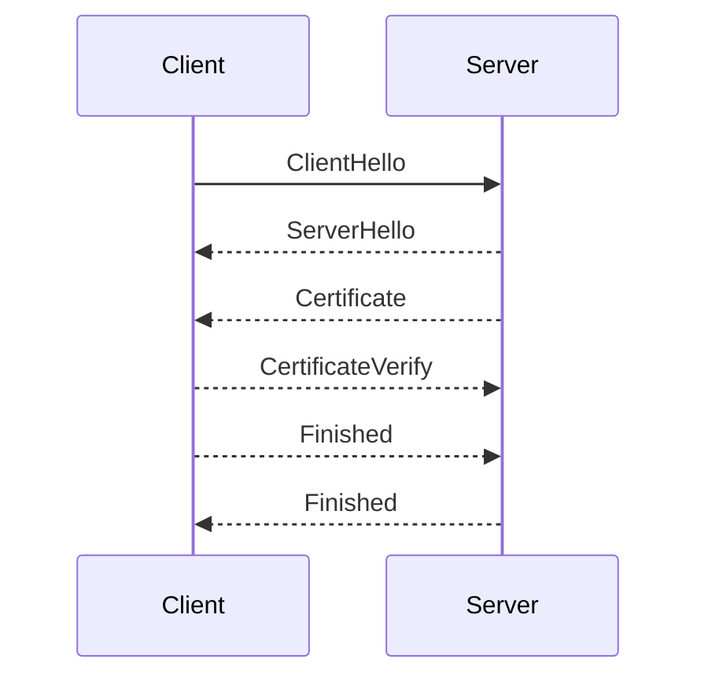
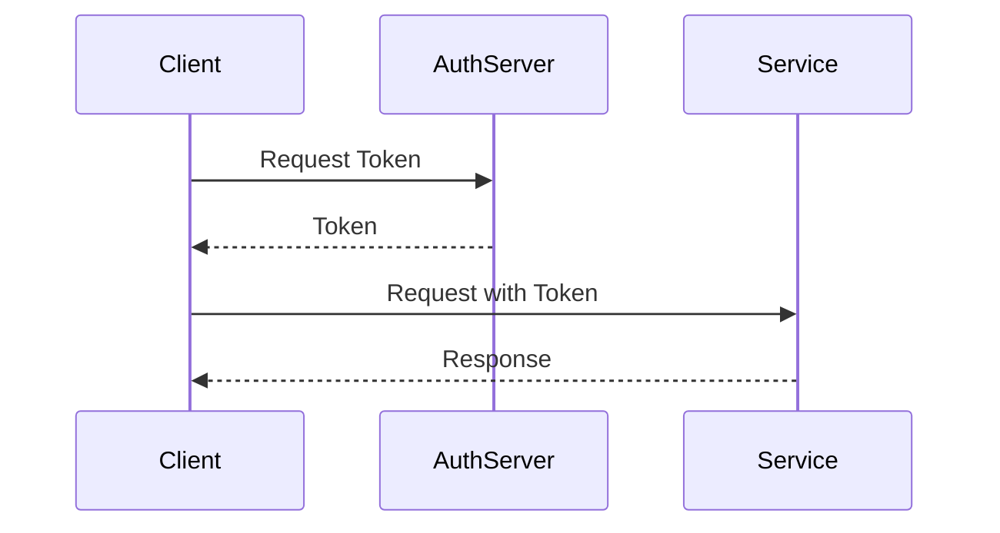

## Introduction to Service Mesh and Istio

Service mesh is a dedicated infrastructure layer for handling service-to-service communication. It provides a way to manage and secure communication between microservices in a distributed system. One of the most popular service mesh implementations is Istio, which is designed to work seamlessly with Kubernetes clusters. This chapter will delve into the details of service mesh and Istio, explaining their importance, functionality, and implementation.

### Importance of Service Mesh

In a microservices architecture, applications are broken down into smaller, independent services that communicate with each other over the network. Without proper management, these communications can become complex and difficult to secure. A service mesh addresses these issues by providing a dedicated layer that handles all inter-service communication.

#### Security Perspective

From a security perspective, if an attacker gains access to the cluster, they can potentially perform any action within the cluster. This is particularly dangerous for applications that handle sensitive user data, such as online banking systems. In such cases, a higher level of security is crucial. A service mesh like Istio helps by providing:

- **Encryption**: Ensuring that all communication between services is encrypted.
- **Authentication and Authorization**: Verifying the identity of services and controlling access to resources.
- **Policy Enforcement**: Enforcing security policies across the entire mesh.

#### Real-World Example: Recent Breaches

Consider the Capital One breach in 2019, where an attacker gained unauthorized access to the company's cloud environment. This breach highlights the importance of securing internal communications within a cluster. A service mesh could have helped mitigate such risks by enforcing strict security policies and encrypting all internal traffic.

### Additional Configuration Inside Each Application

To secure communication between services within the cluster, additional configuration is required. This includes setting up mutual TLS (mTLS) for encryption and configuring authentication mechanisms.

#### Mutual TLS (mTLS)

Mutual TLS ensures that both the client and server authenticate each other before establishing a secure connection. This is crucial in preventing man-in-the-middle attacks.



#### Authentication Mechanisms

Authentication mechanisms ensure that only authorized services can communicate with each other. Istio supports various authentication methods, including JWT (JSON Web Tokens) and OAuth2.



### Retry Logic in Microservices

Retry logic is essential for making the application more robust. If a microservice becomes unreachable or a connection is lost temporarily, retry logic ensures that the application can recover gracefully.

#### Implementation Example

Here’s an example of how retry logic can be implemented in a microservice using Python:

```python
import requests
from requests.exceptions import RequestException

def call_service(url):
    max_retries = 3
    for attempt in range(max_retries):
        try:
            response = requests.get(url)
            response.raise_for_status()
            return response.json()
        except RequestException as e:
            print(f"Attempt {attempt + 1} failed: {e}")
    raise Exception("All attempts failed")

# Usage
try:
    result = call_service('http://example.com/api')
except Exception as e:
    print(e)
```

### Metrics and Monitoring

Monitoring the performance of services is crucial for identifying bottlenecks and ensuring smooth operation. Metrics provide insights into the health and performance of the system.

#### Prometheus for Metrics Collection

Prometheus is a popular open-source monitoring system that can be used to collect metrics from services. Here’s an example of how to set up Prometheus with a microservice:

```yaml
# prometheus.yml
scrape_configs:
  - job_name: 'microservices'
    static_configs:
      - targets: ['localhost:8080']
```

The microservice can expose metrics using the Prometheus client library:

```python
from prometheus_client import start_http_server, Summary

REQUEST_TIME = Summary('request_processing_seconds', 'Time spent processing request')

@REQUEST_TIME.time()
def process_request():
    # Your request processing logic here
    pass

if __name__ == '__main__':
    start_http_server(8080)
    process_request()
```

### Tracing Data

Tracing helps in understanding the flow of requests through the system. Tools like Zipkin can be used to collect and visualize trace data.

#### Zipkin Integration

Here’s an example of how to integrate Zipkin with a microservice using OpenTelemetry:

```python
from opentelemetry import trace
from opentelemetry.exporter.zipkin import ZipkinExporter
from opentelemetry.sdk.trace import TracerProvider
from opentelemetry.sdk.trace.export import BatchExportSpanProcessor

trace.set_tracer_provider(TracerProvider())
tracer = trace.get_tracer(__name__)

zipkin_exporter = ZipkinExporter(
    endpoint="http://localhost:9411/api/v2/spans"
)
span_processor = BatchExportSpanProcessor(zipkin_exporter)
trace.get_tracer_provider().add_span_processor(span_processor)

with tracer.start_as_current_span("process_request"):
    # Your request processing logic here
    pass
```

### How to Prevent / Defend

#### Detection

Detection involves monitoring the system for any suspicious activities. Tools like Prometheus and Grafana can be used to set up alerts for unusual behavior.

#### Prevention

Prevention involves implementing security best practices and hardening configurations. This includes:

- **Using mTLS for Encryption**: Ensure that all communication between services is encrypted.
- **Configuring Authentication Mechanisms**: Use JWT or OAuth2 to authenticate services.
- **Implementing Access Control Policies**: Use Istio's RBAC (Role-Based Access Control) to control access to resources.

#### Secure Coding Fixes

Here’s an example of how to implement secure coding practices:

**Vulnerable Code:**
```python
import requests

def call_service(url):
    response = requests.get(url)
    return response.json()
```

**Secure Code:**
```python
import requests
from requests.exceptions import RequestException

def call_service(url):
    try:
        response = requests.get(url)
        response.raise_for_status()
        return response.json()
    except RequestException as e:
        print(f"Request failed: {e}")
        return None
```

### Conclusion

Service mesh and Istio provide a robust solution for managing and securing communication between microservices. By implementing additional configuration, retry logic, metrics collection, and tracing, you can ensure that your application is both secure and performant. Always follow best practices for detection and prevention to safeguard your system against potential threats.

### Practice Labs

For hands-on experience with service mesh and Istio, consider the following labs:

- **PortSwigger Web Security Academy**: Offers practical exercises on web security.
- **OWASP Juice Shop**: A deliberately insecure web application for learning web security.
- **Istio Official Documentation**: Provides detailed guides and examples for setting up and using Istio.

These labs will help you gain a deeper understanding of service mesh and Istio, and how to effectively implement them in your applications.

---
<!-- nav -->
[[01-Introduction to Service Mesh and Istio Part 1|Introduction to Service Mesh and Istio Part 1]] | [[DevSecOps/DevSecOps Bootcamp/06-Container & Kubernetes Security/04-Service Mesh with Istio/Service Mesh and Istio What Why and How/00-Overview|Overview]] | [[03-Introduction to Service Mesh and Istio Part 3|Introduction to Service Mesh and Istio Part 3]]
