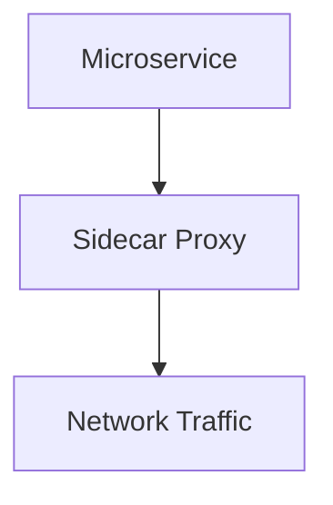
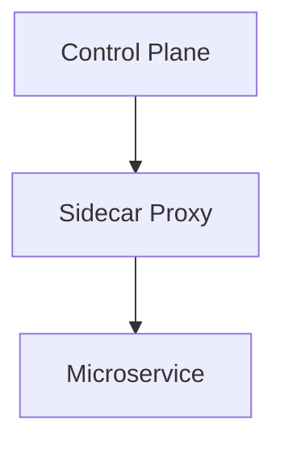

## Introduction to Service Mesh and Istio

### What is a Service Mesh?

A **Service Mesh** is a dedicated infrastructure layer for handling service-to-service communication within a distributed system. It abstracts away the complexities of network communication, security, and observability from individual microservices. Instead of embedding this functionality directly into each microservice, a service mesh uses a series of lightweight, configurable proxies called **sidecars** to manage these tasks.

#### Why Use a Service Mesh?

In a microservices architecture, each service must handle various non-functional requirements such as:

- **Metrics**: Collecting and reporting performance data.
- **Security**: Implementing authentication, authorization, and encryption.
- **Communication**: Managing service discovery and load balancing.
- **Fault Tolerance**: Handling retries, timeouts, and circuit breakers.

Without a service mesh, developers would need to implement these features in each microservice, leading to:

- **Increased Complexity**: Each service becomes bloated with non-core logic.
- **Consistency Issues**: Different implementations across services can lead to inconsistencies.
- **Maintenance Overhead**: Updating or fixing these features requires changes in multiple places.

By using a service mesh, developers can focus solely on business logic, while the service mesh handles the rest.

### How Does a Service Mesh Work?

A service mesh consists of two main components:

1. **Data Plane**: A set of proxies (sidecars) that intercept and manage all network traffic between services.
2. **Control Plane**: A central component that manages the proxies, configures policies, and collects telemetry data.

#### Data Plane: Sidecars

Each microservice runs alongside a sidecar proxy. These proxies intercept all incoming and outgoing network traffic, allowing the service mesh to enforce policies, collect metrics, and perform other tasks.



#### Control Plane: Management and Configuration

The control plane is responsible for managing the sidecar proxies. It configures policies, distributes certificates, and collects telemetry data. The control plane communicates with the sidecar proxies via a management API.



### Example: Istio Service Mesh

Istio is one of the most popular service meshes. It provides a comprehensive solution for managing service-to-service communication in a microservices environment.

#### Installing Istio

To install Istio, you first need a Kubernetes cluster. You can install Istio using the following commands:

```bash
curl -L https://istio.io/downloadIstio | sh -
cd istio-*
bin/istioctl install --set profile=demo -y
```

This command installs Istio with a demo profile, which includes all the necessary components.

#### Configuring Sidecars

Once Istio is installed, you can enable sidecar injection for your microservices. This can be done by annotating your deployment with `sidecar.istio.io/inject=true`.

```yaml
apiVersion: apps/v1
kind: Deployment
metadata:
  name: my-service
spec:
  template:
    metadata:
      annotations:
        sidecar.istio.io/inject: "true"
    spec:
      containers:
      - name: my-service
        image: my-service-image
```

When this deployment is created, Istio will automatically inject a sidecar proxy into the pod.

### Traffic Splitting

One of the key features of a service mesh is traffic splitting. This allows you to route traffic to different versions of a service based on specific criteria, such as percentage-based splits or user-based splits.

#### Percentage-Based Splitting

Percentage-based splitting routes a certain percentage of traffic to a new version of a service. This is useful for gradually rolling out a new version and monitoring its performance.

```yaml
apiVersion: networking.istio.io/v1alpha3
kind: DestinationRule
metadata:
  name: my-service
spec:
  host: my-service
  subsets:
  - name: v1
    labels:
      version: v1
  - name: v2
    labels:
      version: v2

---
apiVersion: networking.istio.io/v1alpha3
kind: VirtualService
metadata:
  name: my-service
spec:
  hosts:
  - my-service
  http:
  - route:
    - destination:
        host: my-service
        subset: v1
      weight: 80
    - destination:
        host: my-service
        subset: v2
      weight: 20
```

In this example, 80% of the traffic is routed to version `v1`, and 20% is routed to version `v2`.

### Real-World Examples

#### Recent Breaches and CVEs

Service meshes like Istio help mitigate many security risks associated with microservices. However, vulnerabilities can still exist if proper configurations and practices are not followed.

For example, CVE-2021-25281 was a vulnerability in Istio's Envoy proxy that allowed an attacker to bypass mutual TLS authentication. This could result in unauthorized access to services.

#### Secure Configuration

To prevent such vulnerabilities, ensure that:

- Mutual TLS is enabled and properly configured.
- Access policies are strictly enforced.
- Regularly update Istio and its components to the latest versions.

### How to Prevent / Defend

#### Detection

Regularly monitor the service mesh for unusual traffic patterns or unauthorized access attempts. Tools like Prometheus and Grafana can be used to visualize and analyze metrics collected by Istio.

#### Prevention

- **Enable Mutual TLS**: Ensure that all service-to-service communication is encrypted and authenticated.
- **Strict Access Policies**: Use Istio's RBAC (Role-Based Access Control) to restrict access to services.
- **Regular Updates**: Keep Istio and its components up to date to patch known vulnerabilities.

#### Secure Coding Fixes

Here’s an example of a vulnerable configuration and its secure counterpart:

**Vulnerable Configuration:**

```yaml
apiVersion: networking.istio.io/v1alpha3
kind: DestinationRule
metadata:
  name: my-service
spec:
  host: my-service
  trafficPolicy:
    tls:
      mode: DISABLE
```

**Secure Configuration:**

```yaml
apiVersion: networking.istio.io/v1alpha3
kind: DestinationRule
metadata:
  name: my-service
spec:
  host: my-service
  trafficPolicy:
    tls:
      mode: ISTIO_MUTUAL
```

### Hands-On Practice

For hands-on practice with Istio, consider the following labs:

- **PortSwigger Web Security Academy**: Offers exercises on securing microservices with Istio.
- **OWASP Juice Shop**: Includes scenarios where you can apply Istio for securing microservices.
- **CloudGoat**: Provides real-world cloud security scenarios, including the use of Istio in a Kubernetes environment.

These labs provide practical experience in configuring and securing a service mesh with Istio.

### Conclusion

A service mesh like Istio simplifies the management of service-to-service communication in a microservices architecture. By abstracting away non-functional requirements, it allows developers to focus on core business logic. Proper configuration and regular updates are crucial to maintaining security and reliability.

---
<!-- nav -->
[[02-Introduction to Service Mesh and Istio Part 2|Introduction to Service Mesh and Istio Part 2]] | [[DevSecOps/DevSecOps Bootcamp/06-Container & Kubernetes Security/04-Service Mesh with Istio/Service Mesh and Istio What Why and How/00-Overview|Overview]] | [[04-Introduction to Service Mesh and Istio Part 4|Introduction to Service Mesh and Istio Part 4]]
