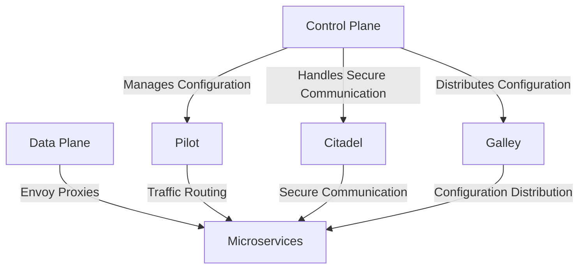

## Introduction to Service Mesh and Istio

Service mesh is an infrastructure layer that handles service-to-service communication. It provides a way to manage and monitor the interactions between services in a microservices architecture. One of the most popular service mesh implementations is Istio, which is designed to provide a uniform way to secure, control, and observe interactions between microservices.

### Components of Istio

Istio consists of several key components:

- **Pilot**: Manages traffic routing and service discovery.
- **Citadel**: Handles secure communication between services.
- **Galley**: Manages configuration distribution.

These components form the control plane of Istio, while the data plane consists of Envoy proxies deployed as sidecars with each microservice.

#### Pilot Component

The Pilot component is responsible for managing traffic routing and service discovery. It acts as the central brain for traffic management within the service mesh. Here’s a detailed breakdown of what Pilot does:

- **Traffic Management**: Pilot routes traffic based on rules defined in the Istio configuration. This includes load balancing, retries, timeouts, and circuit breaking.
- **Service Discovery**: Pilot maintains a dynamic view of the services in the mesh and ensures that services can discover and communicate with each other.

**Example Configuration**

To illustrate how Pilot works, consider a simple scenario where we have two services: `frontend` and `backend`. We want to route 50% of the traffic to `backend-v1` and the remaining 50% to `backend-v2`.

```yaml
apiVersion: networking.istio.io/v1alpha3
kind: VirtualService
metadata:
  name: frontend
spec:
  hosts:
    - frontend
  http:
  - route:
    - destination:
        host: backend
        subset: v1
      weight: 50
    - destination:
        host: backend
        subset: v2
      weight: 50
```

This configuration tells Pilot to split the traffic evenly between `backend-v1` and `backend-v2`.

#### Citadel Component

Citadel is responsible for securing communication between services. It manages certificates, authentication, and authorization. Here’s a detailed breakdown of what Citadel does:

- **Certificate Management**: Citadel generates and distributes TLS certificates to ensure secure communication between services.
- **Authentication and Authorization**: Citadel enforces policies to ensure that only authorized services can communicate with each other.

**Example Configuration**

To illustrate how Citadel works, consider a scenario where we want to enforce mutual TLS between services. We can define a policy using Istio’s `PeerAuthentication` resource.

```yaml
apiVersion: security.istio.io/v1beta1
kind: PeerAuthentication
metadata:
  name: default
  namespace: istio-system
spec:
  mtls:
    mode: STRICT
```

This configuration enforces mutual TLS for all services in the mesh.

#### Galley Component

Galley is responsible for managing configuration distribution. It reads configuration from custom resources defined in the cluster and applies them to the Envoy proxies. Here’s a detailed breakdown of what Galley does:

- **Configuration Distribution**: Galley reads configuration from custom resources like `VirtualService`, `DestinationRule`, and `ServiceEntry`.
- **Validation**: Galley validates the configuration to ensure it is correct and consistent.

**Example Configuration**

To illustrate how Galley works, consider a scenario where we want to define a `DestinationRule` to specify load balancing policies for a service.

```yaml
apiVersion: networking.istio.io/v1alpha3
kind: DestinationRule
metadata:
  name: backend
spec:
  host: backend
  trafficPolicy:
    loadBalancer:
      simple: ROUND_ROBIN
```

This configuration tells Galley to apply a round-robin load balancing policy to the `backend` service.

### Control Plane and Data Plane

The control plane consists of the Istio components (Pilot, Citadel, Galley) that manage the configuration and traffic routing. The data plane consists of Envoy proxies deployed as sidecars with each microservice.

**Mermaid Diagram: Istio Architecture**



### Configuring Istio

To configure Istio, you don’t need to modify the deployment and service YAML files for your microservices. Instead, you configure Istio using custom resources defined in Kubernetes YAML files. These resources extend the Kubernetes API using Custom Resource Definitions (CRDs).

**Example Configuration**

Consider a scenario where we want to define a `VirtualService` and a `DestinationRule` for a microservice.

```yaml
apiVersion: networking.istio.io/v1alpha3
kind: VirtualService
metadata:
  name: frontend
spec:
  hosts:
    - frontend
  http:
  - route:
    - destination:
        host: backend
        subset: v1
      weight: 50
    - destination:
        host: backend
        subset: v2
      weight:  50

---
apiVersion: networking.istio.io/v1alpha3
kind: DestinationRule
metadata:
  name: backend
spec:
  host: backend
  trafficPolicy:
    loadBalancer:
      simple: ROUND_ROBIN
```

This configuration defines a `VirtualService` for `frontend` and a `DestinationRule` for `backend`.

### Real-World Examples

Recent real-world examples of service mesh usage include:

- **Netflix**: Netflix uses Istio to manage traffic between its microservices.
- **Google**: Google uses Istio in its internal systems to manage service-to-service communication.

### Pitfalls and Best Practices

When using Istio, there are several pitfalls to avoid:

- **Complexity**: Istio adds complexity to your system. Ensure you understand the trade-offs.
- **Performance Overhead**: Envoy proxies can introduce performance overhead. Monitor and optimize as needed.
- **Security**: Ensure proper configuration of security policies to prevent unauthorized access.

### How to Prevent / Defend

To prevent and defend against potential issues with Istio, follow these best practices:

- **Monitor Traffic**: Use Istio’s built-in monitoring tools to track traffic patterns and detect anomalies.
- **Secure Communication**: Enforce mutual TLS and other security policies using Citadel.
- **Validate Configuration**: Use Galley to validate configuration and ensure consistency.

### Conclusion

In conclusion, Istio is a powerful tool for managing service-to-service communication in a microservices architecture. By understanding the components of Istio and how to configure them, you can effectively manage and secure your microservices.

### Practice Labs

For hands-on practice with Istio, consider the following labs:

- **PortSwigger Web Security Academy**: Offers a series of labs on web security, including some that involve Istio.
- **OWASP Juice Shop**: A deliberately insecure web application that can be used to practice security testing with Istio.
- **CloudGoat**: A set of labs focused on cloud security, including some that involve Istio.

By completing these labs, you can gain practical experience with Istio and improve your skills in managing and securing microservices.

---
<!-- nav -->
[[03-Introduction to Service Mesh and Istio Part 3|Introduction to Service Mesh and Istio Part 3]] | [[DevSecOps/DevSecOps Bootcamp/06-Container & Kubernetes Security/04-Service Mesh with Istio/Service Mesh and Istio What Why and How/00-Overview|Overview]] | [[05-Introduction to Service Mesh and Istio Part 5|Introduction to Service Mesh and Istio Part 5]]
