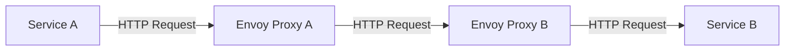
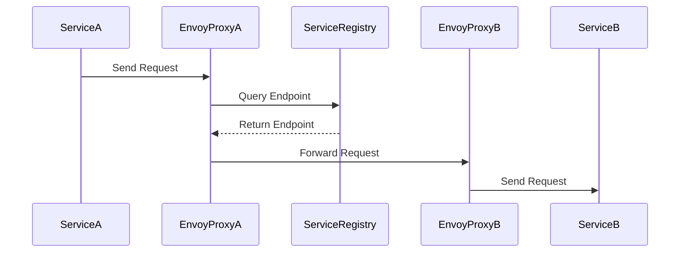
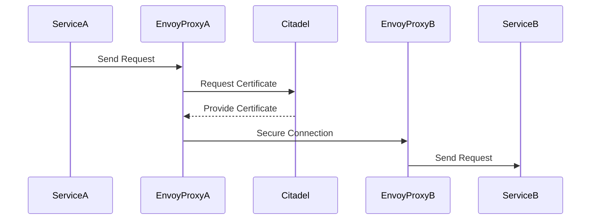
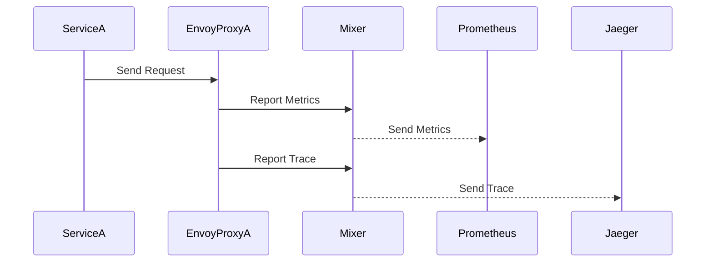
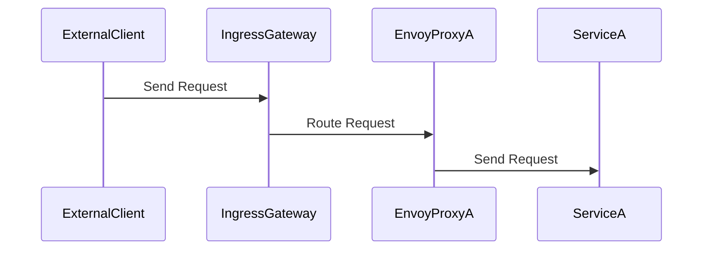

## Introduction to Service Mesh and Istio

### What is a Service Mesh?

A **Service Mesh** is a dedicated infrastructure layer for handling service-to-service communication. It abstracts away the complexity of managing communication between microservices, enabling developers to focus on business logic rather than the intricacies of network communication. A service mesh typically consists of two main components:

1. **Proxies**: Lightweight, transparent proxies that sit alongside each service and handle outbound and inbound communication.
2. **Control Plane**: Centralized management and configuration of the proxies.

### Why Use a Service Mesh?

Service meshes provide several benefits:

- **Traffic Management**: Routing, load balancing, retries, and circuit breaking.
- **Observability**: Metrics, logging, and distributed tracing.
- **Security**: Mutual TLS encryption, authentication, and authorization.
- **Resilience**: Fault tolerance and graceful degradation.

### What is Istio?

**Istio** is an open-source service mesh that provides a uniform way to secure, connect, and monitor microservices. It is designed to work with various platforms, including Kubernetes, and supports a wide range of programming languages and frameworks.

### Key Components of Istio

#### Proxies (Envoy)

In Istio, the proxies are based on **Envoy**, a high-performance proxy developed by Lyft. Envoy is responsible for handling all network communication between services. Each service in the mesh runs alongside an Envoy proxy, which intercepts and manages all incoming and outgoing traffic.

#### Control Plane (Pilot, Citadel, Mixer)

The control plane in Istio consists of several components:

- **Pilot**: Manages the configuration and routing of Envoy proxies.
- **Citadel**: Manages identity and security for the mesh.
- **Mixer**: Enforces policies and collects telemetry data.

### How Istio Works

#### Independent Communication Between Proxies

Once configured, the Envoy proxies can communicate with each other directly without needing to go back to the Istio control plane. This means that the proxies have all the necessary logic and configuration to route traffic independently.



### Dynamic Service Discovery

Instead of statically configuring the endpoints for each microservice, Istio uses a **central registry** to dynamically discover and register services. When a new microservice is deployed, it automatically registers itself in the service registry. This allows the Envoy proxies to query the endpoints and send traffic to the relevant services.



### Certificate Authority (CA)

Istio also acts as a **Certificate Authority (CA)**, generating TLS certificates for all microservices in the cluster. This ensures secure communication between proxies using mutual TLS encryption.



### Metrics and Tracing

Istio collects metrics and tracing data from the Envoy proxies, which can be consumed by monitoring servers like **Prometheus** or tracing servers like **Jaeger**. This provides out-of-the-box observability for the entire microservice application.



### Istio Ingress Gateway

The **Istio Ingress Gateway** is an entry point into the Kubernetes cluster. It handles external traffic and routes it to the appropriate services within the mesh.



### Real-World Examples

#### Recent CVEs and Breaches

One notable example is the **CVE-2020-8175** vulnerability in Envoy, which could lead to a Denial of Service (DoS) condition. This highlights the importance of keeping Istio and Envoy up to date with the latest security patches.

#### Real-World Deployment

Consider a scenario where a company deploys a microservices-based application on Kubernetes using Istio. The application consists of several services, each running alongside an Envoy proxy. The Istio control plane manages the configuration and routing of these proxies, ensuring secure and efficient communication between services.

### Pitfalls and Common Mistakes

#### Misconfiguration

Misconfiguring the Istio control plane or Envoy proxies can lead to issues such as incorrect routing, security vulnerabilities, or performance degradation. It is crucial to thoroughly test and validate configurations.

#### Overhead

While Istio provides significant benefits, it also introduces overhead due to the additional proxies and control plane components. This can impact performance, especially in resource-constrained environments.

### How to Prevent / Defend

#### Detection

Regularly monitor the Istio control plane and Envoy proxies for any anomalies or unexpected behavior. Use tools like Prometheus and Grafana to visualize and analyze metrics.

#### Prevention

- **Keep Software Updated**: Ensure Istio, Envoy, and all dependencies are up to date with the latest security patches.
- **Secure Configuration**: Follow best practices for configuring Istio and Envoy, such as enabling mutual TLS and enforcing strict access controls.
- **Hardening**: Implement security hardening measures, such as disabling unnecessary features and limiting permissions.

#### Secure Coding Fixes

Here is an example of a vulnerable configuration and its secure counterpart:

**Vulnerable Configuration:**

```yaml
apiVersion: networking.istio.io/v1alpha3
kind: DestinationRule
metadata:
  name: my-service
spec:
  host: my-service
  trafficPolicy:
    tls:
      mode: DISABLE
```

**Secure Configuration:**

```yaml
apiVersion: networking.istio.io/v1alpha3
kind: DestinationRule
metadata:
  name: my-service
spec:
  host: my-service
  trafficPolicy:
    tls:
      mode: ISTIO_MUTUAL
```

### Complete Example

#### Full HTTP Request and Response

Consider a scenario where a client sends a request to a service through the Istio Ingress Gateway.

**HTTP Request:**

```http
POST /api/v1/data HTTP/1.1
Host: my-service.example.com
Content-Type: application/json
Authorization: Bearer <token>

{
  "data": "some data"
}
```

**HTTP Response:**

```http
HTTP/1.1 200 OK
Content-Type: application/json
Date: Mon, 01 Jan 2024 00:00:00 GMT
Content-Length: 22

{
  "status": "success"
}
```

#### Full Policy/Config File

Here is an example of an Istio `DestinationRule` configuration file:

```yaml
apiVersion: networking.istio.io/v1alpha3
kind: DestinationRule
metadata:
  name: my-service
spec:
  host: my-service
  trafficPolicy:
    tls:
      mode: ISTIO_MUTUAL
```

### Hands-On Labs

For hands-on practice with Istio, consider the following labs:

- **PortSwigger Web Security Academy**: Offers exercises on securing microservices with Istio.
- **OWASP Juice Shop**: Provides a vulnerable application that can be secured using Istio.
- **Kubernetes Goat**: Focuses on Kubernetes security and includes scenarios involving Istio.

By following these detailed explanations and examples, you can gain a comprehensive understanding of how to effectively use Istio in a DevSecOps environment.

---
<!-- nav -->
[[05-Introduction to Service Mesh and Istio Part 5|Introduction to Service Mesh and Istio Part 5]] | [[DevSecOps/DevSecOps Bootcamp/06-Container & Kubernetes Security/04-Service Mesh with Istio/Service Mesh and Istio What Why and How/00-Overview|Overview]] | [[07-Introduction to Service Mesh and Istio Part 7|Introduction to Service Mesh and Istio Part 7]]
