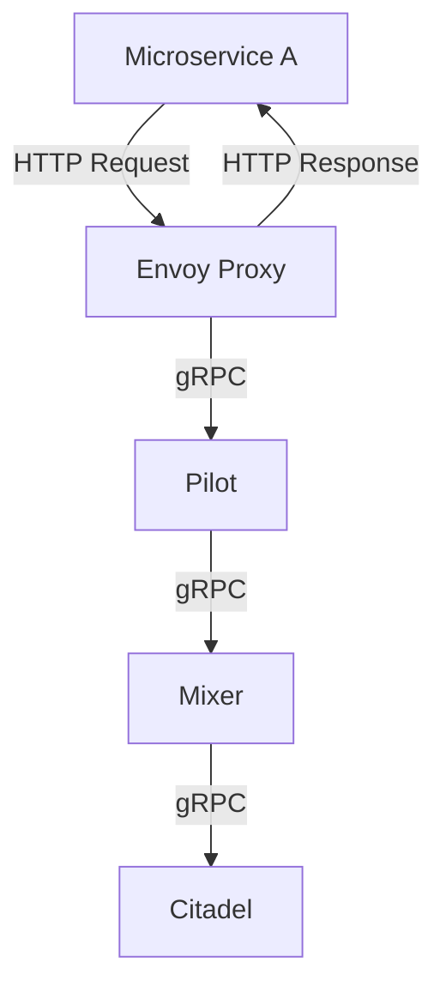

## Introduction to Service Mesh and Istio

### Background Theory

Service mesh is a dedicated infrastructure layer for handling service-to-service communication within a microservices architecture. It provides a way to manage and monitor the interactions between services, ensuring reliability, security, and observability. Before diving into the details of service mesh and Istio, it's essential to understand the challenges faced in a microservices environment.

### Challenges of Microservices Applications

When transitioning from a monolithic application to a microservices architecture, several new challenges arise:

1. **Communication Complexity**: Each microservice communicates with others, leading to a complex web of interactions. Managing these communications can become cumbersome.
2. **Service Discovery**: Services need to discover and communicate with other services dynamically. This requires robust service discovery mechanisms.
3. **Traffic Management**: Routing traffic between services, handling retries, timeouts, and circuit breakers is crucial for maintaining system stability.
4. **Security**: Ensuring secure communication between services is vital. This includes encryption, authentication, and authorization.
5. **Observability**: Monitoring and logging the interactions between services are necessary for debugging and performance tuning.

### Example: Online Shop Application

Consider an online shop application composed of several microservices:

- **Web Server**: Handles UI requests.
- **Payment Microservice**: Manages payment logic.
- **Shopping Cart**: Manages user carts.
- **Product Inventory**: Manages product stock.
- **Database**: Stores data for various services.

These services are deployed inside a Kubernetes cluster. To ensure the application runs successfully, several configurations are required:

1. **Business Logic**: Each microservice has its own specific business logic.
2. **Service Discovery**: Mechanisms to find and communicate with other services.
3. **Traffic Management**: Policies for routing and managing traffic.
4. **Security**: Encryption, authentication, and authorization mechanisms.
5. **Observability**: Logging and monitoring tools.

### Service Mesh Overview

A service mesh addresses these challenges by providing a dedicated infrastructure layer for service-to-service communication. It abstracts away the complexity of managing these interactions, offering features like:

- **Service Discovery**
- **Traffic Management**
- **Security**
- **Observability**

### Istio as a Service Mesh Implementation

Istio is a popular open-source service mesh implementation that provides a comprehensive solution for managing service-to-service communication. It integrates seamlessly with Kubernetes and other container orchestration platforms.

#### Architecture of Istio

The core components of Istio include:

- **Envoy Proxy**: A high-performance proxy that sits between services, handling all network communication.
- **Pilot**: Manages service discovery and traffic management.
- **Mixer**: Enforces policies and collects telemetry data.
- **Citadel**: Manages identity and security.



### Configuring Istio for a Microservices Application

To configure Istio for a microservices application, follow these steps:

1. **Install Istio**: Deploy Istio on your Kubernetes cluster using the official installation guide.
2. **Deploy Envoy Proxies**: Ensure each microservice is configured to use Envoy as a sidecar proxy.
3. **Configure Service Discovery**: Set up service discovery using Pilot.
4. **Set Up Traffic Management**: Define traffic routing rules using Pilot.
5. **Implement Security Policies**: Configure authentication, authorization, and encryption using Citadel and Mixer.
6. **Enable Observability**: Collect and analyze telemetry data using Mixer.

#### Example Configuration

Here is an example of configuring Istio for a simple microservices application:

1. **Install Istio**:
   ```sh
   curl -L https://istio.io/downloadIstio | ISTIO_VERSION=1.11.0 sh -
   cd istio-1.11.0
   export PATH=$PWD/bin:$PATH
   istioctl install --set profile=demo -y
   ```

2. **Deploy Envoy Proxies**:
   ```yaml
   apiVersion: networking.istio.io/v1alpha3
   kind: Gateway
   metadata:
     name: bookinfo-gateway
   spec:
     selector:
       istio: ingressgateway
     servers:
     - port:
         number: 80
         name: http
         protocol: HTTP
       hosts:
       - "*"
   ---
   apiVersion: networking.istio.io/v1alpha3
   kind: VirtualService
   metadata:
     name: bookinfo
   spec:
     hosts:
     - "*"
     gateways:
     - bookinfo-gateway
     http:
     - match:
       - uri:
           exact: /
       route:
       - destination:
           host: productpage
           port:
             number: 9080
   ```

3. **Configure Service Discovery**:
   ```yaml
   apiVersion: networking.istio.io/v1alpha3
   kind: DestinationRule
   metadata:
     name: productpage
   spec:
     host: productpage
     subsets:
     - name: v1
       labels:
         version: v1
   ```

4. **Set Up Traffic Management**:
   ```yaml
   apiVersion: networking.istio.io/v1alpha3
   kind: VirtualService
   metadata:
     name: productpage
   spec:
     hosts:
     - productpage
     http:
     - route:
       - destination:
           host: productpage
           subset: v1
   ```

5. **Implement Security Policies**:
   ```yaml
   apiVersion: security.istio.io/v1beta1
   kind: AuthorizationPolicy
   metadata:
     name: bookinfo-authz
   spec:
     action: ALLOW
     rules:
     - from:
       - source:
           principals: ["cluster.local/ns/default/sa/bookinfo"]
       to:
       - operation:
           methods: ["GET"]
           paths: ["/productpage"]
   ```

6. **Enable Observability**:
   ```yaml
   apiVersion: telemetry.istio.io/v1alpha1
   kind: Telemetry
   metadata:
     name: default
   spec:
     accessLogEncoding: JSON
     accessLogging:
       logAsJson: true
       logEntryFields:
         - source.ip
         - destination.ip
         - request.id
         - response.code
   ```

### Real-World Examples and Recent CVEs

Recent breaches and vulnerabilities have highlighted the importance of service mesh in securing microservices applications. For example:

- **CVE-2021-25282**: A vulnerability in Istio's Envoy proxy allowed unauthorized access to sensitive data. This underscores the need for robust security policies and regular updates.
- **CVE-2021-25283**: Another vulnerability in Istio's Mixer component allowed attackers to bypass authentication mechanisms. This highlights the importance of proper configuration and monitoring.

### Pitfalls and Common Mistakes

1. **Incomplete Configuration**: Failing to configure all necessary components can lead to gaps in security and observability.
2. **Overcomplicating Setup**: Overly complex configurations can make troubleshooting difficult.
3. **Ignoring Updates**: Not keeping Istio and its components up to date can leave the system vulnerable to known exploits.

### How to Prevent / Defend

#### Detection

- **Monitoring**: Use Istio's built-in monitoring tools to track service interactions and identify anomalies.
- **Logging**: Enable detailed logging to capture all service-to-service communications.

#### Prevention

- **Secure Configuration**: Follow best practices for configuring Istio components.
- **Regular Updates**: Keep Istio and its dependencies up to date with the latest security patches.

#### Secure Coding Fixes

Compare the vulnerable and secure versions of a configuration:

**Vulnerable Version**:
```yaml
apiVersion: security.istio.io/v1beta1
kind: AuthorizationPolicy
metadata:
  name: insecure-policy
spec:
  action: ALLOW
  rules:
  - from:
    - source:
        principals: ["*"]
    to:
    - operation:
        methods: ["GET"]
        paths: ["/productpage"]
```

**Secure Version**:
```yaml
apiVersion: security.istio.io/v1beta1
kind: AuthorizationPolicy
metadata:
  name: secure-policy
spec:
  action: ALLOW
  rules:
  - from:
    - source:
        principals: ["cluster.local/ns/default/sa/bookinfo"]
    to:
    - operation:
        methods: ["GET"]
        paths: ["/productpage"]
```

### Conclusion

Service mesh, particularly Istio, provides a powerful solution for managing service-to-service communication in microservices architectures. By addressing challenges such as service discovery, traffic management, security, and observability, Istio helps ensure the reliability and security of microservices applications.

### Hands-On Labs

For practical experience with Istio, consider the following labs:

- **PortSwigger Web Security Academy**: Offers hands-on labs for learning web security concepts.
- **OWASP Juice Shop**: Provides a vulnerable web application for practicing security techniques.
- **CloudGoat**: Focuses on cloud security and offers scenarios for practicing security in cloud environments.
- **Kubernetes Goat**: Provides a vulnerable Kubernetes cluster for practicing security in Kubernetes environments.

By following these steps and resources, you can gain a deep understanding of service mesh and Istio, and effectively apply them to your microservices applications.

---
<!-- nav -->
[[07-Introduction to Service Mesh and Istio Part 7|Introduction to Service Mesh and Istio Part 7]] | [[DevSecOps/DevSecOps Bootcamp/06-Container & Kubernetes Security/04-Service Mesh with Istio/Service Mesh and Istio What Why and How/00-Overview|Overview]] | [[09-Istio Ingress Gateway|Istio Ingress Gateway]]
